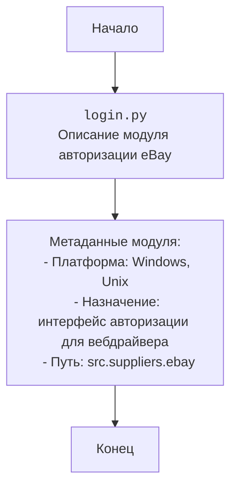

## ИНСТРУКЦИЯ:

Анализируй предоставленный код подробно и объясни его функциональность. Ответ должен включать три раздела:  

1. **<алгоритм>**: Опиши рабочий процесс в виде пошаговой блок-схемы, включая примеры для каждого логического блока, и проиллюстрируй поток данных между функциями, классами или методами.  
2. **<mermaid>**: Напиши код для диаграммы в формате `mermaid`, проанализируй и объясни все зависимости, 
    которые импортируются при создании диаграммы. 
    **ВАЖНО!** Убедитесь, что все имена переменных, используемые в диаграмме `mermaid`, 
    имеют осмысленные и описательные имена. Имена переменных вроде `A`, `B`, `C`, и т.д., не допускаются!  
    
    **Дополнительно**: Если в коде есть импорт `import header`, добавьте блок `mermaid` flowchart, объясняющий `header.py`:\
    ```mermaid
    flowchart TD
        Start --> Header[<code>header.py</code><br> Determine Project Root]
    
        Header --> import[Import Global Settings: <br><code>from src import gs</code>] 
    ```

3. **<объяснение>**: Предоставьте подробные объяснения:  
   - **Импорты**: Их назначение и взаимосвязь с другими пакетами `src.`.  
   - **Классы**: Их роль, атрибуты, методы и взаимодействие с другими компонентами проекта.  
   - **Функции**: Их аргументы, возвращаемые значения, назначение и примеры.  
   - **Переменные**: Их типы и использование.  
   - Выделите потенциальные ошибки или области для улучшения.  

Дополнительно, постройте цепочку взаимосвязей с другими частями проекта (если применимо).  

Это обеспечивает всесторонний и структурированный анализ кода.
## Формат ответа: `.md` (markdown)
**КОНЕЦ ИНСТРУКЦИИ**

## Анализ кода: `hypotez/src/suppliers/ebay/login.py`

### 1. <алгоритм>

Представленный код представляет собой заголовочный файл Python, определяющий модуль `src.suppliers.ebay.login`. Он не содержит исполняемого кода, а только метаданные о модуле, такие как его назначение и совместимость с разными платформами. 

Поскольку исполняемого кода нет, пошаговая блок-схема не применима.

### 2. <mermaid>


В данном случае диаграмма `mermaid` описывает структуру и метаинформацию файла `login.py`. Нет никаких импортов или зависимостей от других модулей в текущем фрагменте кода, поэтому `mermaid` диаграмма является простой и показывает только метаданные модуля.

### 3. <объяснение>
**Импорты**: 
Код не содержит инструкций `import`. 

**Классы**: 
В коде не определены классы.

**Функции**:
В коде не определены функции.

**Переменные**:
В коде не определены переменные.

**Объяснение**:
-  **`# -*- coding: utf-8 -*-`**: Эта строка задает кодировку исходного файла как UTF-8, что позволяет использовать символы Unicode.
-  **``** и **`#! venv/bin/python/python3.12`**: Эти строки указывают интерпретатор Python, который должен использоваться для выполнения скрипта, но они закомментированы, что означает, что они не влияют на выполнение. Они указывают путь к исполняемым файлам Python в виртуальных окружениях.
- **Комментарии-докстринги:** Текст внутри тройных кавычек (`"""`) - это docstring, который используется для документирования модуля. В этом случае docstring содержит информацию о модуле:
    - **`.. module:: src.suppliers.ebay`**: Указывает на принадлежность модуля.
    - **`:platform: Windows, Unix`**: Указывает на платформы, на которых модуль должен работать.
    - **`:synopsis:`**: Предоставляет краткое описание модуля.
    - **`@image html login.png`**: Представляет собой инструкцию для системы документации Sphinx, указывающую на то, что нужно включить изображение `login.png` в HTML-вывод документации.

**Потенциальные ошибки и области для улучшения**:

- **Отсутствие реализации**: Код является просто заголовочным файлом и не содержит никакой фактической реализации. Это означает, что функциональность авторизации eBay еще не написана и требует дальнейшей разработки.
- **Неструктурированные комментарии**: Наличие пустых строк в комментариях может снизить читаемость. Их следует удалить для большей ясности.
- **Отсутствие комментариев**: Код не имеет содержательных комментариев, которые могли бы объяснить его предназначение и будущую реализацию.
- **Избыточность docstring**: Наличие нескольких docstrings подряд, по сути, дублирующих информацию.
- **Отсутствие проверки платформы**: Несмотря на указание в `docstring` поддерживаемых платформ, нет фактической проверки во время выполнения.

**Цепочка взаимосвязей с другими частями проекта**:

Поскольку `login.py` находится в пакете `src.suppliers.ebay`, он вероятно будет взаимодействовать с другими модулями внутри этого пакета. Например, он может использовать модули для работы с веб-драйвером, обработки ответов от eBay и т. д. В более широком смысле, он будет частью подсистемы поставщиков, которая, в свою очередь, вероятно, взаимодействует с основным ядром приложения. 

**Дополнительное**:

Файл `header.py` не был упомянут в коде, поэтому, соответствующая `mermaid` диаграмма не требуется.