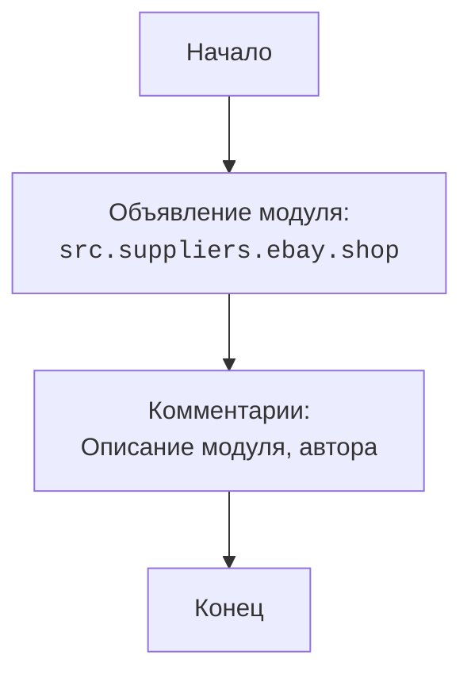

## ИНСТРУКЦИЯ:

Анализируй предоставленный код подробно и объясни его функциональность. Ответ должен включать три раздела:

1.  **<алгоритм>**: Опиши рабочий процесс в виде пошаговой блок-схемы, включая примеры для каждого логического блока, и проиллюстрируй поток данных между функциями, классами или методами.
2.  **<mermaid>**: Напиши код для диаграммы в формате `mermaid`, проанализируй и объясни все зависимости,
    которые импортируются при создании диаграммы.
    **ВАЖНО!** Убедитесь, что все имена переменных, используемые в диаграмме `mermaid`,
    имеют осмысленные и описательные имена. Имена переменных вроде `A`, `B`, `C`, и т.д., не допускаются!

    **Дополнительно**: Если в коде есть импорт `import header`, добавьте блок `mermaid` flowchart, объясняющий `header.py`:\
    ```mermaid
    flowchart TD
        Start --> Header[<code>header.py</code><br> Determine Project Root]

        Header --> import[Import Global Settings: <br><code>from src import gs</code>]
    ```

3.  **<объяснение>**: Предоставьте подробные объяснения:
    -   **Импорты**: Их назначение и взаимосвязь с другими пакетами `src.`.
    -   **Классы**: Их роль, атрибуты, методы и взаимодействие с другими компонентами проекта.
    -   **Функции**: Их аргументы, возвращаемые значения, назначение и примеры.
    -   **Переменные**: Их типы и использование.
    -   Выделите потенциальные ошибки или области для улучшения.

Дополнительно, постройте цепочку взаимосвязей с другими частями проекта (если применимо).

Это обеспечивает всесторонний и структурированный анализ кода.
## Формат ответа: `.md` (markdown)
**КОНЕЦ ИНСТРУКЦИИ**

## <алгоритм>

Поскольку предоставленный код является в основном закомментированным файлом с декларацией модуля,  алгоритм его работы достаточно прост:

1. **Начало**: Запуск интерпретатора Python.
2. **Декларация модуля**:  Определение модуля  `src.suppliers.ebay.shop`.
3. **Комментарии**: Файл содержит большое количество комментариев, которые описывают модуль, авторов и краткое описание назначения.
4. **Конец**: Завершение выполнения кода, так как исполняемого кода нет.

## <mermaid>



**Объяснение `mermaid` диаграммы:**

*   `Start`: Обозначает начало выполнения скрипта.
*   `ModuleDeclaration`: Обозначает декларацию модуля `src.suppliers.ebay.shop`. Это определяет пространство имен, в котором будет работать данный код.
*  `Comments`: Представляет комментарии в файле, которые в основном описывают модуль, автора и платформы, на которых он будет работать.
*   `End`: Обозначает конец выполнения скрипта.

## <объяснение>

**Импорты**:
В предоставленном коде нет импортов. Это означает, что данный файл на данный момент не зависит от каких-либо внешних модулей или пакетов.  Данный файл является базовой отправной точкой для определения модуля.

**Классы**:
В предоставленном коде нет определения классов.

**Функции**:
В предоставленном коде нет определения функций.

**Переменные**:
В предоставленном коде нет переменных, кроме неявных переменных окружения, связанных с запуском скрипта.

**Объяснение:**

Файл `shop.py` в пакете `src.suppliers.ebay` - это файл модуля. Он содержит только декларацию модуля и комментарии с метаданными.
По сути это пустой файл, в котором не определено никаких классов, функций, переменных,  он служит точкой входа и местом для дальнейшего добавления кода, связанного с функциональностью магазина eBay в рамках проекта.

**Потенциальные ошибки и области для улучшения:**
* **Отсутствие кода:** Основная "ошибка"  в том, что файл не содержит исполняемого кода. Его следует заполнить  классами, функциями и переменными, реализующими необходимую логику.
* **Недостаток документации:** Хотя есть общие комментарии, нет описания, как этот модуль должен взаимодействовать с другими частями проекта.
* **Комментарии избыточны**: Присутствует большое количество комментариев, которые дублируют информацию, например, платформы для запуска Windows и Unix повторяются.
* **Не используются docstrings:** Отсутствуют docstrings для модуля.

**Цепочка взаимосвязей:**

Этот модуль будет частью пакета `src.suppliers.ebay`.
Обычно, модуль `shop` будет содержать  логику для взаимодействия с API eBay, обработки товаров, заказов и других операций, связанных с магазином. Он будет связан с другими модулями внутри пакета `src` и будет использовать общие настройки проекта (`src.gs`), логирование и другие общие сервисы. Взаимодействие этого модуля с другими частями проекта будет зависеть от конкретных требований проекта.