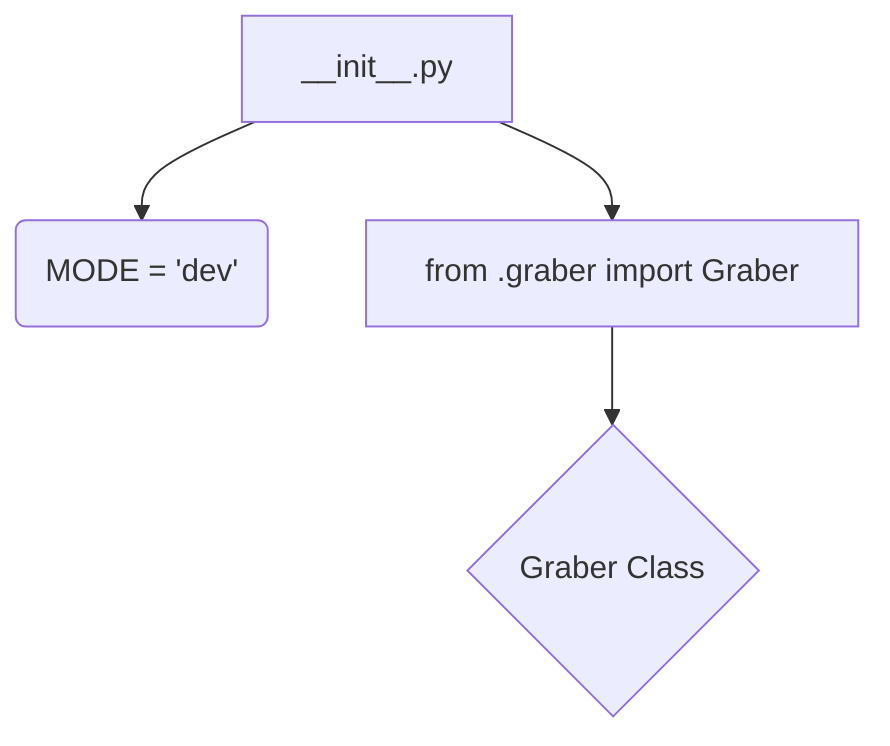
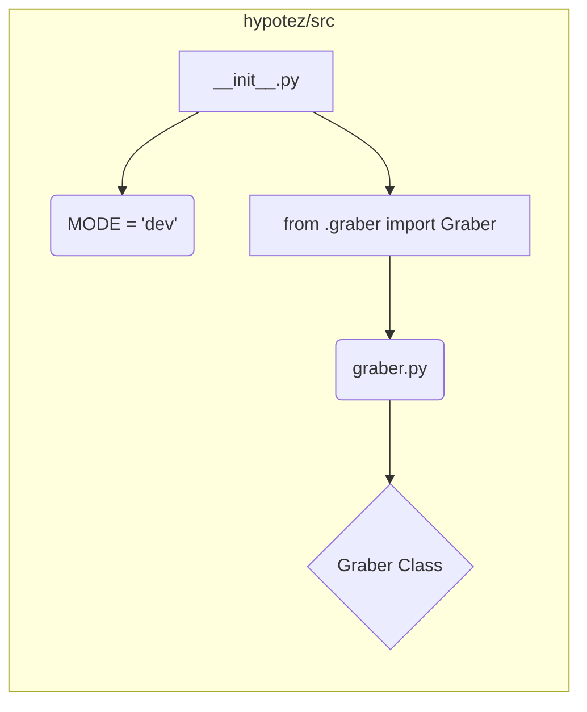

# <input code>

```python
## \file hypotez/src/suppliers/etzmaleh/__init__.py
# -*- coding: utf-8 -*-
#! venv/Scripts/python.exe
#! venv/bin/python/python3.12

"""
.. module: src.suppliers.etzmaleh 
	:platform: Windows, Unix
	:synopsis:

"""
MODE = 'dev'


from .graber import Graber
```

# <algorithm>



**Пример:**

В файле `hypotez/src/suppliers/etzmaleh/__init__.py` определяется константа `MODE` со значением 'dev'. Затем происходит импорт класса `Graber` из модуля `graber.py` в том же каталоге.  Предполагается, что `graber.py` содержит определение класса `Graber` (см. блок D).


# <mermaid>



**Примечание к диаграмме:** Диаграмма показывает импорт класса `Graber` из файла `graber.py`, который находится в том же каталоге `etzmaleh`.


# <explanation>

* **Импорты:**
    * `from .graber import Graber`: Этот импорт подключает класс `Graber` из модуля `graber.py`, который находится в той же директории (`hypotez/src/suppliers/etzmaleh/`).  Символ `.` указывает на относительный импорт, что важно для организации кода в иерархических структурах.  Это связывает `__init__.py` с `graber.py`, создавая модульную структуру.
    * `MODE = 'dev'`: Эта переменная, скорее всего, определяет режим работы, например, 'development' или 'production'.


* **Классы:**
    * `Graber`: Этот класс, определенный в `graber.py`,  не детализирован в файле `__init__.py`.  Его точная функциональность неизвестна без доступа к файлу `graber.py`.  Но, скорее всего, этот класс отвечает за работу с каким-то внешним источником данных (например, API, база данных) для получения информации, связанной с `etzmaleh`.


* **Функции:** Нет явных функций.

* **Переменные:**
    * `MODE`: Строковая переменная, хранящая строковое значение `'dev'`. Она, скорее всего, используется для конфигурации программы.


* **Возможные ошибки или области для улучшений:**
    * Отсутствие документации к классу `Graber` и его методам в `graber.py` может затруднить понимание и использование кода.
    * Улучшением было бы добавление документации к классу `Graber` (документировать его атрибуты и методы).
    * Непонятно, какое действие совершает `MODE = 'dev'`.


* **Взаимосвязи с другими частями проекта:**
    * Файл `__init__.py` связывает текущий модуль `etzmaleh` с классом `Graber`, который, вероятно, отвечает за взаимодействие с каким-то внешним источником.  Без кода `graber.py` мы не можем определить, как именно `etzmaleh` интегрируется с остальной частью приложения `hypotez`.  Вероятно, дальнейшая логика взаимодействия с `Graber` находится в других частях `hypotez/src`.


**Дополнительные замечания:**
Структура `hypotez/src/suppliers/etzmaleh` предполагает, что это модуль, отвечающий за работу с поставщиком данных под названием `etzmaleh`.