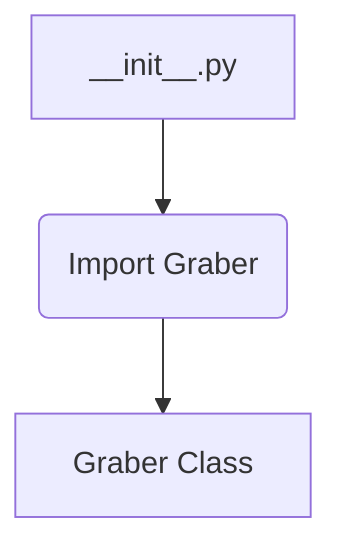

```MD
# Анализ файла `hypotez/src/suppliers/etzmaleh/__init__.py`

## <input code>

```python
## \file hypotez/src/suppliers/etzmaleh/__init__.py
# -*- coding: utf-8 -*-
#! venv/Scripts/python.exe
#! venv/bin/python/python3.12

"""
.. module: src.suppliers.etzmaleh 
	:platform: Windows, Unix
	:synopsis:

"""
MODE = 'dev'


from .graber import Graber
```

## <algorithm>

Этот файл является инициализационным модулем для пакета `etzmaleh`.  Он не содержит собственных функций или классов, но импортирует класс `Graber` из модуля `graber.py` в той же директории.

**Блок-схема:**



**Пример:**

В данном случае нет явной обработки данных, но если бы `__init__.py` содержал функции, эти функции вызывали бы методы класса `Graber`, передавая данные.


## <mermaid>

```mermaid
graph LR
    subgraph "hypotez/src"
        A[__init__.py] --> B[graber.py];
        B -. Graber -> C(Graber Class);
    end
```

**Объяснение диаграммы:**

Диаграмма показывает зависимость `__init__.py` от `graber.py`. Модуль `__init__.py` импортирует класс `Graber` из модуля `graber.py`, устанавливая связь между этими модулями.  `Graber` может содержать методы для работы с данными, которые будут использоваться другими частями проекта.


## <explanation>

* **Импорты:** Файл `__init__.py` содержит единственный импорт: `from .graber import Graber`. Это импортирует класс `Graber` из модуля `graber.py`, который находится в той же папке.  Символ `.` указывает на то, что импортируется модуль из текущего пакета. Это типичный способ организации модулей Python для создания модулей, которые зависят друг от друга и импортируются между собой.

* **Классы:** Класс `Graber` определяется в модуле `graber.py` (не показано в данном фрагменте), и в `__init__.py` импортируется без непосредственного использования. Он вероятно отвечает за взаимодействие с источником данных (например, веб-сайтом) для извлечения данных.

* **Функции:** В данном файле нет функций.

* **Переменные:**  `MODE = 'dev'` — это константа, которая, предположительно, определяет режим работы приложения (например, `dev`, `prod`), и может использоваться в других частях кода, например, для настройки параметров работы.

* **Возможные ошибки или области для улучшений:**
    * Отсутствие документации для класса `Graber` затрудняет понимание его функциональности.
    * В данном файле отсутствует логика.
    * Отсутствие примера использования класса `Graber`.


**Цепочка взаимосвязей:**

Файл `__init__.py` служит связующим звеном для других модулей пакета `etzmaleh`, предоставляя доступ к классу `Graber`.  Далее, `Graber` взаимодействует с источником данных для извлечения данных. Эти данные могут быть обработаны другими частями проекта (возможно, в файлах в папке `hypotez/src`).


**Выводы:**

Этот `__init__.py` выполняет простую, но важную функцию - импортирует необходимый функциональный блок (`Graber`) из другого файла. Это соответствует принципу модульности и организации кода в Python. Для более подробного анализа необходимо просмотреть код модуля `graber.py`.