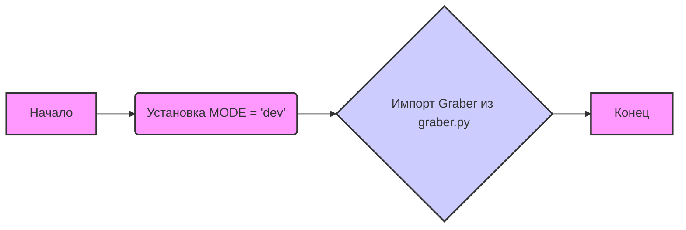

## Анализ кода `hypotez/src/suppliers/etzmaleh/__init__.py`

### <алгоритм>

1. **Инициализация режима:** Устанавливается переменная `MODE` в значение `'dev'`. Это может использоваться для определения, в каком режиме работает приложение (например, разработка или продакшн).
2. **Импорт класса `Graber`:** Импортируется класс `Graber` из модуля `graber.py`, находящегося в текущем пакете `etzmaleh`. Этот класс, вероятно, отвечает за извлечение данных с какого-либо источника.
   
**Пример:**

   - **MODE = 'dev'**: указывает на то, что приложение работает в режиме разработки, что может влиять на логирование, использование тестовых данных или другие настройки.
    -   `from .graber import Graber`:  из модуля `graber.py`  импортируется класс `Graber`, который будет использоваться для выполнения конкретной работы.

**Поток данных:**

   1. **Старт:** Запускается интерпретатор Python, считывая файл `__init__.py`.
   2. **Установка `MODE`:** Переменная `MODE` устанавливается в значение `'dev'`.
   3. **Импорт `Graber`:** Импортируется класс `Graber` из `graber.py`.
   4. **Конец:** Выполнение `__init__.py` завершается.

### <mermaid>



**Объяснение зависимостей:**

-   `A` (Начало) - начало выполнения скрипта.
-   `B` (Установка MODE = 'dev') - устанавливает переменную MODE.
-  `C` (Импорт Graber из graber.py) - импортирует класс `Graber` из `graber.py`.
-   `D` (Конец) - конец выполнения скрипта.

**Импорт `Graber`:** Импортируется класс `Graber` из модуля `graber.py` в том же пакете `etzmaleh`. Это означает, что в данном модуле будет доступен класс `Graber` для использования.

### <объяснение>

#### Импорты

-   `from .graber import Graber`:
    -   **Назначение:** Этот импорт добавляет класс `Graber` в текущее пространство имен модуля `etzmaleh`.
    -   **Взаимосвязь с другими пакетами:** Так как используется относительный импорт (`.graber`), предполагается, что `graber.py` находится в том же каталоге (`hypotez/src/suppliers/etzmaleh/`), что и `__init__.py`. Это внутренний компонент пакета `etzmaleh`.

#### Классы

-   `Graber`:
    -   **Роль:** На основе имени класса можно предположить, что `Graber` занимается извлечением данных (вероятно, с веб-сайтов или из других источников). Он будет использоваться для получения данных поставщика etzmaleh.
    -   **Атрибуты, методы и взаимодействие**: Неизвестны, так как код класса `Graber` не представлен. Однако, скорее всего, класс имеет методы для извлечения и обработки данных.

#### Функции
В данном коде не используются функции.

#### Переменные

-   `MODE = 'dev'`:
    -   **Тип:** Строка.
    -   **Использование:** `MODE` используется для определения рабочего режима приложения. `'dev'` указывает на режим разработки, который может влиять на поведение приложения (например, отладка, логирование).

#### Потенциальные ошибки и области для улучшения

-   **Отсутствие документации:** Код содержит docstring модуля, но не имеет docstring для классов или функций.
-   **Неизвестность класса `Graber`:** Без дополнительной информации о классе `Graber` трудно судить о его функциональности и потенциальных проблемах.
-   **Режим `MODE`:** Жестко задан режим `'dev'`. Необходимо сделать его настраиваемым (например, через переменные окружения).
-   **Отсутствие обработки исключений:** Код импорта не имеет обработки исключений, что может привести к ошибкам во время выполнения.

#### Цепочка взаимосвязей с другими частями проекта

-   Этот модуль `etzmaleh` является частью пакета `suppliers` в проекте `hypotez`.
-   Класс `Graber` предположительно извлекает данные для поставщика `etzmaleh` и, вероятно, будет использоваться в более высоких уровнях проекта для получения данных.
-   `MODE` может использоваться в различных частях проекта, например в `src/config/settings.py` для определения настроек проекта, таких как режим логирования или настройки подключения к базе данных.

**Пример использования:**
    - В другом модуле, например, `src/data_management.py` мы могли бы найти следующий код:
    ```python
    from src.suppliers.etzmaleh import Graber

    def get_etzmaleh_data():
        graber = Graber()
        data = graber.fetch_data()
        return data
    ```
   - Этот пример показывает, как можно использовать `Graber` для получения данных поставщика `etzmaleh`.