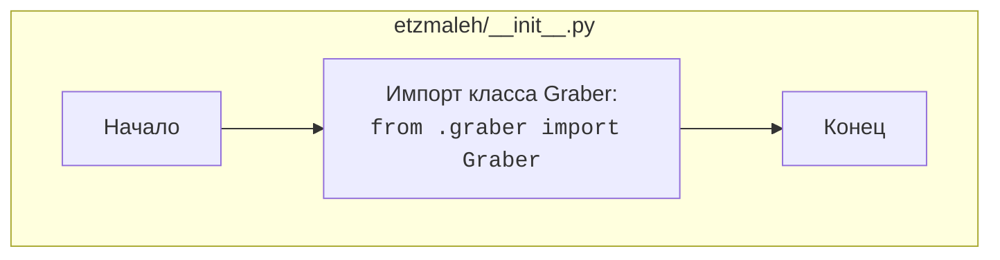

## Анализ кода `hypotez/src/suppliers/etzmaleh/__init__.py`

### <алгоритм>

1.  **Импорт `Graber`:**
    *   Импортируется класс `Graber` из модуля `graber`, находящегося в том же пакете `etzmaleh`.
    *   Пример: `from .graber import Graber` означает, что класс `Graber` можно использовать в этом файле, например, создав экземпляр `graber_instance = Graber()`.

### <mermaid>

### <объяснение>

-   **Импорты:**
    -   `from .graber import Graber`: Импортирует класс `Graber` из модуля `graber.py`, расположенного в той же директории `etzmaleh`. Это позволяет использовать класс `Graber` для создания экземпляров и вызова его методов.
-   **Классы:**
    -   В данном файле класс не определен. Но импортируется класс `Graber` из `graber.py`. Это предполагает, что класс `Graber` содержит основную логику для работы с поставщиком `etzmaleh`.
-   **Функции:**
    -   Функции в явном виде не определены. Но предполагается, что `Graber` содержит необходимые функции для работы с поставщиком.
-   **Переменные:**
    -   В явном виде переменные не определены. Но после импорта `Graber`, можно создать переменную типа Graber для работы с поставщиком `etzmaleh`. Например, `graber = Graber()`

**Цепочка взаимосвязей:**

-   Данный файл является точкой входа для пакета `etzmaleh`.
-   Он импортирует `Graber`, предполагая, что вся логика работы с поставщиком `etzmaleh` инкапсулирована в этом классе.
-   Предполагается что `graber.py` содержит функции  обработки данных от `etzmaleh`.
-   Другие части проекта могут использовать этот пакет, импортируя `Graber` из `src.suppliers.etzmaleh` и используя его методы для работы с поставщиком.