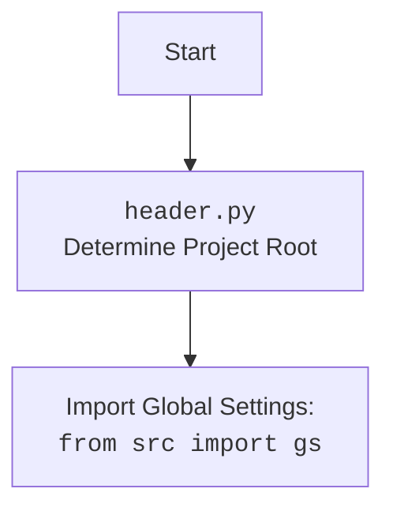

## Анализ кода `hypotez/src/suppliers/etzmaleh/header.py`

### <алгоритм>

1.  **`set_project_root(marker_files)`**:
    *   Начало: Определяется абсолютный путь к директории, в которой находится текущий файл (`__file__`).
    *   Пример: Если файл расположен в `/home/user/project/src/suppliers/etzmaleh/header.py`, то начальный путь будет `/home/user/project/src/suppliers/etzmaleh`.
    *   Поиск родительской директории: Последовательно перебираются родительские директории текущей директории.
    *   Пример: Родительские директории: `/home/user/project/src/suppliers`, `/home/user/project/src`, `/home/user/project`, `/home/user`, `/home`, `/`.
    *   Проверка наличия `marker_files`: Для каждой родительской директории проверяется, существует ли в ней хотя бы один файл или директория из `marker_files` (по умолчанию `__root__`).
        *   Пример: Если `marker_files = ('__root__', 'project.ini')`, то проверяется наличие `__root__` или `project.ini` в каждой родительской директории.
    *   Установка корневой директории: Если `marker_file` найден, текущая родительская директория устанавливается как корневая.
    *   Добавление в `sys.path`: Если корневая директория отсутствует в `sys.path`, она добавляется в начало списка.
    *   Возврат: Возвращается объект `Path`, представляющий корневую директорию.
2.  **Инициализация `__root__`**:
    *   Вызывается `set_project_root()`, возвращённый путь присваивается переменной `__root__`.
    *   Пример: `__root__` становится `/home/user/project` если файл `__root__` находится в папке `/home/user/project`.
3.  **Импорт `gs`**:
    *   Импортируется модуль `gs` из пакета `src`. Предполагается, что `gs` содержит глобальные настройки, в том числе пути к файлам.
4.  **Чтение `settings.json`**:
    *   Пытается открыть и прочитать файл `settings.json` из каталога `src`.
    *   Пример: Файл `settings.json` находится по пути `/home/user/project/src/settings.json`.
    *   Содержимое файла `json` загружается в переменную `settings` как словарь.
    *   Если возникает ошибка `FileNotFoundError` или `json.JSONDecodeError`, блок `try` пропускается.
5.  **Чтение `README.MD`**:
    *   Пытается открыть и прочитать файл `README.MD` из каталога `src`.
    *   Пример: Файл `README.MD` находится по пути `/home/user/project/src/README.MD`.
    *   Содержимое файла  загружается в переменную `doc_str`.
    *   Если возникает ошибка `FileNotFoundError` или `json.JSONDecodeError`, блок `try` пропускается.
6.  **Инициализация глобальных переменных**:
    *   `__project_name__`: Извлекается имя проекта из `settings` (ключ `project_name`), иначе по умолчанию `hypotez`.
    *   `__version__`: Извлекается версия проекта из `settings` (ключ `version`), иначе по умолчанию `''`.
    *   `__doc__`: Присваивается содержимое `doc_str`, если оно существует, иначе по умолчанию `''`.
    *   `__details__`: Инициализируется как пустая строка `''`.
    *   `__author__`: Извлекается автор проекта из `settings` (ключ `author`), иначе по умолчанию `''`.
    *   `__copyright__`: Извлекается авторское право из `settings` (ключ `copyrihgnt`), иначе по умолчанию `''`.
    *   `__cofee__`: Извлекается сообщение для кофе из `settings` (ключ `cofee`), иначе используется сообщение по умолчанию.

### <mermaid>
```mermaid
flowchart TD
    Start[Start] --> FindRoot[set_project_root<br>Find Project Root Directory]
    FindRoot -->  AddRootToSysPath{Add root directory to sys.path if it's not there?}
    AddRootToSysPath -- Yes --> ImportGS[Import Global Settings: <br><code>from src import gs</code>]
    AddRootToSysPath -- No --> ImportGS
    ImportGS --> LoadSettings[Load Settings from <br> <code>settings.json</code>]
    LoadSettings --> LoadDocString[Load doc string from <br> <code>README.MD</code>]
    LoadDocString --> InitGlobalVars[Initialize Global Variables<br>(project_name, version, doc, author, etc.)]
    InitGlobalVars --> End[End]

   style Start fill:#f9f,stroke:#333,stroke-width:2px
   style End fill:#ccf,stroke:#333,stroke-width:2px
    
```


### <объяснение>

**Импорты:**

*   `sys`: Предоставляет доступ к системным переменным и функциям, используется для добавления пути к корневой директории в `sys.path`.
*   `json`: Используется для работы с файлами JSON (чтение настроек).
*   `packaging.version.Version`: Используется для работы с версиями (не используется в этом коде, но импортирован)
*   `pathlib.Path`: Используется для работы с путями к файлам и директориям.
*   `src.gs`: Импортирует модуль `gs` из пакета `src`. `gs` содержит общие настройки и переменные проекта, включая путь к корневой директории и другим ресурсам.

**Функции:**

*   **`set_project_root(marker_files: tuple = ('__root__', )) -> Path`**:
    *   **Аргументы**:
        *   `marker_files`: кортеж имен файлов или директорий, которые используются для определения корневой директории проекта. По умолчанию `('__root__',)`.
    *   **Возвращает**: Объект `Path`, представляющий абсолютный путь к корневой директории проекта.
    *   **Назначение**: Определяет корневую директорию проекта, поднимаясь по родительским директориям, пока не найдет один из `marker_files`.
    *   **Пример**: Если структура директорий:
        ```
        project/
            __root__
            src/
                suppliers/
                    etzmaleh/
                        header.py
        ```
        Вызов `set_project_root()` в `header.py` вернет `Path('/path/to/project')`.

**Переменные:**

*   `__root__`: Объект `Path`, представляющий корневую директорию проекта.
*   `settings`: Словарь, содержащий настройки проекта, загруженные из файла `settings.json`. Может быть `None`, если файл не найден или не может быть декодирован.
*   `doc_str`: Строка, содержащая содержимое файла `README.MD`. Может быть `None`, если файл не найден.
*   `__project_name__`: Строка, содержащая имя проекта, по умолчанию `hypotez`.
*   `__version__`: Строка, содержащая версию проекта, по умолчанию `''`.
*   `__doc__`: Строка, содержащая документацию проекта, по умолчанию `''`.
*    `__details__`: Строка, для дополнительных деталей, по умолчанию `''`.
*   `__author__`: Строка, содержащая имя автора проекта, по умолчанию `''`.
*   `__copyright__`: Строка, содержащая информацию об авторских правах, по умолчанию `''`.
*   `__cofee__`: Строка, содержащая сообщение о возможности поддержки разработчика, со ссылкой.

**Объяснение:**

Файл `header.py` играет ключевую роль в определении контекста проекта. Он определяет корневую директорию и загружает основные настройки, а так же документацию.
*   **Определение корневой директории**: Функция `set_project_root` ищет корневую директорию, поднимаясь по родительским директориям. Это позволяет запускать скрипты из любой точки проекта. Корневая директория добавляется в `sys.path`, что позволяет импортировать модули из других частей проекта, без необходимости указывать абсолютные пути.
*   **Загрузка настроек**: Файл `settings.json` загружается для получения настроек проекта, таких как имя, версия, автор и т.д. Эти настройки используются для инициализации глобальных переменных.
*   **Загрузка документации**: Из файла `README.MD` загружается документация проекта.
*   **Глобальные переменные**: Переменные с двойным подчеркиванием в начале и конце `__variable__` являются глобальными для модуля и могут использоваться в других модулях проекта.

**Взаимосвязь с другими частями проекта:**

*   Файл `header.py` является центральным для настройки проекта.
*   Он используется в других модулях для доступа к корневой директории, настройкам и глобальным переменным.
*   Модуль `src.gs` предоставляет доступ к общим настройкам, определенным в файле `settings.json` и используется в других частях проекта для доступа к этим настройкам.

**Потенциальные ошибки и области для улучшения:**

*   **Обработка ошибок**: Если файлы `settings.json` или `README.MD` не найдены, переменные `settings` и `doc_str` остаются `None`, что может привести к ошибкам в других частях проекта, где они используются. Можно добавить логику по умолчанию или обработку ошибок.
*   **Жесткая привязка к структуре директорий**: Поиск `settings.json` и `README.MD`  ведется по фиксированному пути `src/settings.json`, что может быть неудобно, если структура проекта изменится.
*   **Использование `...` в `except` блоке**: Использование `...` в `except` блоке может скрыть ошибки, лучше использовать `pass` или логирование ошибок.
*    **Отсутствие явной типизации**:  Стоит добавить явную типизацию для переменных `__project_name__` , `__version__` , `__doc__` , `__details__`, `__author__`, `__copyright__`, `__cofee__`.

**Цепочка взаимосвязей с другими частями проекта:**

1.  `header.py` определяет корневую директорию и добавляет её в `sys.path`.
2.  Импортирует `src.gs`, чтобы использовать глобальные переменные, такие как пути.
3.  Считывает настройки из `settings.json` и инициализирует глобальные переменные, которые используются другими модулями проекта.
4.  Читает документацию проекта `README.MD`.
5.  Другие модули импортируют переменные из `header.py` для доступа к общим настройкам и данным.