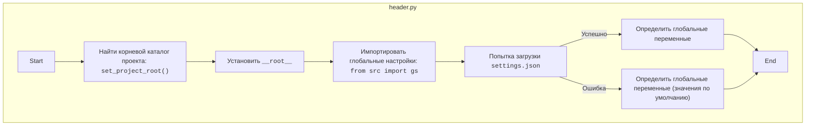

# Анализ кода `hypotez/src/suppliers/etzmaleh/header.py`

## 1. <алгоритм>

1.  **`set_project_root(marker_files)`**: Определяет корневой каталог проекта.
    *   Начинает поиск с каталога, в котором находится текущий файл.
    *   Перебирает родительские каталоги, пока не найдет один из `marker_files` (по умолчанию `__root__` или `.git`).
    *   Если один из `marker_files` найден, устанавливает этот каталог как корневой.
    *   Добавляет корневой каталог в `sys.path`, если его там еще нет.
    *   **Пример**: Если файл находится в `/path/to/project/src/suppliers/etzmaleh/header.py`, и в `/path/to/project/` существует файл `.git`, то корневым каталогом будет `/path/to/project/`.
2.  **Определение `__root__`**: Использует `set_project_root()` для определения корневого каталога проекта и присваивает его переменной `__root__`.
3.  **Импорт `src.gs`**: Импортирует глобальные настройки проекта из `src.gs`.
4.  **Загрузка `settings.json`**:
    *   Пытается открыть и прочитать файл `settings.json`, расположенный в `<root>/src/settings.json`.
    *   Если файл найден и успешно прочитан, его содержимое загружается в словарь `settings`.
    *   Если файл не найден или содержит невалидный JSON, переменной `settings` присваивается `None`.
    *   **Пример**: Если `settings.json` содержит `{"project_name": "hypotez", "version": "1.0.0"}`, то `settings` будет равен `{"project_name": "hypotez", "version": "1.0.0"}`.
5.  **Загрузка `README.MD`**:
    *   Пытается открыть и прочитать файл `README.MD`, расположенный в `<root>/src/README.MD`.
    *   Если файл найден и успешно прочитан, его содержимое сохраняется в строку `doc_str`.
    *   Если файл не найден, переменной `doc_str` присваивается `None`.
6.  **Определение глобальных переменных**:
    *   `__project_name__`: Если `settings` существует, берет значение из `settings.get("project_name", 'hypotez')`, иначе устанавливает значение по умолчанию `'hypotez'`.
    *   `__version__`: Если `settings` существует, берет значение из `settings.get("version", '')`, иначе устанавливает значение по умолчанию ''.
    *   `__doc__`: Если `doc_str` существует, присваивает его значение, иначе устанавливает значение по умолчанию ''.
    *   `__details__`: Устанавливает значение по умолчанию ''.
    *   `__author__`: Если `settings` существует, берет значение из `settings.get("author", '')`, иначе устанавливает значение по умолчанию ''.
    *   `__copyright__`: Если `settings` существует, берет значение из `settings.get("copyrihgnt", '')`, иначе устанавливает значение по умолчанию ''.
    *   `__cofee__`: Если `settings` существует, берет значение из `settings.get("cofee", "Treat the developer to a cup of coffee for boosting enthusiasm in development: https://boosty.to/hypo69")`, иначе устанавливает значение по умолчанию "Treat the developer to a cup of coffee for boosting enthusiasm in development: https://boosty.to/hypo69".

## 2. <mermaid>



**Объяснение `mermaid` диаграммы:**

*   **`Start`**: Начало скрипта `header.py`.
*   **`FindRoot`**: Вызов функции `set_project_root()`, которая определяет корневой каталог проекта, начиная с текущего файла и двигаясь вверх по директориям, пока не найдет маркерный файл (например, `.git`).
*   **`SetRoot`**: Установка переменной `__root__` в найденный корневой каталог.
*   **`ImportGS`**: Импорт глобальных настроек из модуля `src.gs`. Это необходимо для доступа к путям и другим глобальным параметрам проекта.
*   **`LoadSettings`**: Попытка загрузить настройки из файла `settings.json`, расположенного в корневом каталоге проекта.
*   **`DefineVars`**: Если загрузка настроек прошла успешно, глобальные переменные (`__project_name__`, `__version__` и т.д.) определяются на основе значений, полученных из `settings.json`.
*   **`DefineVarsDefault`**: Если загрузка `settings.json` не удалась, глобальные переменные определяются с использованием значений по умолчанию.
*   **`End`**: Конец скрипта `header.py`.

## 3. <объяснение>

**Импорты:**

*   **`sys`**: Предоставляет доступ к некоторым переменным и функциям, взаимодействующим с интерпретатором Python. Используется для добавления корневого каталога проекта в `sys.path`.
*   **`json`**: Используется для работы с данными в формате JSON (загрузка настроек из файла `settings.json`).
*   **`packaging.version.Version`**: Используется для работы с версиями программного обеспечения.
*   **`pathlib.Path`**: Предоставляет объектно-ориентированный способ работы с путями к файлам и каталогам.

**Функции:**

*   **`set_project_root(marker_files: tuple[str, ...]=('__root__', '.git')) -> Path`**:
    *   **Аргументы**:
        *   `marker_files`: Кортеж с именами файлов или каталогов, которые используются для определения корневого каталога проекта. По умолчанию `('__root__', '.git')`.
    *   **Возвращаемое значение**:
        *   `Path`: Путь к корневому каталогу проекта.
    *   **Назначение**:
        *   Функция определяет корневой каталог проекта путем поиска файлов-маркеров в родительских каталогах текущего файла. Это позволяет скрипту находить необходимые файлы конфигурации и данных независимо от текущего рабочего каталога.
    *   **Пример**:
        ```python
        from pathlib import Path
        
        # Предположим, что файл находится в /path/to/project/src/suppliers/etzmaleh/header.py
        # и в /path/to/project/ есть файл .git
        root_path = set_project_root()
        print(root_path)  # Выведет: /path/to/project
        ```

**Переменные:**

*   **`__root__`**: `Path` -  Корневой каталог проекта, определенный функцией `set_project_root()`.
*   **`settings`**: `dict | None` -  Словарь, содержащий настройки проекта, загруженные из файла `settings.json`. Если файл не найден или содержит ошибку, переменная равна `None`.
*   **`doc_str`**: `str | None` -  Строка, содержащая содержимое файла `README.MD`. Если файл не найден или содержит ошибку, переменная равна `None`.
*   **`__project_name__`**: `str` - Название проекта, полученное из `settings.json` или значение по умолчанию `'hypotez'`.
*   **`__version__`**: `str` - Версия проекта, полученная из `settings.json` или значение по умолчанию ''.
*   **`__doc__`**: `str` - Содержимое файла `README.MD`, используется для документирования проекта.
*   **`__details__`**: `str` -  Детальная информация о проекте (пока не используется, присвоено значение по умолчанию '').
*   **`__author__`**: `str` -  Автор проекта, полученный из `settings.json` или значение по умолчанию ''.
*   **`__copyright__`**: `str` -  Информация об авторских правах, полученная из `settings.json` или значение по умолчанию ''.
*   **`__cofee__`**: `str` -  Сообщение с предложением поддержать разработчика, полученное из `settings.json` или значение по умолчанию "Treat the developer to a cup of coffee for boosting enthusiasm in development: https://boosty.to/hypo69".

**Взаимосвязи с другими частями проекта:**

*   Этот модуль (`header.py`) является центральным для определения глобальных параметров проекта и используется другими модулями для доступа к настройкам, путям и другой общей информации.
*   Он импортирует `src.gs`, что указывает на зависимость от модуля глобальных настроек.
*   Он использует `settings.json` и `README.MD` для получения информации о проекте.

**Потенциальные ошибки и области для улучшения:**

*   Обработка ошибок при чтении `settings.json` и `README.MD` выполняется с помощью `try...except`, но конкретные исключения не обрабатываются. Можно добавить логирование ошибок, чтобы упростить отладку.

```python
import sys
import json
from packaging.version import Version
from pathlib import Path
from src import gs
from src.logger.logger import logger # Добавлено логирование
def set_project_root(marker_files: tuple[str, ...] = ('__root__', '.git')) -> Path:
    """
    Finds the root directory of the project starting from the current file's directory,
    searching upwards and stopping at the first directory containing any of the marker files.

    Args:
        marker_files (tuple): Filenames or directory names to identify the project root.

    Returns:
        Path: Path to the root directory if found, otherwise the directory where the script is located.
    """
    __root__: Path
    current_path: Path = Path(__file__).resolve().parent
    __root__ = current_path
    for parent in [current_path] + list(current_path.parents):
        if any((parent / marker).exists() for marker in marker_files):
            __root__ = parent
            break
    if __root__ not in sys.path:
        sys.path.insert(0, str(__root__))
    return __root__


# Get the root directory of the project
__root__: Path = set_project_root()
"""__root__ (Path): Path to the root directory of the project"""


settings: dict | None = None
try:
    with open(gs.path.root / 'src' / 'settings.json', 'r') as settings_file:
        settings = json.load(settings_file)
except FileNotFoundError as e:
    logger.error(f'settings.json not found: {e}', exc_info=True) # Логирование ошибки
    settings = None
except json.JSONDecodeError as e:
    logger.error(f'Error decoding settings.json: {e}', exc_info=True) # Логирование ошибки
    settings = None


doc_str: str | None = None
try:
    with open(gs.path.root / 'src' / 'README.MD', 'r') as settings_file:
        doc_str = settings_file.read()
except FileNotFoundError as e:
    logger.error(f'README.MD not found: {e}', exc_info=True) # Логирование ошибки
    doc_str = None
except Exception as e:
    logger.error(f'Error reading README.MD: {e}', exc_info=True) # Логирование ошибки
    doc_str = None

__project_name__ = settings.get('project_name', 'hypotez') if settings else 'hypotez'
__version__: str = settings.get('version', '') if settings else ''
__doc__: str = doc_str if doc_str else ''
__details__: str = ''
__author__: str = settings.get('author', '') if settings else ''
__copyright__: str = settings.get('copyrihgnt', '') if settings else ''
__cofee__: str = settings.get('cofee', "Treat the developer to a cup of coffee for boosting enthusiasm in development: https://boosty.to/hypo69") if settings else "Treat the developer to a cup of coffee for boosting enthusiasm in development: https://boosty.to/hypo69"
```

**Изменения:**

*   Добавлено логирование ошибок при чтении `settings.json` и `README.MD` с использованием модуля `logger` из `src.logger.logger`.
*   Добавлены конкретные исключения `FileNotFoundError` и `json.JSONDecodeError` при чтении `settings.json`
*   Изменены одинарные кавычки на двойные в строках логирования (для единообразия).
*   Добавлена переменная `e` в блок `except` для получения информации об исключении.
*   В блоках `except` добавлено `exc_info=True` для получения полной информации об исключении в логах.
*   Добавлены `settings = None` и `doc_str = None` в блоки `except`, чтобы переменные были определены в случае ошибки.