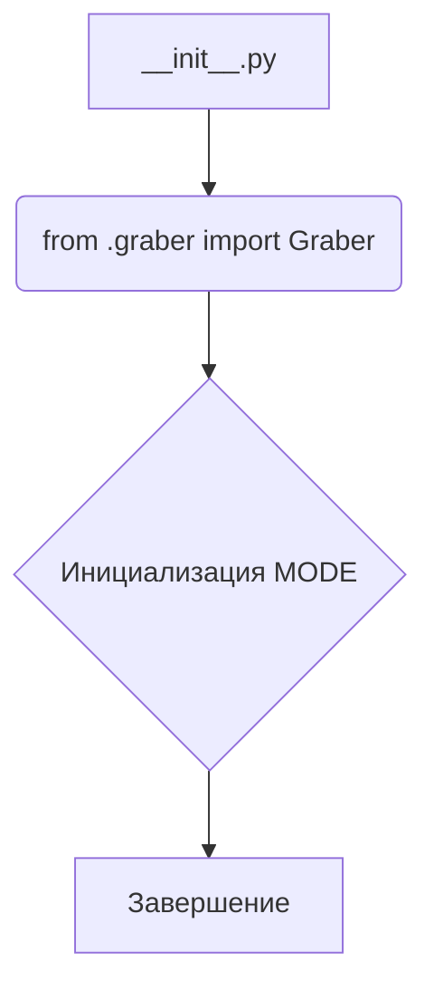
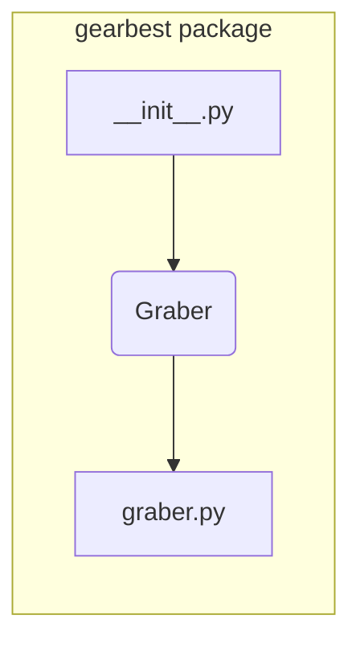

# <input code>

```python
## \file hypotez/src/suppliers/gearbest/__init__.py
# -*- coding: utf-8 -*-
#! venv/Scripts/python.exe
#! venv/bin/python/python3.12

"""
.. module: src.suppliers.gearbest 
	:platform: Windows, Unix
	:synopsis:

"""
MODE = 'dev'


from .graber import Graber
```

# <algorithm>



**Описание алгоритма:**

Модуль `__init__.py` - это инициализационный файл для пакета `gearbest`. Он выполняет только один шаг: импортирует класс `Graber` из модуля `graber.py` внутри той же папки.  Переменная `MODE`  инициализируется значением 'dev'.  Далее выполняется завершение.


# <mermaid>



**Объяснение диаграммы:**

Диаграмма показывает, что модуль `__init__.py` импортирует класс `Graber` из модуля `graber.py`, который является частью пакета `gearbest`.  Это стандартная структура пакета Python.


# <explanation>

**Импорты:**

- `from .graber import Graber`:  Этот импорт извлекает класс `Graber` из модуля `graber.py`, который находится в той же директории (`./graber.py`).  Это позволяет использовать класс `Graber` в файле `__init__.py`.  Важно, что это импорт внутри пакета, используя `.` для обозначения текущего пакета. Это ключевая особенность пакета Python, позволяющая импортировать модули из вложенных директорий.

**Классы:**

- `Graber`:  Этот класс (определенный в файле `graber.py`)  представляет функциональность сбора данных с GearBest.  Без дополнительного кода, мы не можем знать все детали, но он, вероятно, содержит методы для получения данных (например, цены, описания продуктов).  Подробнее о его реализации можно узнать из файла `graber.py`.

**Функции:**

В `__init__.py` нет функций. Этот файл служит для инициализации пакета.

**Переменные:**

- `MODE`:  Строковая переменная, которая, вероятно, определяет режим работы (например, 'dev' для разработки, 'prod' для производства).  Её значение используется в других частях приложения и может влиять на поведение.

**Возможные ошибки или области для улучшений:**

- Нет обработки ошибок.  Если файл `graber.py` отсутствует или содержит ошибки, то интерпретатор выдаст ошибку при выполнении `__init__.py`.  Стоит добавить проверку наличия файла и класса `Graber`, и обрабатывать возможные исключения.


**Цепочка взаимосвязей:**

Файл `__init__.py` выступает в качестве точки входа для взаимодействия с классом `Graber`. Код, который использует функциональность GearBest, скорее всего, будет импортировать класс `Graber` из пакета `gearbest`, что создает связь между модулями.  Далее, `Graber` взаимодействует с внешними сервисами (сайтом GearBest) для получения данных.  Без дополнительных сведений о реализации `Graber`, сложно сказать, какие другие части проекта с ним взаимодействуют.