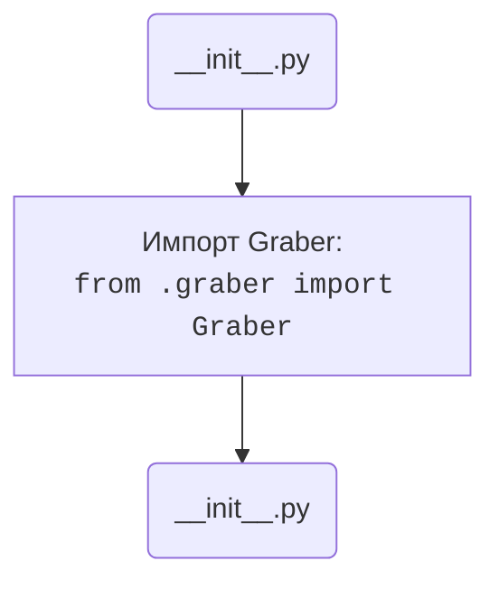

## АНАЛИЗ КОДА: `hypotez/src/suppliers/gearbest/__init__.py`

### <алгоритм>

1. **Начало**: Исполнение скрипта `__init__.py` начинается.
2. **Импорт**: Выполняется импорт класса `Graber` из модуля `graber.py`, расположенного в той же директории (`.`).
   - Пример: `from .graber import Graber` импортирует класс `Graber`, чтобы он стал доступным в текущем модуле (`gearbest`).
3. **Конец**: Исполнение скрипта завершается, делая доступным класс `Graber` для использования в других частях проекта.

### <mermaid>



**Объяснение `mermaid`:**

- `Start(__init__.py)`: Начало выполнения скрипта `__init__.py`.
- `ImportGraber`: Импорт класса `Graber` из модуля `graber.py`, который расположен в той же директории (относительный импорт `from .graber import Graber`). 
- `End(__init__.py)`: Завершение выполнения скрипта `__init__.py`.

### <объяснение>

**Общее:**

Файл `__init__.py` в Python делает директорию `gearbest` пакетом. Это означает, что можно импортировать модули и классы из этой директории, используя точку (`.`) как обозначение текущей директории. В данном случае, он импортирует класс `Graber` из файла `graber.py`, делая его доступным для использования при импорте пакета `gearbest`.

**Импорты:**

- `from .graber import Graber`:
   - `from .graber`: Относительный импорт модуля `graber.py`, который находится в той же директории, что и `__init__.py`. Точка (`.`) означает текущую директорию.
   - `import Graber`: Импортирует класс `Graber` из `graber.py`. Этот класс, вероятно, содержит логику для сбора данных с сайта Gearbest.

   **Взаимосвязь с другими пакетами:**

   - Данный код является частью пакета `suppliers`, что говорит о том, что он предназначен для работы с различными поставщиками. Пакет `gearbest` представляет собой один из таких поставщиков.
   - Класс `Graber` может зависеть от других модулей в пакете `src`. Например, он может использовать:
     - Модули для работы с сетью (например, `requests`).
     - Модули для парсинга HTML (например, `BeautifulSoup`).
     - Модули для хранения данных (например, работа с базами данных).
   - Взаимодействие с другими частями проекта происходит, когда другие модули проекта импортируют `gearbest` и используют его класс `Graber` для сбора данных.

**Классы:**

- `Graber`:
   -  Класс `Graber` не определен в этом файле. Он импортируется из `graber.py`, значит класс `Graber` отвечает за скраппинг данных с веб-сайта Gearbest. Он, вероятно, содержит методы для:
        - Загрузки страниц веб-сайта.
        - Извлечения нужных данных (цены, описания, т.д.).
        - Обработки ошибок при загрузке или парсинге страниц.

**Функции:**

- В этом коде нет функций.

**Переменные:**

- В этом коде нет переменных.

**Потенциальные ошибки и области для улучшения:**

- **Отсутствие документации**: В самом файле `__init__.py` нет никакой документации о том, как использовать этот пакет. Это может быть проблемой для новых разработчиков.
- **Зависимости**: Важно убедиться, что все необходимые зависимости (например, `requests`, `BeautifulSoup`) установлены, если они используются в модуле `graber.py`.
- **Обработка ошибок**: Важно тщательно обрабатывать ошибки при работе с внешним веб-сайтом, чтобы приложение не падало и могло восстановиться после сбоев.

**Цепочка взаимосвязей:**

1. Модули, которые работают с поставщиками, используют пакет `gearbest`.
2. Пакет `gearbest` предоставляет класс `Graber` для сбора данных.
3. Класс `Graber` может взаимодействовать с другими модулями из пакета `src`, такими как модули для работы с сетью, парсинга HTML, и хранения данных.

**Пример использования:**

```python
# Где-то в другом модуле проекта
from src.suppliers.gearbest import Graber

graber = Graber()
data = graber.grab_data() # метод grab_data в graber.py
print(data)
```

В этом примере, импортируется класс `Graber` из пакета `gearbest` и затем создается экземпляр этого класса.  Потом вызывается его метод `grab_data()`, который выполняет сбор данных с сайта Gearbest.