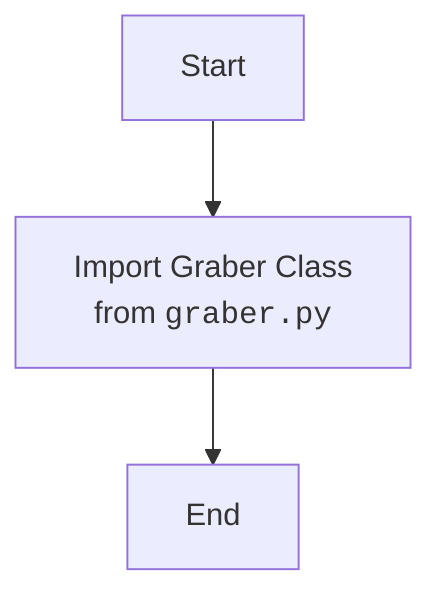

## Анализ кода `hypotez/src/suppliers/gearbest/__init__.py`

### <алгоритм>

1.  **Импорт `Graber`:**
    *   Начало: Запускается процесс импорта.
    *   Пример: `from .graber import Graber`.
    *   Результат: Класс `Graber` становится доступным в текущем модуле.
    *   Поток данных: Модуль `__init__.py` получает доступ к функциональности, определенной в `graber.py`.
2. **Конец**: Завершение импорта.

### <mermaid>

### <объяснение>

**Импорты:**

*   `from .graber import Graber`: Этот импорт означает, что из модуля `graber.py`, находящегося в той же директории (`.`) что и `__init__.py`, импортируется класс `Graber`.

    *   `src.suppliers.gearbest` - это пакет, в котором находится `__init__.py` и `graber.py`.
    *   `graber.py` предположительно содержит логику для сбора данных с веб-сайта GearBest.

**Классы:**

*   `Graber`: Это класс, который вероятно предназначен для извлечения данных с сайта Gearbest. Он импортируется, но не используется напрямую в `__init__.py`. Его функциональность будет использоваться в других модулях, которые импортируют `gearbest`.

**Функции:**

*   В данном файле функции не определены.

**Переменные:**

*   В данном файле нет переменных.

**Цепочка взаимосвязей:**

1.  `__init__.py` является частью пакета `src.suppliers.gearbest`.
2.  `__init__.py` импортирует класс `Graber` из `graber.py`, делая его доступным для использования в других частях проекта, которые импортируют `gearbest`.
3.  Предполагается, что класс `Graber` будет использоваться для извлечения и обработки данных о товарах с сайта Gearbest.

**Потенциальные ошибки и области для улучшения:**

1.  **Отсутствие документации:**  Не хватает Docstring внутри файла для более детального описания его функционала.
2.  **Неявная связь:** Функциональность `Graber` не используется явно в `__init__.py`. Это может сделать код менее очевидным для понимания.
3.  **Зависимость от структуры:** Код зависит от структуры пакета, что потенциально усложнит его рефакторинг.

**Общее заключение:**

Файл `__init__.py` является точкой входа для пакета `src.suppliers.gearbest`. Он импортирует класс `Graber` из `graber.py`, делая его доступным для использования в других модулях. Прямой функциональности данный файл не содержит, он служит в качестве точки доступа к модулям внутри пакета `gearbest`.