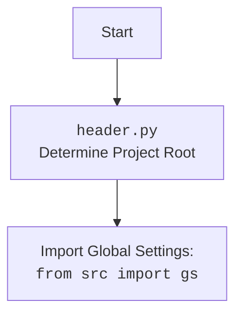

## Анализ кода `hypotez/src/suppliers/gearbest/graber.py`

### 1. **<алгоритм>**

1.  **Импорт модулей:**
    *   Импортируются необходимые модули, такие как `typing`, `header`, `src.suppliers.graber`, `src.webdriver.driver`, и `src.logger.logger`.
2.  **Определение декоратора (закомментировано):**
    *   Определяется (но закомментировано) функция `close_pop_up`, которая является декоратором для закрытия всплывающих окон.
    *   В декораторе, внутри `wrapper` осуществляется попытка выполнения локатора, который отвечает за закрытие всплывающего окна, и в случае ошибки, ошибка записывается в лог.
    *   Декоратор обертывает основную функцию, гарантируя что сначала выполнится закрытие всплывающего окна (если это настроено), а затем функция.
3.  **Определение класса `Graber`:**
    *   Создается класс `Graber`, наследующийся от `Graber` (переименован в `Grbr`) из `src.suppliers.graber`.
    *   Инициализация класса:
        *   Устанавливается префикс поставщика (`supplier_prefix`) как `etzmaleh`.
        *   Вызывается конструктор родительского класса `Grbr` с установленным префиксом и драйвером.
        *   Инициализируется `Context.locator_for_decorator` значением `None`.

**Примеры:**

*   **Импорт модулей:**
    *   `from src.webdriver.driver import Driver`: Импортируется класс `Driver` для управления веб-драйвером.
    *   `import header`: Импортируется модуль `header`, который, вероятно, содержит логику для определения корня проекта.
*   **Инициализация `Graber`:**
    *   `self.supplier_prefix = 'etzmaleh'`:  Устанавливает префикс поставщика для использования в дальнейшем.
    *   `super().__init__(supplier_prefix=self.supplier_prefix, driver=driver)`: Вызывает конструктор родительского класса `Graber`, передавая префикс поставщика и драйвер.
*   **Декоратор:**
    *   Хотя декоратор закомментирован, его использование можно представить как: `@close_pop_up` перед любой функцией класса.
    *   Пример использования: `@close_pop_up()` async def grab_data(...)`.
    *   Вызов `Context.driver.execute_locator(Context.locator.close_pop_up)` пытается закрыть всплывающее окно до вызова основной функции.

### 2. **<mermaid>**

```mermaid
flowchart TD
    Start --> ImportModules[Импорт модулей: <br><code>typing</code>, <code>header</code>,<br><code>src.suppliers.graber</code>, <br><code>src.webdriver.driver</code>, <br><code>src.logger.logger</code> ]
    ImportModules --> DefineGraberClass[Определение класса <code>Graber</code>]
    DefineGraberClass --> InitGraber[Инициализация <code>Graber</code>: <br> Установка <code>supplier_prefix</code>, <br> Вызов конструктора родителя <br>Установка <code>Context.locator_for_decorator = None</code>]
   
    
   subgraph Декоратор close_pop_up (закомментирован)
    
       
     
        DefineDecorator[Определение функции декоратора <code>close_pop_up</code>]
        DefineDecorator --> Wrapper[Определение функции обертки <code>wrapper</code>]
        Wrapper --> TryExecuteLocator[Попытка выполнения локатора закрытия всплывающего окна: <br> <code>Context.driver.execute_locator(Context.locator.close_pop_up)</code>]
        TryExecuteLocator --> ErrorHandling[Обработка ошибки локатора, запись в лог]
        ErrorHandling --> CallFunction[Вызов основной функции с помощью <code>await func(*args, **kwargs)</code>]
        CallFunction --> EndDecorator
     
        EndDecorator --> EndSubgraph
    
    end
    InitGraber --> End[Конец]
    
     
        

  
  
```



**Объяснение:**

*   **Start**: Начало выполнения скрипта.
*   **ImportModules**: Импорт необходимых модулей и пакетов для работы.
*   **DefineGraberClass**: Определение класса `Graber`, который наследует функциональность от `Graber` (переименованного в `Grbr`).
*   **InitGraber**: Инициализация экземпляра класса `Graber`, установка префикса поставщика и вызов конструктора родительского класса. Также устанавливает значение `None` для  `Context.locator_for_decorator`.
*   **DefineDecorator**: Определение функции декоратора `close_pop_up` (закомментировано).
*   **Wrapper**: Определение обертки для функции, к которой применяется декоратор.
*   **TryExecuteLocator**: Попытка выполнения локатора, который должен закрыть всплывающее окно.
*   **ErrorHandling**: Обработка возможных ошибок при выполнении локатора.
*   **CallFunction**: Вызов основной функции, обернутой декоратором.
*   **End**: Конец выполнения.
* **Header**: определение корневой директории проекта
* **import**: импорт глобальных настроек из src.gs

**Зависимости:**

*   **`typing`**: Используется для аннотации типов.
*   **`header`**: Используется для определения корня проекта.
*  **`src.suppliers.graber`**: Предоставляет базовый класс `Graber` (переименован в `Grbr`) для сбора данных.
*   **`src.webdriver.driver`**:  Содержит класс `Driver` для управления веб-драйвером.
*   **`src.logger.logger`**: Предоставляет функциональность для логирования.

### 3. **<объяснение>**

*   **Импорты:**
    *   `from typing import Any`: Импортирует `Any` для аннотации типов, позволяя принимать значения любого типа.
    *   `import header`: Импортирует модуль `header`, который, вероятно, используется для определения корневой директории проекта и импорта глобальных настроек.
    *   `from src.suppliers.graber import Graber as Grbr, Context, close_pop_up`: Импортирует класс `Graber` (переименован в `Grbr`), `Context` и функцию `close_pop_up` из `src.suppliers.graber`. `Context`, вероятно, используется для хранения глобальных настроек или контекста выполнения.
    *   `from src.webdriver.driver import Driver`: Импортирует класс `Driver` из `src.webdriver.driver`, который отвечает за управление веб-драйвером.
    *   `from src.logger.logger import logger`: Импортирует объект `logger` из `src.logger.logger`, который используется для логирования.
*   **Классы:**
    *   `class Graber(Grbr)`:
        *   **Роль:** Наследует функциональность класса `Graber` (переименован в `Grbr`) из `src.suppliers.graber` и реализует специфичные для поставщика `gearbest` методы.
        *   **Атрибуты:**
            *   `supplier_prefix: str`: Префикс поставщика, `etzmaleh` в данном случае, используется для идентификации поставщика.
        *   **Методы:**
            *   `__init__(self, driver: Driver)`: Конструктор класса. Принимает объект `Driver` в качестве аргумента. Устанавливает `supplier_prefix`, вызывает конструктор родительского класса и устанавливает `Context.locator_for_decorator` в `None`.
        *   **Взаимодействие:** Наследуется от класса `Grbr` и использует объекты `Driver` и `Context`.
*   **Функции:**
    *   `close_pop_up`:
        *   **Аргументы:** `value: Any = None` - дополнительное значение для декоратора.
        *   **Возвращаемое значение:** Функция декоратор.
        *   **Назначение:** Закомментированный декоратор, который должен закрывать всплывающие окна перед выполнением основной функции.
        *   **Пример:**  Хотя закомментирован, мог бы использоваться как `@close_pop_up()` перед любым методом класса для автоматического закрытия всплывающих окон.
*   **Переменные:**
    *   `supplier_prefix`: Строка, хранящая префикс поставщика, используется в конструкторе.
    * `Context.locator_for_decorator`: Используется для передачи локатора в декоратор.
*   **Потенциальные ошибки и области для улучшения:**
    *   Декоратор `close_pop_up` закомментирован, что может означать, что эта функциональность не используется или еще не реализована. Если необходимо закрывать всплывающие окна, нужно раскомментировать код декоратора и правильно настроить локаторы.
    *  В коде не определено как именно используются `Context` и `locator`. Это может сделать код более сложным для понимания и дальнейшей разработки. 
    *  Обработка ошибок в `wrapper` декоратора  записывает ошибку в лог, но не останавливает выполнение, что может привести к непредсказуемому поведению. Возможно, стоит пересмотреть логику обработки ошибок.
    *   Необходимо реализовать другие методы сбора данных, например `grab_price()` и другие, в соответствии с родителем и потребностями проекта.

**Взаимосвязи с другими частями проекта:**

*   **`src.suppliers.graber`:** Используется как базовый класс для `Graber`, предоставляя общую логику сбора данных.
*   **`src.webdriver.driver`:** Используется для управления веб-драйвером, который необходим для взаимодействия с веб-страницами.
*   **`src.logger.logger`:** Используется для логирования ошибок и другой информации, что помогает в отладке и мониторинге приложения.
*   **`header.py`**: используется для определения корня проекта, и является основой для последующих импортов.
*   **`src.gs`**: импортирует глобальные настройки, что влияет на общее поведение приложения.

Этот анализ предоставляет полное представление о функциональности и структуре данного файла, выявляя его зависимости и возможные улучшения.