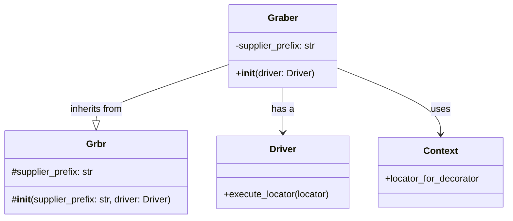
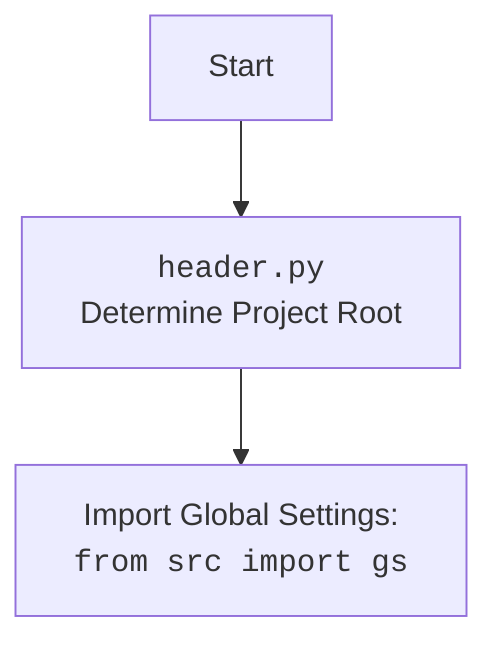

## АНАЛИЗ КОДА: `hypotez/src/suppliers/gearbest/graber.py`

### 1. <алгоритм>

**Блок-схема:**

```mermaid
graph LR
    A[Начало: Инициализация класса Graber] --> B{Создание экземпляра класса `Graber`}
    B --> C[Установка `supplier_prefix` в "etzmaleh"]
    C --> D[Вызов `__init__` родительского класса `Graber` (`src.suppliers.graber.Graber`)]
    D --> E[Инициализация `Context.locator_for_decorator` в `None`]
    E --> F[Конец: Класс Graber инициализирован]
   
    style A fill:#f9f,stroke:#333,stroke-width:2px
    style F fill:#f9f,stroke:#333,stroke-width:2px
    
```

**Пояснения:**

1.  **Начало**: Инициируется процесс создания экземпляра класса `Graber`.
2.  **Создание экземпляра класса `Graber`**:  Создается объект класса `Graber`, определённого в текущем файле.
3.  **Установка `supplier_prefix`**: Атрибут экземпляра `supplier_prefix` устанавливается равным `"etzmaleh"`. Это строка, идентифицирующая поставщика.
4.  **Вызов `__init__` родительского класса**: Вызывается конструктор родительского класса `Graber` (наследуется из `src.suppliers.graber.Graber`), передавая ему `supplier_prefix` и объект драйвера браузера. Этот шаг инициализирует основные параметры и настройки для сбора данных.
5. **Инициализация `Context.locator_for_decorator`**: Устанавливается значение `None` для `Context.locator_for_decorator`, что отключает выполнение декоратора по умолчанию.
6.  **Конец**: Объект класса `Graber` успешно инициализирован и готов к работе.

### 2. <mermaid>





**Объяснение зависимостей:**

*   **`class Graber`**: Класс, определенный в файле `graber.py`, который наследует от класса `Grbr`. Он отвечает за сбор данных с сайта `gearbest.com`.
    *   `supplier_prefix`: Строка, идентифицирующая поставщика (в данном случае "etzmaleh").
    *   `__init__(driver: Driver)`: Метод инициализации класса, принимает объект драйвера браузера (`Driver`).
*   **`class Grbr`**: Родительский класс, определенный в `src.suppliers.graber.py`, предоставляющий общую функциональность для грабберов.
    *   `supplier_prefix`: Строка, идентифицирующая поставщика.
    *   `__init__(supplier_prefix: str, driver: Driver)`: Метод инициализации родительского класса.
*   **`class Driver`**: Класс из `src.webdriver.driver.py`, представляющий драйвер браузера для взаимодействия с веб-страницами.
    *   `execute_locator(locator)`: Метод для выполнения локаторов, например, для закрытия всплывающих окон.
*   **`class Context`**: Класс из `src.suppliers.graber.py`, используемый для хранения глобального контекста, в том числе декораторов.
    *   `locator_for_decorator`: Атрибут для хранения локатора, который будет выполняться в декораторе.

* **`header.py`**: Определяет корневой каталог проекта для корректной работы импорта.
  *   Импортирует глобальные настройки `gs` из `src` (например, `src/gs.py`).

### 3. <объяснение>

**Импорты:**

*   `from typing import Any`: Импортирует `Any` для аннотации типов, указывая, что переменная может иметь любой тип.
*   `import header`: Импортирует модуль `header.py`, который устанавливает корневой каталог проекта. Это важно для правильной работы импортов внутри проекта.
*   `from src.suppliers.graber import Graber as Grbr, Context, close_pop_up`: Импортирует родительский класс `Graber` (переименованный в `Grbr`), класс `Context` и декоратор `close_pop_up` из `src.suppliers.graber.py`. Это обеспечивает наследование функциональности и использование контекста.
*   `from src.webdriver.driver import Driver`: Импортирует класс `Driver` для взаимодействия с веб-браузером. Это позволяет выполнять действия на веб-странице (напр. открывать страницы, искать элементы).
*   `from src.logger.logger import logger`: Импортирует объект `logger` для логирования событий. Используется для отладки и мониторинга работы программы.

**Классы:**

*   **`class Graber(Grbr)`**:
    *   **Роль**: Класс-наследник от `Grbr`, специализирующийся на сборе данных с сайта `gearbest.com`.
    *   **Атрибуты**:
        *   `supplier_prefix: str`: Указывает префикс поставщика (`"etzmaleh"`).
    *   **Методы**:
        *   `__init__(self, driver: Driver)`: Конструктор класса. Инициализирует `supplier_prefix` и вызывает конструктор родительского класса `Grbr`, а также устанавливает `Context.locator_for_decorator` в `None`.
    *   **Взаимодействие**: Наследуется от `Grbr`, переопределяя или дополняя его функциональность для работы с конкретным сайтом поставщика. Использует `Driver` для управления браузером. Использует `Context` для хранения данных контекста.

**Функции:**

*   Декоратор `close_pop_up`: (Закомментирован в коде)
    *   **Аргументы**: `value: Any` (необязательный, дополнительное значение).
    *   **Возвращаемое значение**: Декоратор, который оборачивает функцию.
    *   **Назначение**: Создает декоратор для закрытия всплывающих окон перед выполнением основной логики функции.
    *   **Пример**: При применении к функции, перед ее выполнением будет попытается закрыть всплывающее окно, используя локатор из `Context.locator.close_pop_up`.
*   `__init__`:
    *   **Аргументы**: `driver: Driver`
    *   **Возвращаемое значение**: `None`
    *   **Назначение**: Инициализирует экземпляр класса `Graber`, устанавливая префикс поставщика и вызывая конструктор родительского класса.
    *   **Пример**: `graber = Graber(my_driver)`

**Переменные:**

*   `supplier_prefix`: Строка, идентифицирующая поставщика (`"etzmaleh"`).
*   `Context.locator_for_decorator`: Атрибут, определяющий локатор для закрытия всплывающих окон в декораторе. По умолчанию установлен в `None`, чтобы отключить выполнение декоратора.

**Потенциальные ошибки и улучшения:**

1.  **Закомментированный декоратор**: Декоратор `close_pop_up` закомментирован. Это говорит о том, что он может быть нужен в будущем или используется в других местах.
2.  **Обработка ошибок**: Блок `try-except` в декораторе содержит только логирование ошибки. Необходимо добавить полноценную обработку ошибок, возможно, с повторными попытками.
3.  **Отсутствие логики сбора данных**: В текущей версии кода не хватает логики для сбора данных. Только определены классы, импорты и инициализация.
4.  **Зависимости**: Для полноценной работы кода необходимо обеспечить корректное функционирование классов `Driver`, `Grbr`, `Context`.

**Цепочка взаимосвязей:**

1.  `graber.py` импортирует и наследует от `src.suppliers.graber.Graber` (`Grbr`).
2.  `graber.py` использует `src.webdriver.driver.Driver` для управления браузером.
3.  `graber.py` использует `src.suppliers.graber.Context` для хранения контекста (локаторы, настройки).
4.  `graber.py` использует `src.logger.logger.logger` для логирования.
5.  `graber.py` использует `header.py` для установки корневой директории проекта и импорта глобальных настроек из `src/gs.py`.
6.  На основе родительского класса `src.suppliers.graber.Graber` строится вся логика сбора данных.