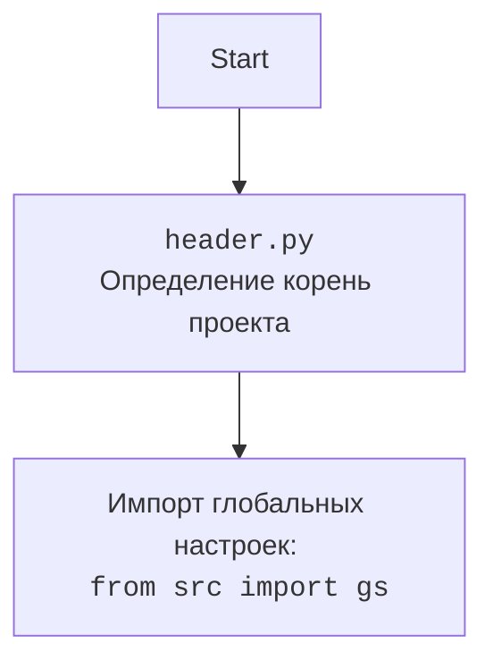

## Анализ кода: `hypotez/src/suppliers/gearbest/graber.py`

### 1. <алгоритм>

1.  **Инициализация**:
    *   Импортируются необходимые модули и классы, такие как `header`, `Graber` (из `src.suppliers.graber`), `Driver` (из `src.webdriver.driver`), `logger` (из `src.logger.logger`), `Context`, `close_pop_up`.
    *   Определяется класс `Graber`, который наследуется от класса `Graber` (переименованного как `Grbr`) из модуля `src.suppliers.graber`.
    *   В конструкторе класса `Graber` происходит инициализация префикса поставщика (`supplier_prefix`) и вызов конструктора родительского класса `Grbr`.
    *   Устанавливается значение `Context.locator_for_decorator` в `None`.
        *   Пример:

            ```python
            class Graber(Grbr):
                def __init__(self, driver: Driver, lang_index):
                    self.supplier_prefix = 'etzmaleh'
                    super().__init__(supplier_prefix=self.supplier_prefix, driver=driver, lang_index=lang_index)
                    Context.locator_for_decorator = None
            ```

2.  **Декоратор (закомментированный)**:
    *   Представлен шаблон декоратора `close_pop_up`, который предназначен для закрытия всплывающих окон перед выполнением основной логики функции.
    *   Декоратор пытается выполнить локатор `Context.locator.close_pop_up` для закрытия всплывающего окна и обрабатывает возможные исключения.
    *   В случае ошибки выполнения локатора, информация об ошибке записывается в лог с уровнем `DEBUG`.
        *   Пример:

            ```python
            # def close_pop_up(value: Any = None) -> Callable:
            #     def decorator(func: Callable) -> Callable:
            #         @wraps(func)
            #         async def wrapper(*args, **kwargs):
            #             try:
            #                 ...
            #             except ExecuteLocatorException as e:
            #                 logger.debug(f'Ошибка выполнения локатора: {e}')
            #             return await func(*args, **kwargs)
            #         return wrapper
            #     return decorator
            ```

3.  **Методы класса `Graber`**:
    *   Класс `Graber` предположительно содержит методы для сбора данных о товарах со страницы `gearbest.com`. Эти методы могут быть перегружены для нестандартной обработки полей, если это необходимо.

4.  **Использование `Context`**:
    *   Класс `Context` используется для хранения глобального состояния, такого как драйвер веб-браузера и локаторы для выполнения действий на странице.

### 2. <mermaid>

```mermaid
flowchart TD
    A[<code>src.suppliers.gearbest.graber.py</code><br>Класс Graber для парсинга Gearbest] --> B(Инициализация Graber);
    B --> C{Вызов Graber из src.suppliers.graber};
    C -- Наследует --> D[<code>src.suppliers.graber.py</code><br>Родительский класс Graber];
    B --> E{Инициализация supplier_prefix};
    E --> F[supplier_prefix = 'etzmaleh'];
    B --> G{Установка Context.locator_for_decorator};
    G --> H[Context.locator_for_decorator = None];
    H --> I{Использование декоратора close_pop_up (опционально)};
    I -- Выполняется при наличии --> J[Закрытие всплывающих окон];
    J --> K{Обработка полей товара (методы класса Graber)};
    K --> L[Сбор данных о товарах с gearbest.com];
    L --> M[Использование Driver из src.webdriver.driver];
    M --> N[Управление веб-браузером];
    L --> O[Логирование через src.logger.logger];
    O --> P[Запись ошибок и отладочной информации];
    D --> Q[<code>header.py</code><br>Определение корень проекта];
    Q --> R[Импорт глобальных настроек из src];
    R --> S[<code>src.gs</code><br>Глобальные настройки];

    style A fill:#f9f,stroke:#333,stroke-width:2px
    style D fill:#ccf,stroke:#333,stroke-width:2px
    style M fill:#ccf,stroke:#333,stroke-width:2px
    style O fill:#ccf,stroke:#333,stroke-width:2px
```

**Описание зависимостей:**

*   **`src.suppliers.gearbest.graber.py`**: Основной модуль, содержащий класс `Graber` для парсинга данных с сайта Gearbest.
*   **`src.suppliers.graber.py`**: Родительский класс `Graber`, предоставляющий общую логику для парсинга сайтов поставщиков.
*   **`src.webdriver.driver.py`**: Модуль, управляющий веб-браузером для выполнения действий на странице.
*   **`src.logger.logger.py`**: Модуль логирования для записи ошибок и отладочной информации.
*   **`header.py`**: Модуль, определяющий корень проекта и импортирующий глобальные настройки.
*   **`src.gs`**: Глобальные настройки, используемые в проекте.
*   **`Context`**: Класс, предназначенный для хранения глобального состояния, такого как драйвер веб-браузера и локаторы для выполнения действий на странице. Он обеспечивает доступ к общим ресурсам и данным, необходимым для работы парсера.



### 3. <объяснение>

**Импорты:**

*   `typing`: Используется для аннотации типов.
*   `header`: Предположительно, содержит общие функции или настройки для проекта.
*   `src.suppliers.graber.Graber as Grbr`: Импортирует родительский класс `Graber` из модуля `src.suppliers.graber` и переименовывает его в `Grbr` для краткости.
*   `src.webdriver.driver.Driver`: Импортирует класс `Driver` для управления веб-браузером.
*   `src.logger.logger.logger`: Импортирует модуль `logger` для логирования.

**Классы:**

*   `Graber(Grbr)`:
    *   Роль: Класс для сбора данных о товарах с сайта `gearbest.com`.
    *   Атрибуты:
        *   `supplier_prefix` (str): Префикс поставщика, установлен в `etzmaleh`.
    *   Методы:
        *   `__init__(self, driver: Driver, lang_index)`: Конструктор класса, инициализирует префикс поставщика и вызывает конструктор родительского класса.

**Функции:**

*   `close_pop_up(value: Any = None)`:
    *   Аргументы:
        *   `value` (Any, optional): Дополнительное значение для декоратора. По умолчанию `None`.
    *   Возвращаемое значение:
        *   `Callable`: Декоратор, оборачивающий функцию.
    *   Назначение: Создает декоратор для закрытия всплывающих окон перед выполнением основной логики функции.

**Переменные:**

*   `supplier_prefix` (str): Префикс поставщика, используется для идентификации поставщика в системе.
*   `Context.locator_for_decorator`: Используется для установки локатора, который будет выполнен в декораторе `@close_pop_up`.

**Потенциальные ошибки и области для улучшения:**

*   Закомментированный код декоратора `close_pop_up` может указывать на то, что функциональность закрытия всплывающих окон не реализована или отключена.
*   Отсутствие обработки исключений в конструкторе класса `Graber` может привести к неожиданному поведению программы.
*   Использование класса `Context` для хранения глобального состояния может затруднить тестирование и отладку кода.

**Взаимосвязи с другими частями проекта:**

*   Класс `Graber` наследуется от класса `Graber` из модуля `src.suppliers.graber`, что указывает на общую структуру для парсинга сайтов поставщиков.
*   Для управления веб-браузером используется класс `Driver` из модуля `src.webdriver.driver`.
*   Для логирования используется модуль `logger` из `src.logger.logger`.
*   `Context` используется для передачи общих параметров и состояния между различными компонентами.
*   `header.py` используется для определения корня проекта и импорта глобальных настроек из `src.gs`.