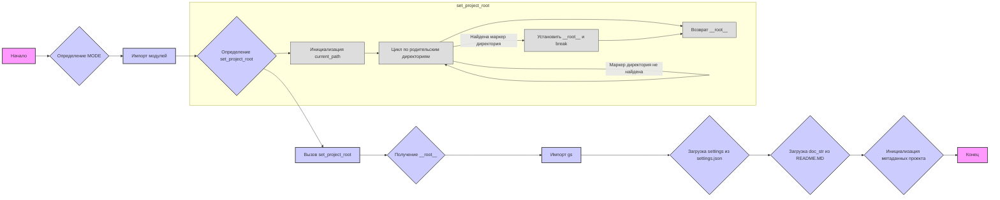

## Анализ кода `hypotez/src/suppliers/gearbest/header.py`

### <алгоритм>

1.  **Инициализация**:
    *   Устанавливается переменная `MODE = 'dev'`.
    *   Импортируются необходимые модули: `sys`, `json`, `Version` из `packaging.version` и `Path` из `pathlib`.

2.  **Поиск корневой директории проекта (`set_project_root`)**:
    *   Функция `set_project_root` принимает кортеж `marker_files` (по умолчанию `('pyproject.toml', 'requirements.txt', '.git')`), используемый для поиска корневой директории.
    *   Начальная текущая директория определяется как родительская директория текущего файла (`__file__`).
    *   Цикл проходит вверх по иерархии директорий, начиная с текущей.
    *   На каждой итерации проверяется, существует ли хотя бы один из `marker_files` в текущей директории. Если да, текущая директория устанавливается как корневая (`__root__`), и цикл завершается.
    *   Если корневая директория не найдена, то корневой директорией остается директория, где находится текущий скрипт.
    *   Корневая директория добавляется в `sys.path`, если ее там нет.
    *   Функция возвращает путь к корневой директории.

    _Пример:_
      *   `marker_files` = `('pyproject.toml', 'requirements.txt', '.git')`
      *   Путь к скрипту: `/home/user/project/src/suppliers/gearbest/header.py`
      *   Поиск идет в `/home/user/project/src/suppliers/gearbest`, `/home/user/project/src/suppliers`, `/home/user/project/src` и `/home/user/project`.
      *   Если в `/home/user/project` существует `pyproject.toml`, то `/home/user/project` устанавливается как корневая директория.

3.  **Получение корневой директории**:
    *   Вызывается `set_project_root` для получения корневой директории проекта, результат сохраняется в `__root__`.

4.  **Загрузка настроек (`settings`)**:
    *   Импортируется модуль `gs` из `src`.
    *   Пытается открыть файл `settings.json`, расположенный в `src` в корневой директории, и загрузить его содержимое в `settings` как словарь.
    *   Если файл не найден или возникают ошибки при чтении JSON, блок `try...except` перехватывает исключение.

5.  **Чтение документации (`doc_str`)**:
    *   Пытается открыть файл `README.MD`, расположенный в `src` в корневой директории, и прочитать его содержимое в `doc_str` как строку.
    *   Если файл не найден или возникают ошибки при чтении, блок `try...except` перехватывает исключение.

6.  **Инициализация метаданных проекта**:
    *   Инициализируются переменные с метаданными проекта, используя значения из словаря `settings`, если он был успешно загружен. В противном случае устанавливаются значения по умолчанию.
        *   `__project_name__` - имя проекта (по умолчанию 'hypotez').
        *   `__version__` - версия проекта (по умолчанию '').
        *   `__doc__` - документация проекта (содержимое `README.MD`, по умолчанию '').
        *    `__details__` - пустая строка.
        *   `__author__` - автор проекта (по умолчанию '').
        *   `__copyright__` - авторские права (по умолчанию '').
        *    `__cofee__` - строка с предложением поддержать разработчика.

### <mermaid>

**Зависимости `mermaid`:**

*   **Начало**: Отправная точка выполнения скрипта.
*   **Определение `MODE`**: Установка переменной режима работы.
*   **Импорт модулей**: Импорт необходимых библиотек `sys`, `json`, `packaging.version` и `pathlib`.
*   **Определение `set_project_root`**: Определение функции для поиска корневой директории.
*   **Вызов `set_project_root`**: Выполнение функции для поиска и установки корневой директории.
*   **Получение `__root__`**: Получение пути к корневой директории.
*   **Импорт `gs`**: Импорт модуля `gs` из `src`.
*   **Загрузка `settings`**: Загрузка настроек из файла `settings.json`.
*   **Загрузка `doc_str`**: Загрузка документации из файла `README.MD`.
*   **Инициализация метаданных проекта**: Установка переменных с метаданными проекта.
*   **Конец**: Конечная точка выполнения скрипта.

**Внутренние зависимости `set_project_root`:**

*   **Инициализация `current_path`**: Получение пути к директории, где находится текущий файл.
*   **Цикл по родительским директориям**: Поиск маркерных файлов в родительских директориях.
*   **Установить `__root__` и `break`**: Установка корневой директории при нахождении маркерного файла.
*   **Возврат `__root__`**: Возврат найденной корневой директории.

### <объяснение>

**Импорты:**

*   `sys`: Модуль `sys` используется для работы с параметрами и функциями, специфичными для интерпретатора Python. В данном случае он используется для добавления пути к корневой директории проекта в `sys.path`, что позволяет импортировать модули из `src`.
*   `json`: Модуль `json` используется для работы с JSON-данными, в частности, для загрузки настроек из файла `settings.json`.
*   `packaging.version.Version`: Модуль `Version` используется для сравнения версий, но в этом файле напрямую не используется.
*   `pathlib.Path`: Модуль `Path` используется для работы с путями в файловой системе. Это позволяет более удобно манипулировать путями к файлам и директориям.

**Классы:**

*   В данном коде классы не используются.

**Функции:**

*   `set_project_root(marker_files: tuple = ('pyproject.toml', 'requirements.txt', '.git')) -> Path`:
    *   **Аргументы**:
        *   `marker_files` (tuple): Кортеж строк, представляющих имена файлов или директорий, которые идентифицируют корень проекта. По умолчанию `('pyproject.toml', 'requirements.txt', '.git')`.
    *   **Возвращаемое значение**:
        *   `Path`: Объект `Path`, представляющий путь к корневой директории проекта. Если корневая директория не найдена, возвращается путь к директории, где находится текущий скрипт.
    *   **Назначение**:
        *   Эта функция определяет корневую директорию проекта путем поиска маркерных файлов или директорий в родительских директориях текущего файла. Функция используется для правильной работы с модулями из пакета `src`.

**Переменные:**

*   `MODE` (str): Определяет режим работы приложения. В данном случае установлено значение `'dev'`.
*   `__root__` (Path): Содержит путь к корневой директории проекта, вычисленный функцией `set_project_root`.
*   `settings` (dict): Словарь, содержащий настройки проекта, загруженные из файла `settings.json`. Может быть `None`, если загрузка не удалась.
*   `doc_str` (str): Строка, содержащая текст из файла `README.MD`. Может быть `None`, если загрузка не удалась.
*   `__project_name__` (str): Имя проекта, загруженное из настроек или значение по умолчанию `'hypotez'`.
*   `__version__` (str): Версия проекта, загруженная из настроек или значение по умолчанию `''`.
*    `__doc__` (str): Документация проекта, загруженная из файла `README.MD` или значение по умолчанию `''`.
*    `__details__` (str): Пустая строка для дополнительных деталей.
*   `__author__` (str): Автор проекта, загруженный из настроек или значение по умолчанию `''`.
*   `__copyright__` (str): Авторские права, загруженные из настроек или значение по умолчанию `''`.
*   `__cofee__` (str): Строка с предложением поддержать разработчика, загруженная из настроек или значение по умолчанию `"Treat the developer to a cup of coffee for boosting enthusiasm in development: https://boosty.to/hypo69"`.

**Потенциальные ошибки и улучшения:**

*   **Обработка ошибок**: В блоках `try...except` перехватываются ошибки `FileNotFoundError` и `json.JSONDecodeError`, но никак не обрабатываются, что может затруднить диагностику проблем. Было бы полезно добавить хотя бы логирование ошибок.
*   **Зависимость от `gs`**: Модуль `gs` импортируется, но в этом файле непосредственно не используется. Это может указывать на то, что структура модуля и его зависимостей может быть пересмотрена.
*   **Использование `...` в `except`**: Использование `...` в блоке `except` является неявным способом обработки исключений и может быть не совсем понятным. Лучше использовать `pass` или  `logging.exception` для явной обработки исключений.

**Взаимосвязи с другими частями проекта:**

*   Этот файл является частью модуля `gearbest` в пакете `suppliers`.
*   Функция `set_project_root` используется для определения корневой директории проекта, что необходимо для правильного импорта модулей и работы с файлами проекта, в частности `src.gs`, `settings.json` и `README.MD`.
*   Метаданные проекта (имя, версия, автор и т.д.) устанавливаются в этом файле и могут использоваться в других частях проекта.
*    Переменные `__doc__`, `__author__`, `__cofee__`, `__copyright__` могут быть использованы в модуле `gs` для вывода информации о проекте в CLI.

Таким образом, файл `header.py` играет важную роль в инициализации проекта, определении его корневой директории и загрузке основных настроек и метаданных.