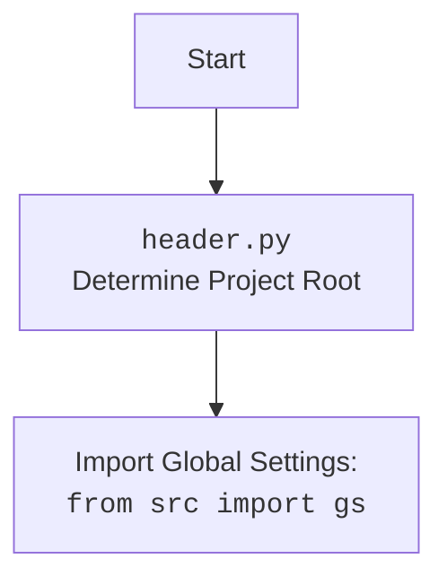

## АНАЛИЗ КОДА: `hypotez/src/suppliers/graber.py`

### 1. <алгоритм>

**Общая схема работы:**

1.  **Инициализация:**
    *   Создается экземпляр класса `Graber` с префиксом поставщика (`supplier_prefix`) и экземпляром драйвера (`Driver`).
    *   Загружаются локаторы (`locators`) из JSON-файла.
    *   Создается экземпляр `ProductFields` для хранения данных о товаре.
    *   Устанавливаются глобальные настройки `Context.driver` и `Context.supplier_prefix`.
    *   _Пример_: `graber = Graber('supplier_a', driver_instance)`

2.  **Сбор данных:**
    *   Вызывается асинхронная функция `grab_page` с перечнем полей, которые нужно собрать (`*args`), и словарем с дополнительными значениями для этих полей (`**kwargs`).
    *   Внутри `grab_page` вызывается `fetch_all_data`, которая динамически вызывает методы класса `Graber` для каждого поля, указанного в `*args`.
    *   Каждый метод, соответствующий полю (например, `name`, `price`, `description`), извлекает данные с веб-страницы с помощью драйвера (`driver.execute_locator`).
    *   Данные извлекаются по локаторам из `self.locator`.
    *   Извлеченные данные нормализуются и сохраняются в объекте `self.fields` типа `ProductFields`.
        *   _Пример_: `await grabber.grab_page('name', 'price', description = 'test', id_supplier = 123)`
        *   _Поток данных_: `grab_page` -> `fetch_all_data` -> `name/price/description` -> `driver.execute_locator` -> `normalize_*` -> `self.fields`

3.  **Обработка полей:**
    *   Каждый метод для сбора поля (например, `name()`, `price()`) использует декоратор `@close_pop_up`.
    *   Декоратор `@close_pop_up` выполняет попытку закрытия всплывающего окна (если для этого установлен `Context.locator_for_decorator`).
        *   _Пример_: При выполнении `name` сначала выполниться `close_pop_up` с локатором если он задан, затем метод `name`.
    *   Методы извлекают данные с веб-страницы, используя `driver.execute_locator(self.locator.<поле>)`.
    *   Данные нормализуются с помощью функций `normalize_string`, `normalize_int`, `normalize_float`, и т.д.
    *   Если в `kwargs` передано значение для поля, оно используется вместо извлечения со страницы.
        *   _Пример_: Если вызвать `name(value = "Test Name")` значение поля `name` примет значение "Test Name" минуя `driver.execute_locator(self.locator.name)`.

4.  **Завершение:**
    *   Метод `grab_page` возвращает заполненный объект `ProductFields` с данными о продукте.
    *   _Поток данных_: `driver.execute_locator` -> `normalize_*` -> `ProductFields`

**Блок-схема (пример для поля `name`):**

```mermaid
flowchart TD
    A[Начало grab_page] --> B{Вызов fetch_all_data};
    B --> C{Цикл по полям};
    C -- name --> D[Вызов метода name];
    D --> E{close_pop_up?};
    E -- Да --> F[driver.execute_locator (close_pop_up)];
    F --> G[driver.execute_locator (name)];
    E -- Нет --> G
    G --> H{Нормализация name};
    H --> I[Сохранение name в self.fields];
    I --> J{Следующее поле};
     J -- Нет --> K[Возврат ProductFields];
    J -- Да --> C
     K--> L[Конец grab_page]

```

```mermaid
classDiagram
    class Context{
        <<class>>
        +driver: 'Driver'
        +locator_for_decorator: SimpleNamespace
        +supplier_prefix: str
    }
    class Graber {
        <<class>>
        +supplier_prefix: str
        +locator: SimpleNamespace
        +driver: 'Driver'
        +fields: ProductFields
        +__init__(supplier_prefix: str, driver: 'Driver')
        +error(field: str)
        +set_field_value(value: Any, locator_func: Callable, field_name: str, default: Any) : Any
        +grab_page(*args, **kwards): ProductFields
         +additional_shipping_cost(value:Optional[Any] = None)
         +delivery_in_stock(value:Optional[Any] = None)
         +active(value:Optional[Any] = None)
         +additional_delivery_times(value:Optional[Any] = None)
         +advanced_stock_management(value:Optional[Any] = None)
         +affiliate_short_link(value:Optional[Any] = None)
         +affiliate_summary(value:Optional[Any] = None)
         +affiliate_summary_2(value:Optional[Any] = None)
         +affiliate_text(value:Optional[Any] = None)
         +affiliate_image_large(value:Optional[Any] = None)
         +affiliate_image_medium(value:Optional[Any] = None)
         +affiliate_image_small(value:Optional[Any] = None)
         +available_date(value:Optional[Any] = None)
         +available_for_order(value:Optional[Any] = None)
         +available_later(value:Optional[Any] = None)
         +available_now(value:Optional[Any] = None)
        +additional_categories(value: str | list = None) : dict
        +cache_default_attribute(value:Optional[Any] = None)
        +cache_has_attachments(value:Optional[Any] = None)
        +cache_is_pack(value:Optional[Any] = None)
        +condition(value:Optional[Any] = None)
        +customizable(value:Optional[Any] = None)
        +date_add(value:Optional[str | datetime.date] = None)
        +date_upd(value:Optional[Any] = None)
        +delivery_out_stock(value:Optional[Any] = None)
        +depth(value:Optional[Any] = None)
        +description(value:Optional[Any] = None)
         +description_short(value:Optional[Any] = None)
         +id_category_default(value:Optional[Any] = None)
         +id_default_combination(value:Optional[Any] = None)
         +id_product(value:Optional[Any] = None) : bool
        +locale(value:Optional[Any] = None)
        +id_default_image(value:Optional[Any] = None)
        +ean13(value:Optional[Any] = None)
         +ecotax(value:Optional[Any] = None)
         +height(value:Optional[Any] = None)
         +how_to_use(value:Optional[Any] = None)
        +id_manufacturer(value:Optional[Any] = None)
         +id_supplier(value:Optional[Any] = None)
        +id_tax(value:Optional[Any] = None)
        +id_type_redirected(value:Optional[Any] = None)
        +images_urls(value:Optional[Any] = None)
        +indexed(value:Optional[Any] = None)
        +ingredients(value:Optional[Any] = None)
        +meta_description(value:Optional[Any] = None)
         +meta_keywords(value:Optional[Any] = None)
         +meta_title(value:Optional[Any] = None)
         +is_virtual(value:Optional[Any] = None)
         +isbn(value:Optional[Any] = None)
         +link_rewrite(value:Optional[Any] = None)
        +location(value:Optional[Any] = None)
        +low_stock_alert(value:Optional[Any] = None)
         +low_stock_threshold(value:Optional[Any] = None)
        +minimal_quantity(value:Optional[Any] = None)
        +mpn(value:Optional[Any] = None)
        +name(value:Optional[Any] = None)
         +online_only(value:Optional[Any] = None)
         +on_sale(value:Optional[Any] = None)
        +out_of_stock(value:Optional[Any] = None)
        +pack_stock_type(value:Optional[Any] = None)
        +price(value:Optional[Any] = None)
        +product_type(value:Optional[Any] = None)
        +quantity(value:Optional[Any] = None)
        +quantity_discount(value:Optional[Any] = None)
        +redirect_type(value:Optional[Any] = None)
        +reference(value:Optional[Any] = None)
        +show_condition(value:Optional[int] = None)
        +show_price(value:Optional[int] = None)
        +state(value:Optional[Any] = None)
        +text_fields(value:Optional[Any] = None)
        +unit_price_ratio(value:Optional[Any] = None)
        +unity(value:Optional[str] = None)
        +upc(value:Optional[str] = None)
        +uploadable_files(value:Optional[Any] = None)
        +default_image_url(value:Optional[Any] = None)
        +visibility(value:Optional[str] = None)
        +weight(value:Optional[float] = None)
        +wholesale_price(value:Optional[float] = None)
        +width(value:Optional[float] = None)
        +specification(value:Optional[str|list] = None)
        +link(value:Optional[str] = None)
         +byer_protection(value:Optional[str|list] = None)
         +customer_reviews(value:Optional[Any] = None)
         +link_to_video(value:Optional[Any] = None)
        +local_image_path(value: Optional[str] = None)
        +local_video_path(value:Optional[Any] = None)
    }
    class ProductFields{
        <<class>>
         +additional_shipping_cost: str
         +delivery_in_stock: str
         +active: int
         +additional_delivery_times: str
         +advanced_stock_management: str
         +affiliate_short_link: str
         +affiliate_summary: str
         +affiliate_summary_2: str
         +affiliate_text: str
         +affiliate_image_large: str
         +affiliate_image_medium: str
         +affiliate_image_small: str
         +available_date: str
         +available_for_order: str
         +available_later: str
        +available_now: str
        +additional_categories: dict
        +cache_default_attribute: str
        +cache_has_attachments: str
        +cache_is_pack: str
        +condition: str
        +customizable: str
        +date_add: str
        +date_upd: str
        +delivery_out_stock: str
        +depth: float
        +description: str
        +description_short: str
         +id_category_default: str
         +id_default_combination: str
         +id_product: str
        +locale: str
        +id_default_image: str
        +ean13: str
         +ecotax: str
         +height: str
         +how_to_use: str
        +id_manufacturer: str
         +id_supplier: str
        +id_tax: str
        +id_type_redirected: str
        +images_urls: str
        +indexed: str
        +ingredients: str
        +meta_description: str
         +meta_keywords: str
         +meta_title: str
         +is_virtual: str
         +isbn: str
         +link_rewrite: str
        +location: str
         +low_stock_alert: str
         +low_stock_threshold: str
        +minimal_quantity: int
        +mpn: str
        +name: str
         +online_only: int
         +on_sale: str
        +out_of_stock: str
        +pack_stock_type: str
        +price: float
        +product_type: str
        +quantity: int
         +quantity_discount: str
         +redirect_type: str
        +reference: str
         +show_condition: int
         +show_price: int
         +state: str
         +text_fields: str
         +unit_price_ratio: str
        +unity: str
        +upc: str
        +uploadable_files: str
        +default_image_url: str
        +visibility: str
        +weight: int
        +wholesale_price: float
        +width: float
         +specification: str
         +link: str
         +byer_protection: str
         +customer_reviews: str
         +link_to_video: str
        +local_image_path: str
        +local_video_path: str

    }
    class Driver{
    <<class>>
        +execute_locator(locator: SimpleNamespace)
    }
    
    Graber --|> Context : uses
    Graber *--  ProductFields : has
    Graber *-- Driver : has
```

### 2. <mermaid>


#### Объяснение зависимостей `mermaid`:

1.  **`Context`**:
    *   Это класс, который хранит глобальные настройки, такие как экземпляр драйвера (`driver`),  локатор для декоратора (`locator_for_decorator`), и префикс поставщика (`supplier_prefix`).
    *   Класс `Graber` использует `Context` для доступа к этим глобальным настройкам.

2.  **`Graber`**:
    *   Это основной класс, который занимается сбором данных о товаре со страницы.
    *   Он имеет атрибуты: `supplier_prefix` (префикс поставщика), `locator` (локаторы), `driver` (экземпляр `Driver`) и `fields` (экземпляр `ProductFields` для хранения собранных данных).
    *   Класс имеет множество методов для сбора и нормализации конкретных полей товара, таких как `name`, `price`, `description` и др.
        *   **Примечание:** Отношение `*--` означает "имеет" или "агрегация".
    *   Наследует класс `Context` (использует его методы и переменные).

3.  **`ProductFields`**:
    *   Это класс, который определяет структуру данных для хранения информации о товаре.
    *   Он содержит атрибуты для всех возможных полей товара, таких как `name`, `price`, `description`, `images_urls` и др.

4.  **`Driver`**:
    *   Это абстракция веб-драйвера, используемая для взаимодействия с браузером.
    *   Класс `Graber` использует `Driver` для выполнения локаторов и получения данных со страницы.
    *   Отношение `*--` означает "имеет" или "агрегация".

**Дополнительно:**

### 3. <объяснение>

#### Импорты:

*   `from __future__ import annotations`:  Используется для поддержки аннотаций типов в Python.
*   `datetime`: Для работы с датами и временем.
*   `os`: Для работы с операционной системой.
*   `sys`: Для доступа к параметрам среды выполнения.
*   `asyncio`: Для асинхронного программирования.
*   `pathlib.Path`: Для работы с путями к файлам.
*   `typing.Optional, Any, Callable`: Для аннотации типов.
*   `types.SimpleNamespace`: Для создания объектов с атрибутами.
*   `langdetect.detect`: Для определения языка текста.
*   `functools.wraps`: Для сохранения метаданных декорируемой функции.
*   `header`: Модуль для определения корневой директории проекта, добавляет глобальные переменные.
    *  `header` определяет корневую директорию проекта.
    *  `header` импортирует `from src import gs` который является экземпляром класса `GlobalSettings` из файла `src/settings.py`
*   `src.gs`:  Глобальные настройки проекта, экземпляр класса `GlobalSettings`.
*   `src.endpoints.prestashop.product_fields.ProductFields`: Класс для хранения полей продукта.
*   `src.category.Category`: Класс для работы с категориями.
*   `src.utils.jjson`: Модуль для работы с JSON, `j_loads`, `j_loads_ns`, `j_dumps`.
*   `src.utils.image`: Модуль для работы с изображениями, `save_image_from_url`, `save_image`.
*   `src.utils.string.normalizer`: Модуль для нормализации строк, чисел, дат и т.д.
*   `src.logger.exceptions.ExecuteLocatorException`: Исключение, связанное с выполнением локатора.
*   `src.utils.printer.pprint`: Функция для красивой печати.
*   `src.logger.logger`: Модуль для логирования.

#### Классы:

*   **`Context`**:
    *   Роль: Хранит глобальные настройки, доступные в рамках `Graber`.
    *   Атрибуты:
        *   `driver`: Экземпляр драйвера.
        *   `locator_for_decorator`: Локатор для декоратора `@close_pop_up`.
        *   `supplier_prefix`: Префикс поставщика.
    *   Методы: Нет.
    *   Взаимодействие: Используется классом `Graber` для доступа к глобальным параметрам.
*   **`Graber`**:
    *   Роль: Базовый класс для сбора данных со страниц поставщиков.
    *   Атрибуты:
        *   `supplier_prefix`: Префикс поставщика.
        *   `locator`:  Пространство имен для хранения локаторов для текущего поставщика.
        *   `driver`:  Экземпляр драйвера для взаимодействия с веб-страницей.
        *   `fields`: Экземпляр `ProductFields` для хранения данных.
    *   Методы:
        *   `__init__`: Инициализирует объект `Graber`.
        *   `error`: Обработчик ошибок для полей.
        *   `set_field_value`: Устанавливает значение поля, выполняет `locator_func` если  `value`  не определен.
        *   `grab_page`: Асинхронно собирает данные о товаре, динамически вызывая методы для каждого поля.
        *  `additional_shipping_cost` - `local_video_path`: асинхронные методы для сбора данных для всех полей в `ProductFields`. Каждый метод:
            * принимает опциональный параметр `value`, который позволяет передать значение для поля.
            * Использует декоратор `@close_pop_up` для закрытия всплывающих окон.
            * Выполняет запрос к браузеру через `self.driver.execute_locator` с локатором поля.
            * Нормализует полученные данные с помощью соответствующих функций `normalize_*`.
            *  Записывает результат в поле объекта `ProductFields`
            * Если  `value` передан, значение поля устанавливается без запроса к браузеру.
    *   Взаимодействие: Использует `Driver` для доступа к веб-странице, `ProductFields` для хранения данных, `utils` для нормализации, `logger` для логирования, и `Context` для глобальных настроек.

#### Функции:

*   **`close_pop_up(value: 'Driver' = None)`**:
    *   Аргументы: `value` (опционально).
    *   Возвращает: Декоратор.
    *   Назначение: Создает декоратор для закрытия всплывающих окон перед выполнением функции. Если в `Context.locator_for_decorator` установлен локатор - то выполнится закрытие окна.
    *   Примеры: `@close_pop_up()`

#### Переменные:

*   `Context.driver`: Объект драйвера, используемый для управления браузером или другим интерфейсом.
*   `Context.locator_for_decorator`: Пространство имен для хранения локаторов.
*    `Context.supplier_prefix`: Префикс поставщика.
*   `self.supplier_prefix`: Префикс поставщика, устанавливается при инициализации класса `Graber`.
*   `self.locator`: Локаторы для текущего поставщика, загружаются из JSON-файла.
*   `self.driver`: Экземпляр драйвера, используется для управления браузером или другим интерфейсом.
*   `self.fields`: Экземпляр класса `ProductFields` для хранения данных о товаре.
*   `value`: Значение, передаваемое в методы для установки полей.
*   `locator_result`: Результат выполнения локатора.
*   `raw_value`, `raw_data`: Значение, полученные от `driver.execute_locator`
* `img_tmp_path`: Путь к сохраненному изображению.

#### Потенциальные ошибки и области для улучшения:

*   **Жесткая привязка путей:**
    *   Пути к файлам (например, локаторы) жестко заданы. Это может привести к проблемам при изменении структуры проекта. Можно использовать более гибкий механизм загрузки конфигурации.
*   **Обработка ошибок:**
    *   В некоторых методах обработки ошибок используется `...` в блоке `except`, что может затруднить отладку. Необходимо более явно обрабатывать исключения и сообщать о них в лог.
*   **Параметризация декоратора**:
    *  Декоратор `@close_pop_up` привязан к контексту `Context.locator_for_decorator` что может быть неудобно. Лучше передавать локатор непосредственно в декоратор.
*   **Передача параметров**:
    *  В `local_image_path` есть `TODO` связанное с передачей значений из  `**kwargs` функции `grab_product_page(**kwargs)`. Необходимо проработать механизм передачи значений.
*   **`self.locator.id_supplier.attribute`**:
    *   Используется для получения `id_supplier` вместо запроса к браузеру, что может быть источником ошибок.
*   **Асинхронность**:
    *   Пока неясно использование `asyncio.to_thread(locator_func)`, вероятно следует изучить `async` возможности библиотеки `selenium` если используется вебдрайвер.

#### Взаимосвязи с другими частями проекта:

*   `src.endpoints.prestashop.product_fields`:  Используется для описания структуры данных для товаров в PrestaShop.
*   `src.utils.jjson`:  Используется для загрузки JSON-файлов с локаторами.
*   `src.utils.image`: Используется для сохранения изображений, полученных с веб-страниц.
*   `src.utils.string.normalizer`: Используется для нормализации данных, полученных со страниц (преобразование строк, чисел, и т.д.).
*   `src.logger.exceptions`: Для обработки исключений, возникающих при выполнении локаторов.
*   `src.logger.logger`: Для ведения логов работы программы.
*  `src.webdriver.driver.Driver`: Для взаимодействия с браузером.
*  `src.settings.GlobalSettings`: Для получения глобальных настроек.

Этот анализ дает полное представление о работе класса `Graber`, его зависимостях и возможных проблемах.