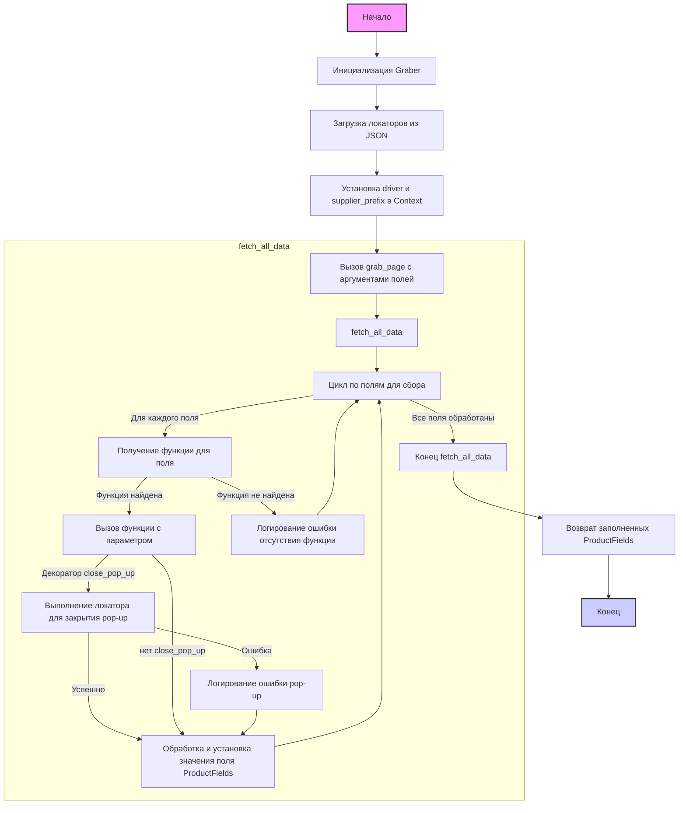

## ИНСТРУКЦИЯ:

Анализируй предоставленный код подробно и объясни его функциональность. Ответ должен включать три раздела:

1.  **<алгоритм>**: Опиши рабочий процесс в виде пошаговой блок-схемы, включая примеры для каждого логического блока, и проиллюстрируй поток данных между функциями, классами или методами.
2.  **<mermaid>**: Напиши код для диаграммы в формате `mermaid`, проанализируй и объясни все зависимости,
    которые импортируются при создании диаграммы.
    **ВАЖНО!** Убедитесь, что все имена переменных, используемые в диаграмме `mermaid`,
    имеют осмысленные и описательные имена. Имена переменных вроде `A`, `B`, `C`, и т.д., не допускаются!

    **Дополнительно**: Если в коде есть импорт `import header`, добавьте блок `mermaid` flowchart, объясняющий `header.py`:
    ```mermaid
    flowchart TD
        Start --> Header[<code>header.py</code><br> Determine Project Root]

        Header --> import[Import Global Settings: <br><code>from src import gs</code>]
    ```

3.  **<объяснение>**: Предоставьте подробные объяснения:
    *   **Импорты**: Их назначение и взаимосвязь с другими пакетами `src.`.
    *   **Классы**: Их роль, атрибуты, методы и взаимодействие с другими компонентами проекта.
    *   **Функции**: Их аргументы, возвращаемые значения, назначение и примеры.
    *   **Переменные**: Их типы и использование.
    *   Выделите потенциальные ошибки или области для улучшения.

Дополнительно, постройте цепочку взаимосвязей с другими частями проекта (если применимо).

Это обеспечивает всесторонний и структурированный анализ кода.
## Формат ответа: `.md` (markdown)
**КОНЕЦ ИНСТРУКЦИИ**

## <алгоритм>



**Пример для каждого логического блока:**

1.  **Инициализация `Graber`:**
    *   Пример: `graber = Graber(supplier_prefix="supplier1", driver=driver_instance)`
    *   Действие: Создается экземпляр класса `Graber` для поставщика `supplier1` с использованием объекта вебдрайвера `driver_instance`. Загружаются локаторы из `locators/product.json`. Устанавливается контекст драйвера и префикса поставщика.
2.  **Загрузка локаторов:**
    *   Пример: Локаторы из `src/suppliers/supplier1/locators/product.json` загружаются в `self.locator`.
    *   Действие: JSON-файл с локаторами для конкретного поставщика десериализуется в объект `SimpleNamespace`.
3.  **Установка контекста:**
    *   Пример: `Context.driver = self.driver`, `Context.supplier_prefix = supplier_prefix`
    *   Действие: Сохраняется экземпляр драйвера и префикс поставщика в статическом классе `Context`, чтобы они были доступны в декораторах и других частях кода.
4.  **Вызов `grab_page`:**
    *   Пример: `product_fields = await graber.grab_page("name", "price", name="Some Name")`
    *   Действие: Запускается процесс сбора данных о товаре. Вызывается `fetch_all_data` для итерации по полям.
5.  **`fetch_all_data`:**
    *   Действие: Проходит по списку полей, переданных в `*args`. Для каждого поля получается соответствующий метод из класса `Graber` с помощью `getattr`.
6.   **Получение функции для поля:**
    *   Пример: Для поля `"name"` получается метод `self.name` если он определен в классе.
    *   Действие: Используется `getattr` для получения функции-метода, соответствующего названию поля товара.
7.  **Выполнение функции поля:**
    *   Пример: Вызов `await self.name("Some Name")`, если имя передано как `kwargs` или `await self.name()` если `kwargs` нет
    *   Действие: Вызывается функция, специфичная для поля (например, `name`, `price` и т.д.).
8. **Декоратор `close_pop_up`:**
   *  Пример: Выполняется `await Context.driver.execute_locator(Context.locator_for_decorator)`, если `Context.locator_for_decorator`  установлен
   *  Действие: Перед выполнением функции (например, `name`, `price`), декоратор выполняет локатор для закрытия всплывающего окна, если он настроен в контексте,  если  `Context.locator_for_decorator` не установлен - ничего не происходит.
9.  **Выполнение локатора:**
    *   Пример: `await self.driver.execute_locator(self.locator.name)` внутри метода `name`
    *   Действие: Используется `execute_locator` драйвера для получения данных со страницы.
10. **Обработка и установка значения поля:**
    *   Пример: `self.fields.name = normalize_string(value or  await self.driver.execute_locator(self.locator.name) or '')`
    *   Действие: Полученное значение обрабатывается (например, нормализуется строка, число) и сохраняется в объект `ProductFields`.
11. **Возврат заполненных `ProductFields`:**
    *   Пример: `return self.fields`
    *   Действие: Функция `grab_page` возвращает заполненный объект `ProductFields` со всеми собранными данными.
12. **Конец:**
     * Действие: Сбор данных завершен

## <mermaid>
```mermaid
flowchart TD
    Start --> GraberInit[<code>Graber.__init__</code><br>Initialize Graber Object]
    GraberInit --> LoadLocators[<code>j_loads_ns</code><br>Load Locators from JSON]
    LoadLocators --> SetContext[Set <code>Context.driver</code> and <code>Context.supplier_prefix</code>]
    SetContext --> GrabPage[<code>Graber.grab_page</code><br>Start Data Collection]
    GrabPage --> FetchAllData[<code>fetch_all_data</code><br>Iterate Over Fields]

    subgraph FieldProcessing[Field Processing Loop]
      FetchAllData --> LoopStart[Start Loop: For each Field Name]
      LoopStart --> GetFieldMethod[<code>getattr(self, filed_name, None)</code><br>Get Field Processing Method]
         GetFieldMethod -- Method Found --> ExecuteMethod[<code>await field_method()</code><br>Execute Field Method]
         ExecuteMethod -- Has <code>@close_pop_up</code> --> ClosePopupDecorator[<code>@close_pop_up</code><br>Execute Popup Close Locator]
         ClosePopupDecorator --> ExecuteLocator[<code>Context.driver.execute_locator</code><br>Execute Locator for Popup]
         ExecuteLocator -- Success --> ProcessValue[Process and Set Field Value]
        ExecuteLocator -- Error --> LogPopupError[Log Popup Error]
        LogPopupError --> ProcessValue
        
         ExecuteMethod -- No decorator--> ProcessValue

         ProcessValue --> LoopEnd[End Loop]

         GetFieldMethod -- Method Not Found --> LogFieldMethodError[Log Missing Method Error]
         LogFieldMethodError --> LoopEnd

         LoopEnd -- Has more Fields --> LoopStart
    end
    
    LoopEnd --> ReturnFields[Return <code>ProductFields</code>]
    ReturnFields --> End[End]
    
    style Start fill:#f9f,stroke:#333,stroke-width:2px
    style End fill:#ccf,stroke:#333,stroke-width:2px
    

    
    subgraph header_flow[header.py Flow]
        H_Start[Start] --> H_Header[<code>header.py</code><br> Determine Project Root]
        H_Header --> H_import[Import Global Settings: <br><code>from src import gs</code>]
    end
```

**Анализ зависимостей `mermaid`:**

*   **`Graber.__init__`**: Инициализирует объект `Graber`, устанавливая префикс поставщика, загружая локаторы, устанавливая драйвер и префикс поставщика в контекст `Context`.
*   **`j_loads_ns`**: Загружает данные из JSON-файла и преобразует их в пространство имен `SimpleNamespace` для удобного доступа к локаторам.
*    **`Context`**: Сохраняет глобальные данные, такие как драйвер и префикс поставщика, которые используются в различных методах и декораторах.
*   **`Graber.grab_page`**: Основной метод для сбора данных о товаре, вызывающий `fetch_all_data`.
*   **`fetch_all_data`**: Итерируется по полям, которые необходимо собрать, и вызывает соответствующие методы для каждого поля.
*   **`getattr(self, filed_name, None)`**: Получает метод для обработки конкретного поля, динамически вызывая его по имени.
*   **`@close_pop_up`**: Декоратор, который выполняется перед каждым методом сбора данных для закрытия всплывающих окон, если это необходимо.
*   **`Context.driver.execute_locator`**: Выполняет локаторы для получения данных со страницы с помощью вебдрайвера.
*   **`ProductFields`**: Класс для хранения собранных данных о товаре.
*   **`header.py`**: Определяет корневую директорию проекта и загружает глобальные настройки.

## <объяснение>

### Импорты

*   `from __future__ import annotations`: Позволяет использовать аннотации типов, в том числе для классов, которые определены позже.
*   `datetime`: Работа с датами и временем.
*   `os`: Взаимодействие с операционной системой (например, для работы с файловой системой).
*   `sys`: Доступ к системным параметрам и функциям.
*   `asyncio`: Библиотека для асинхронного программирования.
*   `pathlib.Path`: Работа с путями к файлам и директориям в объектно-ориентированном стиле.
*   `typing.Optional`, `typing.Any`, `typing.Callable`:  Аннотации типов для более явного определения типов переменных, параметров функций и возвращаемых значений.
*   `types.SimpleNamespace`: Создание простых объектов для хранения атрибутов.
*   `langdetect.detect`: Определение языка текста.
*   `functools.wraps`: Декоратор для сохранения метаданных декорируемых функций.
*   `header`: Пользовательский модуль для определения корня проекта и загрузки глобальных настроек (`src.gs`).
*   `src.gs`:  Глобальные настройки проекта.
*   `src.product.product_fields.ProductFields`: Класс для хранения данных о товаре.
*    `src.category.Category`: Класс для представления категории товара.
*   `src.utils.jjson.j_loads`, `src.utils.jjson.j_loads_ns`, `src.utils.jjson.j_dumps`:  Модуль для работы с JSON, включающий функции загрузки и сохранения данных.
*   `src.utils.image.save_png_from_url`, `src.utils.image.save_png`:  Функции для сохранения изображений.
*   `src.utils.string.normalizer`: Набор функций для нормализации различных типов данных, таких как строки, числа, булевы значения и даты.
*   `src.logger.exceptions.ExecuteLocatorException`: Пользовательское исключение, возникающее при ошибке выполнения локатора.
*   `src.utils.printer.pprint`: Функция для красивой печати данных.
*   `src.logger.logger.logger`:  Логгер для записи сообщений об ошибках и отладочных данных.

### Классы

1.  **`Context`**:
    *   **Роль**:  Класс для хранения глобальных настроек, таких как драйвер веб-браузера и префикс поставщика. Это позволяет получить доступ к этим данным из любой точки кода, особенно в декораторах.
    *   **Атрибуты**:
        *   `driver`: Объект драйвера веб-браузера, используется для взаимодействия со страницами сайта. Тип: 'Driver'.
        *   `locator_for_decorator`:  Пространство имен `SimpleNamespace` для хранения локаторов, используемых в декораторе `@close_pop_up`.
        *    `supplier_prefix`: Префикс поставщика. Тип: `str`.
    *   **Методы**: Нет. Это класс для хранения данных, а не для выполнения операций.
    *   **Взаимодействие**: Используется классами `Graber` и  декоратором `@close_pop_up` для доступа к общим ресурсам (драйверу и локаторам).

2.  **`Graber`**:
    *   **Роль**:  Базовый класс для сбора данных со страниц веб-сайтов поставщиков.
    *   **Атрибуты**:
        *   `supplier_prefix`: Префикс поставщика. Тип: `str`.
        *   `locator`: Пространство имен `SimpleNamespace` для хранения локаторов, загруженных из JSON-файла.
        *   `driver`: Объект драйвера веб-браузера.
        *   `fields`: Объект класса `ProductFields`, используется для хранения собранных данных.
    *   **Методы**:
        *   `__init__(self, supplier_prefix: str, driver: 'Driver')`: Конструктор класса, инициализирует атрибуты.
        *   `error(self, field: str)`: Обработчик ошибок для записи в лог ошибок.
        *   `set_field_value(...)`: Универсальная функция для установки значения поля, выполняет локатор и обрабатывает результат.
        *   `grab_page(self, *args, **kwards)`: Основная функция для сбора данных, вызывающая методы для каждого поля.
         *   `additional_shipping_cost(self, value:Optional[Any] = None)`: Получает и устанавливает дополнительную стоимость доставки товара.
            ... (множество методов для каждого поля, например, `name`, `price`, `description`, `id_product` и т.д.)
         *   `local_image_path(self, value: Optional[str] = None)`: Сохраняет изображение локально и устанавливает путь.
    *   **Взаимодействие**: Использует `Driver` для взаимодействия с веб-страницей,  `ProductFields` для хранения данных, `Context` для доступа к глобальным настройкам, и `j_loads_ns` для загрузки локаторов.

### Функции

1.  **`close_pop_up(value: 'Driver' = None) -> Callable`**:
    *   **Аргументы**:
        *   `value`: Дополнительное значение для декоратора (не используется напрямую).
    *   **Возвращаемое значение**: Декоратор, который оборачивает функцию.
    *   **Назначение**: Создает декоратор для закрытия всплывающих окон перед выполнением основной логики функции.
        * **Пример**:
         ```python
         @close_pop_up()
         async def name(self, value:Optional[Any] = None):
            ...
         ```
    *  **Принцип работы**:
         - Декоратор проверяет, установлен ли `Context.locator_for_decorator`.
         - Если установлен, выполняется локатор для закрытия всплывающего окна.
         - Затем выполняется декорируемая функция.
2.  **`set_field_value(...)`**:
    *   **Аргументы**:
        *   `value`: Значение для установки.
        *   `locator_func`: Функция для получения значения из локатора.
        *   `field_name`: Название поля.
        *   `default`: Значение по умолчанию.
    *   **Возвращаемое значение**: Установленное значение.
    *   **Назначение**: Универсальная функция для установки значений полей, обрабатывает ошибки и возвращает значение.
    *  **Принцип работы**:
         - Выполняет локатор с помощью `asyncio.to_thread`.
         - Возвращает `value`, если оно было передано, или результат локатора, или `default`.
         - Если значение не найдено, логирует ошибку.
3.  **`grab_page(self, *args, **kwards) -> ProductFields`**:
    *   **Аргументы**:
        *   `args`: Кортеж с названиями полей для сбора.
        *   `kwards`: Словарь с дополнительными значениями для каждого поля.
    *   **Возвращаемое значение**: Объект `ProductFields` с собранными данными.
    *   **Назначение**: Основная функция для сбора данных. Вызывает `fetch_all_data`, а затем возвращает объект `ProductFields`.
    *  **Принцип работы**:
        - Вызывает  `fetch_all_data` передавая в нее `*args, **kwards`
         - возвращает `self.fields`

4.  **`fetch_all_data(self, *args, **kwards)`**:
    *   **Аргументы**:
        *   `args`: Кортеж с названиями полей для сбора.
        *   `kwards`: Словарь с дополнительными значениями для каждого поля.
    *   **Возвращаемое значение**: None.
    *  **Назначение**: Итерируется по полям и вызывает соответствующие методы.
    *  **Принцип работы**:
         - Получает метод по названию поля с помощью `getattr`
         - Если метод существует - вызывает метод с параметром `kwargs.get(filed_name, '')`
5. **Методы для каждого поля (`name`, `price`, `description` и т.д.)**:
    * **Аргументы**:
          `value`:  Значение, которое может быть передано извне, через `kwargs`.
    * **Возвращаемое значение**: `True` или `None`
    *   **Назначение**: Извлекают данные со страницы, используя локаторы, обрабатывают значения (нормализация) и сохраняют в объект `ProductFields`.
    *   **Принцип работы**:
         - Вызывает локатор, используя `self.driver.execute_locator`
         - Нормализуют результат, используя функции из `src.utils.string.normalizer`
         - Сохраняют результат в `self.fields.<field_name>`

### Переменные

*   `MODE`: Режим работы (`dev` или `prod`).
*   `self.supplier_prefix`: Префикс поставщика (например, "supplier1").
*   `self.locator`: Пространство имен `SimpleNamespace`, содержащее локаторы.
*   `self.driver`: Экземпляр класса `Driver` для управления браузером.
*   `self.fields`: Экземпляр класса `ProductFields` для хранения данных о товаре.
*   `Context.driver`: Статический атрибут в классе `Context` для хранения драйвера.
*    `Context.supplier_prefix`: Статический атрибут в классе `Context` для хранения префикса поставщика.
* `Context.locator_for_decorator`: Статический атрибут в классе `Context` для хранения локаторов для декоратора `@close_pop_up`

### Потенциальные ошибки и области для улучшения

*   **Жесткая привязка к путям:** Пути к локаторам и временным файлам жёстко заданы, что делает код менее гибким. Можно использовать переменные среды или конфигурационные файлы для управления путями.
*   **Обработка ошибок:**  Обработка ошибок может быть улучшена, например, путём добавления кастомных исключений для различных ситуаций.
*   **`TODO` в методе `local_image_path`:**
    *   Как передать значение из `**kwargs` функции `grab_product_page(**kwargs)`?
    *   Как передать путь к файлу без жесткой привязки?
* **Дублирование логики:**  Многие методы для отдельных полей имеют схожую структуру. Можно использовать функцию высшего порядка или метапрограммирование для сокращения дублирования кода.
*  **Отсутствие проверки типов для полей**: Код не делает проверку типов для значений, возвращаемых локаторами, что потенциально может вызвать ошибки, при некорректной настройке локаторов.
* **Зависимость от `Context`**: Использование статического класса `Context` может затруднить тестирование и усложнить понимание потока данных. Рассмотреть возможность использования DI (Dependency Injection) для передачи зависимостей.
* **Отсутствие асинхронности в `set_field_value`** Вызов  `locator_func`  происходит в отдельном потоке, но код не дожидается завершения выполнения. Необходимо использовать `await` для вызова функции в асинхронном режиме.

### Взаимосвязи с другими частями проекта

*   `header.py`: Определяет корневой путь проекта и загружает общие настройки.
*   `src.gs`: Глобальные настройки проекта.
*   `src.product.product_fields.ProductFields`:  Класс для хранения данных о товаре.
*   `src.webdriver.driver.Driver`:  Класс для управления веб-драйвером.
*   `src.utils.jjson`: Модуль для работы с JSON-файлами.
*   `src.utils.image`: Модуль для работы с изображениями.
*   `src.utils.string.normalizer`: Модуль для нормализации строк.
*   `src.logger`: Модуль для логирования.
*  `src.category`: Модуль для работы с категориями товаров.

Этот класс `Graber` является центральной частью системы сбора данных, отвечая за взаимодействие с веб-страницами и извлечение необходимой информации для дальнейшей обработки. Он тесно связан с настройками и общими функциями проекта.