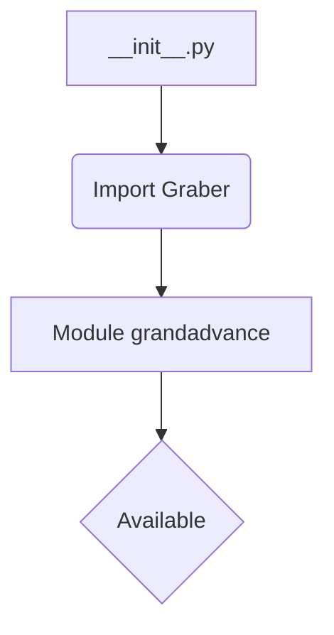
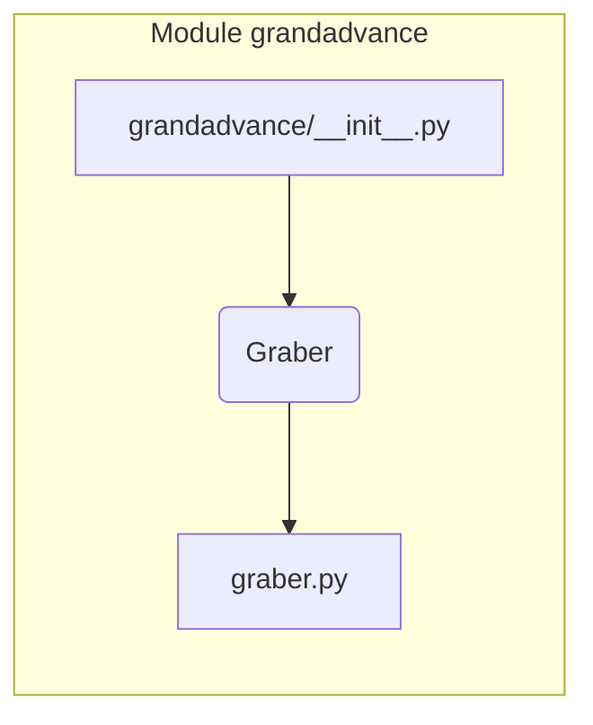

1. **<input code>**

```python
## \file hypotez/src/suppliers/grandadvance/__init__.py
# -*- coding: utf-8 -*-
#! venv/Scripts/python.exe
#! venv/bin/python/python3.12

"""
.. module: src.suppliers.grandadvance 
	:platform: Windows, Unix
	:synopsis:

"""
MODE = 'dev'

from .graber import Graber
```

2. **<algorithm>**

Этот файл `__init__.py` является файлом инициализации для модуля `grandadvance` в пакете поставщиков `suppliers`.  Он не содержит сложных алгоритмов.  Основной его функцией является импорт класса `Graber` из подмодуля `graber`.  

Блок-схема:



Пример: Этот код подготовит окружение, чтобы в дальнейшем использовать класс `Graber`, например, для сбора данных.

3. **<mermaid>**



4. **<explanation>**

* **Импорты**: `from .graber import Graber` - импортирует класс `Graber` из файла `graber.py`, который находится в том же каталоге (`./graber.py`).  `src.suppliers.grandadvance` - это путь до пакета `grandadvance`, который является частью пакета `suppliers`, который в свою очередь входит в папку `src`.  Этот импорт позволяет использовать класс `Graber` внутри модуля `grandadvance`.

* **Классы**:  Класс `Graber` определён в файле `graber.py`.  Этот файл, скорее всего, содержит реализацию логики сбора данных. Файл `__init__.py` просто предоставляет доступ к этому классу.  Подробности реализации класса `Graber` не показаны, но они будут определять функциональность его методов.  

* **Функции**: В этом файле нет собственных функций, только импорт класса.

* **Переменные**: `MODE = 'dev'` - вероятно, переменная, задающая режим работы (разработка, тестирование, производство). Это может влиять на конфигурацию или поведение программного обеспечения.


* **Возможные ошибки/улучшения**: Нет явно выраженных ошибок.  Возможным улучшением могло бы быть добавление документации для переменной `MODE`.


**Цепочка взаимосвязей:**

Файл `__init__.py`  в `src.suppliers.grandadvance` необходим для использования класса `Graber`.  Класс `Graber` предполагается, что используется для взаимодействия с источником данных (например, API GrandAdvance),  извлекает данные и обрабатывает их.  В дальнейшем данные могут обрабатываться другими частями проекта.  Например, `Graber` может быть использован в других модулях, или для инициализации какого-либо другого функционала.


**В заключение:** Файл `__init__.py` является важной частью структуры пакета `grandadvance`, обеспечивая доступ к классу `Graber`, который, по-видимому, отвечает за взаимодействие с поставщиком данных GrandAdvance.  Для более глубокого понимания необходимо проанализировать файл `graber.py`.