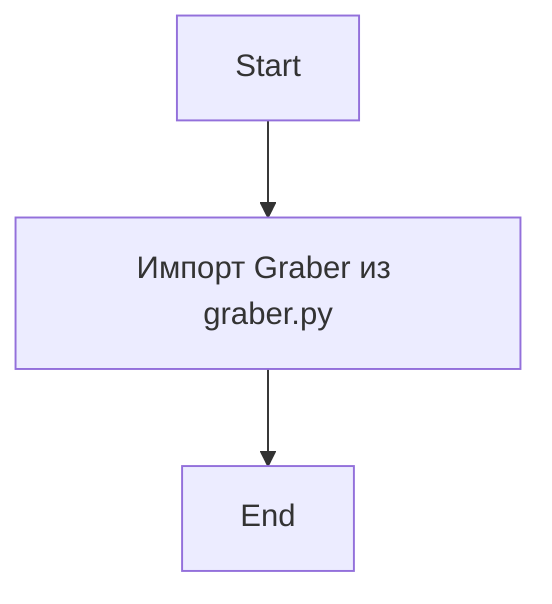
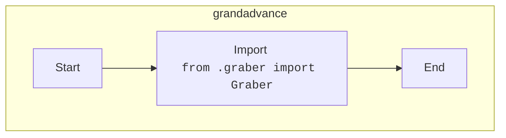

## Анализ кода `hypotez/src/suppliers/grandadvance/__init__.py`

### 1. <алгоритм>

1. **Импорт:**
   - Импортируется класс `Graber` из модуля `graber.py`, который находится в той же директории `src/suppliers/grandadvance`. Этот класс, вероятно, отвечает за парсинг данных с веб-сайта поставщика Grand Advance.

### 2. <mermaid>

**Анализ зависимостей `mermaid`:**

- Диаграмма показывает, что в модуле `__init__.py` из `grandadvance` импортируется класс `Graber` из файла `graber.py`, находящегося в той же директории. Это означает, что модуль `grandadvance` зависит от `graber.py`.

### 3. <объяснение>

**Импорты:**
- `from .graber import Graber`: Этот импорт является относительным и означает, что из модуля `graber.py`, расположенного в той же директории, что и `__init__.py` импортируется класс `Graber`. Класс `Graber`  предположительно отвечает за парсинг и получение данных с веб-сайта поставщика Grand Advance.

**Классы:**
- `Graber`:  Импортируется, но не используется непосредственно в данном файле. Этот класс, вероятно, содержит логику для сбора данных с сайта поставщика `Grand Advance`.

**Файлы и назначение:**
- `__init__.py`: Этот файл делает директорию `grandadvance` пакетом Python. Импорт `Graber` в `__init__.py` позволяет другим модулям проекта легко импортировать этот класс из пакета `grandadvance`, например: `from src.suppliers.grandadvance import Graber`.

**Цепочка взаимосвязей:**
- `__init__.py` является точкой входа для пакета `grandadvance`. Другие части проекта, вероятно, будут импортировать класс `Graber` отсюда для сбора данных.
-   Модуль `grandadvance`  находится в директории `src/suppliers/`, следовательно, он является частью более крупной системы для работы с поставщиками.
-   Логика парсинга (которая, скорее всего, находится в `graber.py`) предположительно используется для получения данных о товарах, ценах и т.д. у поставщика `Grand Advance`.
-   Предполагается, что другие модули, например,  `src/core/` (если есть такой модуль)  будут потреблять данные, полученные с помощью `Graber`.

**Потенциальные улучшения:**

-  Документировать класс `Graber` внутри `graber.py` и указать его назначение.
-  Указать типы данных, которые будет возвращать `Graber`.
-   Если в дальнейшем понадобится добавить больше классов, их тоже необходимо будет импортировать в `__init__.py`.