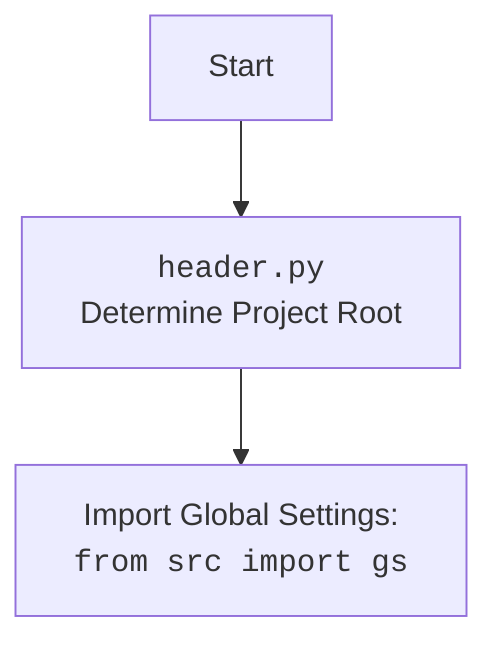

## АНАЛИЗ КОДА: `hypotez/src/suppliers/grandadvance/graber.py`

### 1. <алгоритм>

**Блок-схема:**

```mermaid
graph LR
    A[Начало] --> B(Импорт модулей);
    B --> C{Определение класса Graber};
    C --> D(Инициализация класса `__init__`);
    D --> E{Установка `supplier_prefix`};
    E --> F(Вызов `super().__init__()`);
    F --> G{Установка `Context.locator_for_decorator` в `None`};    
    G --> H[Конец];
```

**Пример для каждого блока:**

*   **A (Начало):** Программа начинает выполнение с импорта необходимых модулей и определения класса `Graber`.
*   **B (Импорт модулей):**
    *   `typing.Any`: Для аннотации типов, позволяющей использовать любой тип данных.
    *   `header`: Заголовочный файл, возможно, для общих настроек проекта.
    *  `src.suppliers.graber`: Импортируется родительский класс `Graber` и `Context`, `close_pop_up`  для наследования и контекста.
    *   `src.webdriver.driver`:  Импортируется `Driver` для управления веб-драйвером.
    *   `src.logger.logger`: Импортируется `logger` для логирования.
*   **C (Определение класса `Graber`):** Определяется класс `Graber`, наследующий от `Grbr` (предположительно родительского класса).
*  **D (Инициализация класса `__init__`):**  Метод `__init__` инициализирует экземпляр класса `Graber`, принимая аргумент `driver` типа `Driver`.
*   **E (Установка `supplier_prefix`):** Устанавливает атрибут `supplier_prefix` в значение 'grandadvance'.
*   **F (Вызов `super().__init__()`):** Вызывается конструктор родительского класса `Grbr` с аргументами `supplier_prefix` и `driver`, передавая их для инициализации родительского класса.
*   **G (Установка `Context.locator_for_decorator` в `None`):** Устанавливает атрибут `locator_for_decorator` в `Context` на `None`. Это отключает использование декоратора по умолчанию из родительского класса.
*   **H (Конец):**  Инициализация объекта `Graber` завершена.

### 2. <mermaid>

```mermaid
flowchart TD
    A[<code>graber.py</code><br> Start] --> B(import: <br> <code>typing.Any</code>);
    B --> C(import: <br> <code>header</code>);
    C --> D(import: <br> <code>src.suppliers.graber</code><br> as Grbr, Context, close_pop_up);    
    D --> E(import: <br> <code>src.webdriver.driver</code> <br> as Driver);
    E --> F(import: <br> <code>src.logger.logger</code><br> as logger);
    F --> G[class Graber <br> Inherits from <br> <code>Grbr</code>];
    G --> H[def <code>__init__</code> <br> with <code>Driver</code> argument];
    H --> I{set <code>supplier_prefix</code> <br> to 'grandadvance'};
    I --> J[call <br> <code>super().__init__()</code>];
    J --> K{set <br> <code>Context.locator_for_decorator</code> <br> to <code>None</code>};
    K --> L[End];
    
    style A fill:#f9f,stroke:#333,stroke-width:2px
    style L fill:#f9f,stroke:#333,stroke-width:2px
    
```

**Зависимости:**
*   `typing.Any`: Используется для аннотации типов, указывая, что переменная может быть любого типа.
*   `header`: Импортируется для доступа к общим настройкам.
*   `src.suppliers.graber`: Импортируется `Graber` как `Grbr`,  `Context`, `close_pop_up` для наследования и контекста. Это означает, что текущий класс `Graber` является подклассом `Grbr`,  использует `Context` для хранения контекста (данные) и функцию для  закрытия всплывающих окон.
*   `src.webdriver.driver`: Импортируется `Driver` для управления веб-драйвером, необходимого для взаимодействия с веб-страницами.
*   `src.logger.logger`: Импортируется `logger` для логирования, который используется для отслеживания выполнения программы и обработки ошибок.


### 3. <объяснение>

**Импорты:**

*   `typing.Any`: Используется для аннотации типов. `Any` позволяет переменной быть любого типа.
*   `header`: Этот модуль, вероятно, содержит общие настройки проекта или утилиты. Импортируется для доступа к этим настройкам.
*   `src.suppliers.graber`:
    *   `Graber as Grbr`: Импортируется родительский класс `Graber` из `src.suppliers.graber` и переименовывается в `Grbr`. Это делается для того, чтобы избежать конфликтов имен при наследовании.
    *   `Context`: Импортируется класс `Context`, который, вероятно, используется для хранения глобального контекста выполнения, например, состояния веб-драйвера или общих настроек.
    * `close_pop_up`: Функция для создания декоратора, который закрывает всплывающие окна.
*   `src.webdriver.driver`:
    *   `Driver`: Импортируется класс `Driver`, предназначенный для управления веб-драйвером (например, Selenium), позволяющего взаимодействовать с веб-страницами.
*   `src.logger.logger`:
    *   `logger`: Импортируется объект `logger`, который используется для записи сообщений в лог-файл. Это полезно для отладки и мониторинга работы программы.

**Классы:**

*   `class Graber(Grbr)`:
    *   **Роль:** Класс `Graber` предназначен для сбора данных со страниц товаров на сайте `grandadvanse.co.il`. Он наследует от класса `Grbr` (который, вероятно, является общим классом для сборщиков данных).
    *   **Атрибуты:**
        *   `supplier_prefix`: Атрибут типа `str`, устанавливается в значение `'grandadvance'`.  Он используется для идентификации поставщика, с которым работает данный класс.
    *   **Методы:**
        *   `__init__(self, driver: Driver)`:
            *   **Аргументы:** Принимает объект `Driver` для управления веб-драйвером.
            *   **Назначение:** Инициализирует экземпляр класса `Graber`. Устанавливает `supplier_prefix`, вызывает конструктор родительского класса `Grbr` и устанавливает `Context.locator_for_decorator` в `None` ,отключая дефолтный декоратор.

**Функции:**

*   В этом коде явно определена только функция  `__init__`, у родительского класса есть другие функции.
*   В закомментированном коде есть функция `close_pop_up`, которая создает декоратор.
    *   **Аргументы:** `value` типа `Any`.
    *   **Возвращаемое значение:** Декоратор.
    *   **Назначение:** Создает декоратор для закрытия всплывающих окон перед выполнением основной логики функции.

**Переменные:**

*   `supplier_prefix`: Атрибут класса `Graber`, строка `'grandadvance'`. Используется для определения поставщика.
*   `Context.locator_for_decorator`:  Атрибут `Context`, устанавливается в `None`, отключая дефолтный декоратор.
*   `driver`: Объект класса `Driver`, используется для управления веб-драйвером.

**Взаимосвязь с другими частями проекта:**

*   **Родительский класс (`Grbr`)**: Класс `Graber` наследует функциональность от родительского класса `Grbr` из модуля `src.suppliers.graber`, что предполагает, что этот родительский класс реализует общую логику для всех сборщиков данных.
*   **Модуль `src.webdriver.driver`**:  Класс `Driver` используется для управления веб-драйвером, обеспечивая возможность взаимодействия с веб-страницами.
*   **Модуль `src.logger.logger`**: Объект `logger` используется для логирования, что помогает отслеживать ход выполнения программы и диагностировать ошибки.
*   **Модуль `header`**: Используется для доступа к общим настройкам проекта.
*   **`Context`**: Класс `Context` используется как контейнер для хранения глобального контекста выполнения.

**Потенциальные ошибки и области для улучшения:**

*   **Отсутствие обработки исключений:** В текущем коде нет явной обработки исключений в методе `__init__`. Желательно добавить `try-except` блоки для обработки возможных ошибок при инициализации.
*   **Закомментированный декоратор:** Код декоратора закомментирован, что подразумевает возможность реализации пользовательского декоратора в будущем. Возможно стоит включить эту функциональность в текущую реализацию.
*   **Отсутствие документации на методы:** Код `Grbr`  не показан, возможно есть недочеты по документации, хорошо бы дополнить информацию.
*   **Конфигурация `locator_for_decorator`**: В данном случае `Context.locator_for_decorator`  устанавливается в `None`, отключая возможность использовать декоратор.

**Цепочка взаимосвязей:**

`graber.py` -> `src.suppliers.graber` (наследование, контекст) -> `src.webdriver.driver` (управление веб-драйвером) -> `src.logger.logger` (логирование) -> `header.py` (глобальные настройки проекта).