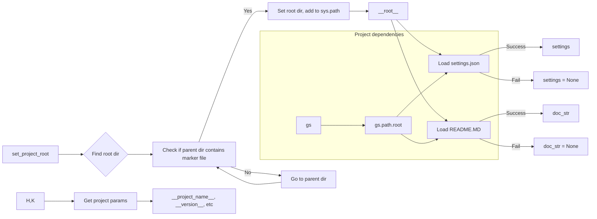

# <input code>

```python
## \file hypotez/src/suppliers/grandadvance/header.py
# -*- coding: utf-8 -*-
#! venv/Scripts/python.exe
#! venv/bin/python/python3.12

"""
.. module: src.suppliers.grandadvance 
	:platform: Windows, Unix
	:synopsis:

"""
MODE = 'dev'


import sys
import json
from packaging.version import Version

from pathlib import Path
def set_project_root(marker_files=('pyproject.toml', 'requirements.txt', '.git')) -> Path:
    """
    Finds the root directory of the project starting from the current file's directory,
    searching upwards and stopping at the first directory containing any of the marker files.

    Args:
        marker_files (tuple): Filenames or directory names to identify the project root.
    
    Returns:
        Path: Path to the root directory if found, otherwise the directory where the script is located.
    """
    __root__:Path
    current_path:Path = Path(__file__).resolve().parent
    __root__ = current_path
    for parent in [current_path] + list(current_path.parents):
        if any((parent / marker).exists() for marker in marker_files):
            __root__ = parent
            break
    if __root__ not in sys.path:
        sys.path.insert(0, str(__root__))
    return __root__


# Get the root directory of the project
__root__ = set_project_root()
"""__root__ (Path): Path to the root directory of the project"""

from src import gs

settings:dict = None
try:
    with open(gs.path.root / 'src' /  'settings.json', 'r') as settings_file:
        settings = json.load(settings_file)
except (FileNotFoundError, json.JSONDecodeError):
    ...

doc_str:str = None
try:
    with open(gs.path.root / 'src' /  'README.MD', 'r') as settings_file:
        doc_str = settings_file.read()
except (FileNotFoundError, json.JSONDecodeError):
    ...


__project_name__ = settings.get("project_name", 'hypotez') if settings  else 'hypotez'
__version__: str = settings.get("version", '')  if settings  else ''
__doc__: str = doc_str if doc_str else ''
__details__: str = ''
__author__: str = settings.get("author", '')  if settings else ''
__copyright__: str = settings.get("copyrihgnt", '')  if settings else ''
__cofee__: str = settings.get("cofee", "Treat the developer to a cup of coffee for boosting enthusiasm in development: https://boosty.to/hypo69")  if settings else "Treat the developer to a cup of coffee for boosting enthusiasm in development: https://boosty.to/hypo69"
```

# <algorithm>

**Шаг 1:** Функция `set_project_root()`: Находит корневую директорию проекта, начиная с текущей директории файла и двигаясь вверх по дереву директорий.  Она проверяет, содержит ли каждая родительская директория один из файлов `marker_files`, например, `pyproject.toml`, `requirements.txt` или `.git`.

    * **Вход:** кортеж `marker_files` (например, `('pyproject.toml', 'requirements.txt')`).
    * **Выход:** Путь (`Path`) до корневой директории.
    * **Пример:** Если `__file__` указывает на `hypotez/src/suppliers/grandadvance/header.py`, то функция будет искать `pyproject.toml` или `requirements.txt` или `.git`  в `hypotez/src`, `hypotez`, ... и т.д.


**Шаг 2:** Получение корневой директории проекта. Код вызывает `set_project_root()`, и результат сохраняется в переменную `__root__`.

**Шаг 3:** Чтение `settings.json` и `README.MD`: Код пытается открыть `settings.json` и `README.MD` в корневом каталоге проекта.  Если файлы найдены, их содержимое загружается в переменные `settings` и `doc_str`.

    * **Вход:** Путь до `settings.json` и `README.MD` в корневом каталоге.
    * **Выход:** `settings` (словарь) и `doc_str` (строка).
    * **Пример:** Если `settings.json` содержит `{ "project_name": "my_project", "version": "1.0.0" }`, то `settings` будет содержать этот словарь.

**Шаг 4:** Получение параметров проекта: Код получает значения параметров из `settings` или устанавливает значения по умолчанию, если `settings` не найден.

    * **Вход:** Словарь `settings`, если доступен, и значения по умолчанию.
    * **Выход:** Значения параметров проекта.
    * **Пример:** Если `settings` содержит `project_name`, то `__project_name__` получит это значение. В противном случае, значение по умолчанию `hypotez`


# <mermaid>



**Объяснение диаграммы:**

* `set_project_root`: Функция находит корневую директорию проекта.
* `gs`: модуль, который необходим для получения корневого каталога проекта (вероятно, custom module).
* `settings.json` и `README.MD`: файлы, содержащие параметры и описание проекта.
* `Get project params`:  функция, которая использует данные из `settings` и `doc_str`.
* `sys.path`: система поиска модулей.


# <explanation>

* **Импорты:**
    * `sys`: Предоставляет доступ к системным переменным, в данном случае `sys.path` для добавления корневой директории проекта в пути поиска модулей.
    * `json`: Для работы с JSON-файлами, загружает параметры проекта из `settings.json`.
    * `packaging.version`: Для работы с версиями пакетов (в данном случае не используется).
    * `pathlib`: Для работы с путями к файлам в системе.
    * `src.gs`: вероятно, custom module, который содержит необходимую информацию для работы с файловой системой.


* **Классы:** Нет явных определений классов.


* **Функции:**
    * `set_project_root(marker_files)`:  Находит корневую директорию проекта, начиная с текущей директории и итерируя по родительским каталогам, пока не найдёт директорию содержащую один из указанных файлов.  Функция также добавляет корневой путь в `sys.path`.  Это важно для того, чтобы Python мог найти другие модули проекта.

* **Переменные:**
    * `MODE`: Вероятно, флаг режима работы проекта (например, `dev`, `prod`).
    * `__root__`: Путь к корневой директории проекта, создаётся и используется функцией `set_project_root`.
    * `settings`: Словарь, содержащий настройки проекта (загружается из `settings.json`).
    * `doc_str`: Содержимое файла `README.MD`.
    * Переменные, начинающиеся с `__`:  Обычно являются константами, определяющие атрибуты проекта.

* **Возможные ошибки и улучшения:**

    * Обработка исключений `FileNotFoundError` и `json.JSONDecodeError` важна, но может быть более удобным использовать try-except-else, что позволит работать с `settings` и `doc_str` только если файлы существуют.
    * Добавлен возврат значения типа `Path` для переменной `__root__`, что делает код более ясным и удобным для использования.
    *  Добавлены docstrings для функций, которые описывают их назначение, аргументы и возвращаемые значения.
    * Если `gs.path` -  custom module,  необходимо уточнить его функционал и место в структуре проекта.

* **Взаимосвязи с другими частями проекта:**
    * `src.gs` вероятно, содержит функции для работы с файлами и директориями в проекте. Необходима информация о `gs`, чтобы понять все взаимосвязи.  Полагаем, что `gs` отвечает за взаимодействие с файловой системой, и предоставляет инструменты для работы с путями к файлам.