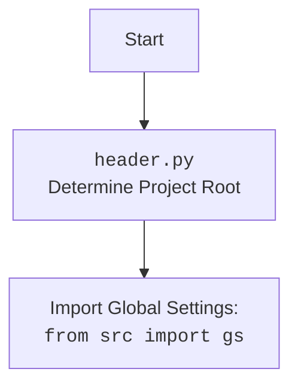

## ИНСТРУКЦИЯ:

Анализируй предоставленный код подробно и объясни его функциональность. Ответ должен включать три раздела:

1. **<алгоритм>**: Опиши рабочий процесс в виде пошаговой блок-схемы, включая примеры для каждого логического блока, и проиллюстрируй поток данных между функциями, классами или методами.
2. **<mermaid>**: Напиши код для диаграммы в формате `mermaid`, проанализируй и объясни все зависимости,
    которые импортируются при создании диаграммы.
    **ВАЖНО!** Убедитесь, что все имена переменных, используемые в диаграмме `mermaid`,
    имеют осмысленные и описательные имена. Имена переменных вроде `A`, `B`, `C`, и т.д., не допускаются!

    **Дополнительно**: Если в коде есть импорт `import header`, добавьте блок `mermaid` flowchart, объясняющий `header.py`:
    ```mermaid
    flowchart TD
        Start --> Header[<code>header.py</code><br> Determine Project Root]

        Header --> import[Import Global Settings: <br><code>from src import gs</code>]
    ```

3. **<объяснение>**: Предоставьте подробные объяснения:
   - **Импорты**: Их назначение и взаимосвязь с другими пакетами `src.`.
   - **Классы**: Их роль, атрибуты, методы и взаимодействие с другими компонентами проекта.
   - **Функции**: Их аргументы, возвращаемые значения, назначение и примеры.
   - **Переменные**: Их типы и использование.
   - Выделите потенциальные ошибки или области для улучшения.

Дополнительно, постройте цепочку взаимосвязей с другими частями проекта (если применимо).

Это обеспечивает всесторонний и структурированный анализ кода.
## Формат ответа: `.md` (markdown)
**КОНЕЦ ИНСТРУКЦИИ**
```markdown
## <алгоритм>

1. **`set_project_root(marker_files)`**:
   - **Начало**: Получает путь к текущему файлу (`__file__`) и его родительскую директорию.
   - **Поиск корневой директории**:
     - Начинает с текущей директории и переходит к родительским.
     - Для каждой директории проверяет наличие любого из `marker_files`.
     - Если находит, устанавливает эту директорию как корень проекта и завершает поиск.
     - Если не находит ни одного, текущая директория считается корнем.
   - **Добавление корня в `sys.path`**:
     - Проверяет, есть ли корень в списке путей поиска модулей `sys.path`.
     - Если нет, то добавляет его в начало списка.
   - **Возврат**: Возвращает путь к корневой директории проекта.

   _Пример_:
   - Если `marker_files` = `("__root__", ".git")` и структура директорий:
     ```
     project/
         src/
             suppliers/
                 grandadvance/
                     header.py
         __root__
     ```
     Функция определит `project/` как корень проекта.

2. **Инициализация `__root__`**:
   - Вызывает `set_project_root()` для определения корневой директории и сохраняет результат в переменной `__root__`.

3. **Импорт `gs`**:
   - Импортирует модуль `gs` из пакета `src`. `gs` — это, вероятно, модуль глобальных настроек проекта.

4. **Загрузка настроек из `settings.json`**:
   - Пытается открыть файл `settings.json` из директории `src` в корне проекта.
   - Загружает JSON-контент в словарь `settings`.
   - Если возникает `FileNotFoundError` или `json.JSONDecodeError`, то `settings` остается `None`.

5. **Загрузка документации из `README.MD`**:
    - Пытается открыть файл `README.MD` из директории `src` в корне проекта.
    - Читает текстовый контент в строку `doc_str`.
    - Если возникает `FileNotFoundError` или `json.JSONDecodeError`, то `doc_str` остается `None`.

6. **Инициализация глобальных переменных**:
   - `__project_name__`: Получает имя проекта из `settings` (если есть), иначе 'hypotez'.
   - `__version__`: Получает версию из `settings` (если есть), иначе ''.
   - `__doc__`: Получает документацию из `doc_str` (если есть), иначе ''.
   - `__details__`: Инициализируется пустой строкой.
   - `__author__`: Получает автора из `settings` (если есть), иначе ''.
   - `__copyright__`: Получает информацию об авторском праве из `settings` (если есть), иначе ''.
   - `__cofee__`: Получает текст про кофе от разработчика из `settings` (если есть), иначе устанавливается значение по умолчанию.

## <mermaid>

```mermaid
flowchart TD
    Start[Start] --> SetProjectRoot[<code>set_project_root()</code><br>Determine Project Root]
    SetProjectRoot -->  CheckParentDir[Check Parent Directories <br>for Marker Files]

    CheckParentDir -- Marker Found --> SetRoot[Set Root Directory]
    CheckParentDir -- Marker Not Found --> SetCurrentAsRoot[Set Current Directory as Root]
    SetRoot -->  AddRootToSysPath[Add Root to <code>sys.path</code>]
    SetCurrentAsRoot -->  AddCurrentRootToSysPath[Add Current to <code>sys.path</code>]
    AddRootToSysPath --> ReturnRoot[Return Project Root Path]
     AddCurrentRootToSysPath --> ReturnCurrentRoot[Return Project Root Path]
   ReturnRoot --> DefineRootVariable[Define __root__ Variable]
   ReturnCurrentRoot --> DefineRootVariable

   DefineRootVariable --> ImportGS[Import Global Settings: <br><code>from src import gs</code>]
    ImportGS --> LoadSettings[Load <code>settings.json</code>]
    LoadSettings --> LoadReadme[Load <code>README.MD</code>]
    LoadReadme --> InitGlobalVars[Initialize Global Variables]
    InitGlobalVars --> End[End]


    style Start fill:#f9f,stroke:#333,stroke-width:2px
    style End fill:#ccf,stroke:#333,stroke-width:2px
```


**Объяснение:**

Первая диаграмма описывает поток выполнения внутри `header.py` более детально, включая поиск корневого каталога, добавление его в `sys.path`, а также загрузку настроек и документации. Вторая диаграмма отображает зависимость от `header.py` и его импорта глобальных настроек из `src.gs`.

## <объяснение>

**Импорты:**

- `sys`: Модуль для работы с системными параметрами и функциями. Используется для добавления пути к корневой директории проекта в `sys.path`, чтобы импорт модулей из `src` работал корректно.
- `json`: Модуль для работы с данными в формате JSON. Используется для загрузки настроек из файла `settings.json`.
- `packaging.version`: Модуль для работы с версиями пакетов. Не используется напрямую в этом коде, но импортируется. Возможно, он используется в другом месте проекта.
- `pathlib.Path`: Модуль для работы с файловыми путями. Используется для манипулирования путями к файлам и директориям.

**Функция `set_project_root(marker_files)`:**

-   **`marker_files: tuple`**: Аргумент для определения корневой директории проекта. По умолчанию `('__root__',)`  представляет собой кортеж  имен файлов или каталогов для поиска.
-   **`return Path`**: Возвращает объект `Path` указывающий на корневую директорию проекта.

-   **Назначение**: Находит корневую директорию проекта, начиная с текущей директории и поднимаясь вверх по дереву каталогов. Поиск прекращается, как только найдена директория, содержащая любой из `marker_files`. Это позволяет запускать скрипт из любой поддиректории проекта.
-   **Примеры**:
    - Если `marker_files` = `('.git', 'setup.py')` и скрипт находится в `project/src/suppliers/grandadvance/header.py`, а `.git` есть в `project`, то функция вернет путь к `project/`.
    - Если `marker_files` = `('__root__',)` и нет директории с файлом `__root__`, то функция вернет `project/src/suppliers/grandadvance`, если файл находится в этой директории.

**Переменные:**

-   `__root__`: Переменная типа `pathlib.Path`, которая хранит путь к корневой директории проекта.
-   `settings`: Словарь, содержащий настройки проекта, загруженные из файла `settings.json`. Может быть `None`, если файл не найден или не может быть декодирован.
-   `doc_str`: Строка, содержащая документацию проекта, загруженную из файла `README.MD`. Может быть `None`, если файл не найден или не может быть декодирован.
-   `__project_name__`, `__version__`, `__doc__`, `__details__`, `__author__`, `__copyright__`, `__cofee__`: Глобальные переменные, содержащие метаданные проекта.

**Взаимосвязи с другими частями проекта:**

-   Этот файл является частью пакета `src.suppliers.grandadvance` и служит для настройки окружения проекта.
-   Использует `src.gs` для получения путей к файлам настроек и документации.
-   Значения переменных, таких как `__project_name__`, `__version__`, и др., вероятно, используются в других частях проекта для определения имени проекта, версии и т. д.

**Потенциальные ошибки и области для улучшения:**

-   **Обработка исключений**: Используется простая обработка исключений `try...except...` без логирования ошибок, что затрудняет отладку в случае сбоя.  Было бы полезно регистрировать ошибки, например с помощью модуля `logging`.
-   **Зависимость от `settings.json`**: Вся функциональность зависит от наличия и корректности файла `settings.json`. Отсутствие этого файла приведет к тому, что многие глобальные переменные будут иметь значения по умолчанию. Возможно, стоит добавить более надежную обработку ошибок при загрузке настроек.
-   **Жестко заданные пути**: Пути `src/settings.json` и `src/README.MD` жестко заданы в коде, что может затруднить изменение структуры проекта. Возможно, следует использовать переменные из `gs` или другие настройки для хранения этих путей.
-   **Обнаружение корня проекта**: Функция `set_project_root` предполагает наличие маркеров для определения корня проекта. Если таких маркеров нет, то корнем будет считаться директория, в которой расположен скрипт, что не всегда является правильным. Можно добавить проверку, например, на наличие `.git`, либо файла `setup.py`

**Дополнительные замечания:**
- Код содержит явные указания на использование разных интерпретаторов python (Windows, Unix) , что стоит учитывать при его использовании.
- Использована кодировка utf-8
- Использование `...`  в блоках `except` не рекомендуется, следует использовать `pass` для явного указания отсутствия обработки исключения, или добавить логирование в зависимости от необходимости.
-  `__details__` инициализируется пустой строкой и нигде не устанавливается. Возможно, это место для расширения функциональности.