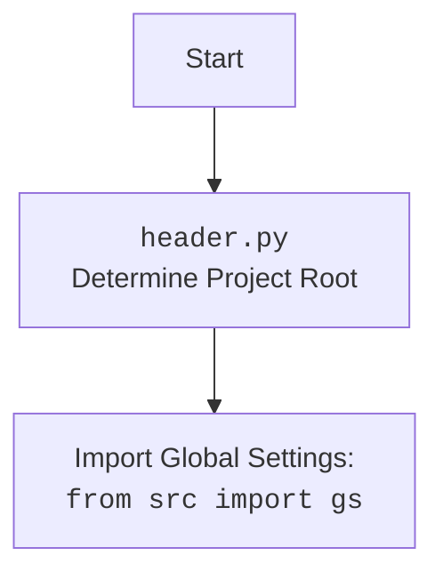

## ИНСТРУКЦИЯ:

Анализируй предоставленный код подробно и объясни его функциональность. Ответ должен включать три раздела:

1. **<алгоритм>**: Опиши рабочий процесс в виде пошаговой блок-схемы, включая примеры для каждого логического блока, и проиллюстрируй поток данных между функциями, классами или методами.
2. **<mermaid>**: Напиши код для диаграммы в формате `mermaid`, проанализируй и объясни все зависимости,
    которые импортируются при создании диаграммы.
    **ВАЖНО!** Убедитесь, что все имена переменных, используемые в диаграмме `mermaid`,
    имеют осмысленные и описательные имена. Имена переменных вроде `A`, `B`, `C`, и т.д., не допускаются!

    **Дополнительно**: Если в коде есть импорт `import header`, добавьте блок `mermaid` flowchart, объясняющий `header.py`:
    ```mermaid
    flowchart TD
        Start --> Header[<code>header.py</code><br> Determine Project Root]

        Header --> import[Import Global Settings: <br><code>from src import gs</code>]
    ```

3. **<объяснение>**: Предоставьте подробные объяснения:
   - **Импорты**: Их назначение и взаимосвязь с другими пакетами `src.`.
   - **Классы**: Их роль, атрибуты, методы и взаимодействие с другими компонентами проекта.
   - **Функции**: Их аргументы, возвращаемые значения, назначение и примеры.
   - **Переменные**: Их типы и использование.
   - Выделите потенциальные ошибки или области для улучшения.

Дополнительно, постройте цепочку взаимосвязей с другими частями проекта (если применимо).

Это обеспечивает всесторонний и структурированный анализ кода.
## Формат ответа: `.md` (markdown)
**КОНЕЦ ИНСТРУКЦИИ**

## <алгоритм>

1. **Начало**: Запускается скрипт `header.py`.
2. **Определение `set_project_root`**: Вызывается функция `set_project_root` для определения корневой директории проекта.
   - **Инициализация**:  Переменная `current_path` инициализируется как путь к директории, где находится скрипт `header.py`.
   - **Поиск корня**: Функция итерируется по родительским директориям текущего пути. Для каждой родительской директории проверяется, есть ли в ней файлы или папки из списка `marker_files` (`'__root__'`, `'.git'`).
   - **Найдено**: Если маркерный файл найден, то путь к этой директории присваивается переменной `__root__`. Поиск завершается.
        - *Пример*: Если скрипт лежит в `hypotez/src/suppliers/grandadvance` и `.git` найден в `hypotez`, то `__root__` станет `hypotez`.
    - **Не найдено**: Если маркерные файлы не найдены, переменная `__root__` останется равна пути к директории, где находится скрипт.
        - *Пример*: Если ни `__root__` ни `.git` не найдены, `__root__` станет `hypotez/src/suppliers/grandadvance`.
   - **Обновление sys.path**: Если корневая директория не добавлена в `sys.path`, она добавляется в начало списка.
   - **Возврат**: Функция возвращает путь к корневой директории `__root__`.
3. **Инициализация `__root__`**: Переменная `__root__` инициализируется путем, полученным из `set_project_root`.
4. **Импорт `gs`**: Импортируется модуль `gs` из пакета `src`.
5. **Чтение `settings.json`**:
    - **Открытие файла**: Пытается открыть файл `settings.json` расположенный в `src` директории относительно корневой папки.
    - **Загрузка JSON**: Если файл открыт успешно, то его содержимое загружается в словарь `settings` с помощью `json.load`.
    - **Обработка ошибок**: Если происходит ошибка `FileNotFoundError` или `json.JSONDecodeError` (например, файл не найден или имеет неверный формат), то ошибки игнорируются. `settings` остается `None`.
6. **Чтение `README.MD`**:
   - **Открытие файла**: Пытается открыть файл `README.MD` расположенный в `src` директории относительно корневой папки.
   - **Чтение файла**: Если файл открыт успешно, то его содержимое считывается в строку `doc_str`.
   - **Обработка ошибок**: Если происходит ошибка `FileNotFoundError` или `json.JSONDecodeError` то ошибки игнорируются. `doc_str` остается `None`.
7. **Инициализация переменных проекта**: На основе данных из `settings.json` или по умолчанию, устанавливаются значения переменных:
   - `__project_name__`: Название проекта. По умолчанию `hypotez`.
   - `__version__`: Версия проекта. По умолчанию `''`.
   - `__doc__`:  Содержимое `README.MD`, или `''`, если файл отсутствует.
   - `__details__`: Детальная информация. По умолчанию `''`.
   - `__author__`: Автор проекта. По умолчанию `''`.
   - `__copyright__`: Копирайт проекта. По умолчанию `''`.
   - `__cofee__`: Сообщение для поддержки разработчика. По умолчанию ссылка на boosty.
8. **Конец**: Скрипт завершает работу.

## <mermaid>

```mermaid
flowchart TD
    Start(Start) --> FindProjectRoot{Find Project Root<br>set_project_root()};
    FindProjectRoot --> InitCurrentPath{Initialize Current Path<br>current_path = Path(__file__).resolve().parent};
    InitCurrentPath --> LoopParents{Loop through parent directories};
    LoopParents -- Yes, marker found --> SetRootPath{Set Root Path<br>__root__ = parent};
    SetRootPath --> BreakLoop{Break loop};
    LoopParents -- No, marker not found --> LoopParents;
    BreakLoop --> CheckSysPath{Check if __root__ in sys.path};
    CheckSysPath -- No --> InsertSysPath{Insert __root__ to sys.path};
    InsertSysPath --> ReturnRootPath{Return Root Path<br>return __root__};
    CheckSysPath -- Yes --> ReturnRootPath;
    ReturnRootPath --> InitRoot{Initialize __root__};
    InitRoot --> ImportGS{Import Global Settings<br>from src import gs};
    ImportGS --> ReadSettings{Read settings.json};
    ReadSettings --> HandleSettingsError{Handle FileNotFoundError/JSONDecodeError<br>settings=None};
    ReadSettings -- Success --> ReadDoc{Read README.MD};
    HandleSettingsError --> ReadDoc;
    ReadDoc --> HandleDocError{Handle FileNotFoundError/JSONDecodeError<br>doc_str=None};
    ReadDoc -- Success --> InitProjectVariables{Initialize Project Variables<br>__project_name__, __version__, ...};
    HandleDocError --> InitProjectVariables;
    InitProjectVariables --> End(End);
```


## <объяснение>

### Импорты:

- **`import sys`**: Модуль `sys` предоставляет доступ к некоторым переменным и функциям, которые взаимодействуют с интерпретатором Python. В данном случае используется для добавления пути к корневой директории проекта в `sys.path`, чтобы можно было импортировать модули из других частей проекта.
- **`import json`**: Модуль `json` используется для работы с JSON (JavaScript Object Notation) данными. Здесь он применяется для загрузки данных из файла `settings.json` в словарь Python.
- **`from packaging.version import Version`**:  Импортирует класс `Version` из библиотеки `packaging`. Этот класс используется для сравнения версий и других задач управления версиями. В этом коде он не используется, но он импортируется, возможно, для дальнейшего использования в других частях проекта.
-   **`from pathlib import Path`**: Импортирует класс `Path` из модуля `pathlib`. Этот класс позволяет работать с путями к файлам и директориям в объектно-ориентированном стиле. В коде используется для определения абсолютного пути к скрипту, определения корневой директории и работы с файлами настроек и документации.
- **`from src import gs`**:  Импортирует модуль `gs` из пакета `src`. Предположительно, `gs` содержит глобальные настройки и константы проекта, включая пути к директориям, которые используются для определения расположения файла `settings.json` и `README.MD`. Этот импорт устанавливает зависимость `header.py` от модуля `gs`.

### Функции:

-   **`set_project_root(marker_files=('__root__','.git')) -> Path`**:
    -   **Аргументы**: `marker_files` - кортеж строк, определяющий маркерные файлы/директории, наличие которых указывает на корневую директорию проекта. Значение по умолчанию: `('__root__', '.git')`.
    -   **Возвращаемое значение**: `Path` - путь к корневой директории проекта.
    -   **Назначение**: Функция находит корневую директорию проекта, начиная с директории, где расположен данный скрипт, и двигаясь вверх по иерархии директорий, пока не будет найдена директория, содержащая хотя бы один из файлов/директорий, указанных в `marker_files`. Если такой директории не найдено, возвращает директорию, где находится сам скрипт. Затем функция добавляет путь к корневой директории в `sys.path`, если его там еще нет, что позволяет импортировать модули из любой части проекта.
    -   **Примеры**:
        -   Если маркерный файл `.git` находится в каталоге `hypotez`, а `header.py` лежит в `hypotez/src/suppliers/grandadvance`, то функция вернет путь к `hypotez`.
        -   Если маркерных файлов не найдено, и скрипт лежит в `hypotez/src/suppliers/grandadvance`, то функция вернет `hypotez/src/suppliers/grandadvance`.
- Внутри функции `set_project_root` используется цикл `for parent in [current_path] + list(current_path.parents):`
    - Цикл перебирает сначала текущий путь, а затем все родительские каталоги. Это делается для того, чтобы проверить наличие маркерных файлов в текущем каталоге.
    - Внутри цикла `if any((parent / marker).exists() for marker in marker_files):` используется генератор и функция `any`.
    - Генератор `(parent / marker).exists() for marker in marker_files` создает последовательность булевых значений `True` если файл/папка по пути `parent / marker` существует и `False` иначе.
    - `any` возвращает `True` если хотя бы один из элементов последовательности `True` и `False` иначе.
-   В строке `sys.path.insert(0, str(__root__))` используется метод `insert`, для того, что бы добавить путь в начало списка `sys.path`, что позволит интерпретатору быстрее находить модули по этому пути.

### Переменные:

-   **`__root__` (Path)**: Путь к корневой директории проекта. Инициализируется результатом выполнения функции `set_project_root()`. Используется как основа для определения путей к другим файлам и директориям в проекте.
-   **`settings` (dict)**: Словарь, содержащий настройки проекта, загруженные из файла `settings.json`. Если файл не найден или имеет неверный формат, `settings` имеет значение `None`. Используется для инициализации переменных проекта.
-   **`doc_str` (str)**: Содержимое файла `README.MD`. Если файл не найден, то `doc_str`  имеет значение `None`.
-   **`__project_name__` (str)**: Название проекта, по умолчанию `hypotez`. Получается из `settings` или используется значение по умолчанию.
-   **`__version__` (str)**: Версия проекта. Получается из `settings` или используется значение по умолчанию.
-   **`__doc__` (str)**: Содержание файла `README.MD` если он существует, или пустая строка.
-   **`__details__` (str)**: Детальная информация о проекте. По умолчанию пустая строка.
-   **`__author__` (str)**: Автор проекта. Получается из `settings` или используется значение по умолчанию.
-   **`__copyright__` (str)**: Информация о копирайте проекта. Получается из `settings` или используется значение по умолчанию.
-  **`__cofee__` (str)**:  Сообщение для поддержки разработчика, по умолчанию ссылка на boosty.

### Потенциальные ошибки и области для улучшения:

-   **Обработка ошибок чтения файлов**: Блок `try...except` для чтения `settings.json` и `README.MD` просто игнорирует ошибки. Возможно, стоит добавить более детальную обработку ошибок (например, вывод предупреждения в консоль или использование значений по умолчанию) для удобства отладки.
-   **Зависимость от `gs`**: Зависимость от `src.gs` может сделать `header.py` менее переносимым, особенно если структура проекта изменится. Стоит рассмотреть возможность передавать путь к файлу `settings.json` как параметр, вместо использования глобальной переменной.
-   **Избыточный импорт**: Импорт `packaging.version.Version` не используется.
-   **Неуникальные маркеры**: Маркер `__root__` достаточно не уникальный, стоит добавить префикс, например, `.__project_root__`

### Взаимосвязь с другими частями проекта:

-   **`gs`**: Модуль `gs` (предположительно `src/gs.py`) предоставляет пути к директориям проекта, которые используются в `header.py` для определения местоположения файлов `settings.json` и `README.MD`. `header.py`  зависит от корректной инициализации и работы модуля `gs`.
-   **Импорт модулей из проекта**:  `header.py` добавляет корневую директорию проекта в `sys.path`,  что позволяет другим частям проекта импортировать модули, находящиеся в других директориях проекта, тем самым устанавливая взаимосвязь между модулями проекта.
-   **Загрузка настроек проекта**: `header.py` загружает настройки из `settings.json`, предоставляя другим модулям проекта информацию о названии, версии, авторе и т.д. Это делает `header.py` точкой доступа к общим настройкам проекта.

Таким образом, `header.py` играет важную роль в инициализации проекта, определении его корневой директории, загрузке настроек и обеспечении доступа к другим модулям проекта.