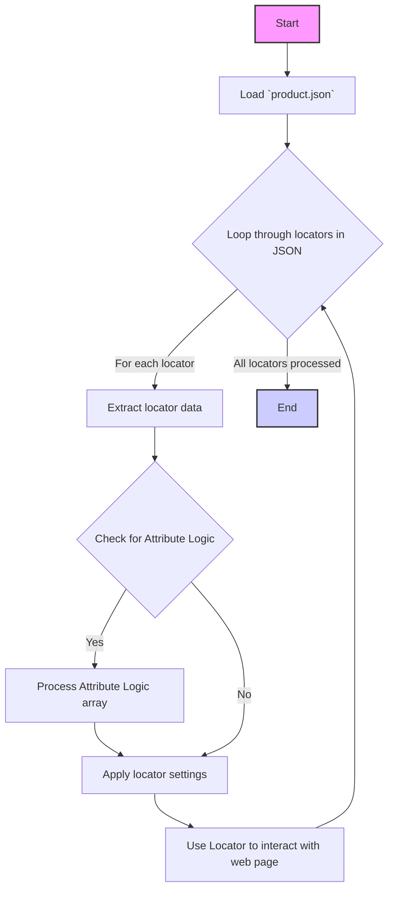

## ИНСТРУКЦИЯ:

Анализируй предоставленный код подробно и объясни его функциональность. Ответ должен включать три раздела:

1.  **<алгоритм>**: Опиши рабочий процесс в виде пошаговой блок-схемы, включая примеры для каждого логического блока, и проиллюстрируй поток данных между функциями, классами или методами.
2.  **<mermaid>**: Напиши код для диаграммы в формате `mermaid`, проанализируй и объясни все зависимости,
    которые импортируются при создании диаграммы.
    **ВАЖНО!** Убедитесь, что все имена переменных, используемые в диаграмме `mermaid`,
    имеют осмысленные и описательные имена. Имена переменных вроде `A`, `B`, `C`, и т.д., не допускаются!

    **Дополнительно**: Если в коде есть импорт `import header`, добавьте блок `mermaid` flowchart, объясняющий `header.py`:
    ```mermaid
    flowchart TD
        Start --> Header[<code>header.py</code><br> Determine Project Root]

        Header --> import[Import Global Settings: <br><code>from src import gs</code>]
    ```

3.  **<объяснение>**: Предоставьте подробные объяснения:
    - **Импорты**: Их назначение и взаимосвязь с другими пакетами `src.`.
    - **Классы**: Их роль, атрибуты, методы и взаимодействие с другими компонентами проекта.
    - **Функции**: Их аргументы, возвращаемые значения, назначение и примеры.
    - **Переменные**: Их типы и использование.
    - Выделите потенциальные ошибки или области для улучшения.

Дополнительно, постройте цепочку взаимосвязей с другими частями проекта (если применимо).

Это обеспечивает всесторонний и структурированный анализ кода.
## Формат ответа: `.md` (markdown)
**КОНЕЦ ИНСТРУКЦИИ**

## <алгоритм>

1. **Начало**: Загрузка JSON-файла, содержащего определения локаторов для элементов веб-страницы.
   - Пример: `product.json` файл содержит объекты, такие как `close_pop_up`, `id`, `id_manufacturer` и т.д.

2.  **Итерация по элементам верхнего уровня JSON**: Для каждого ключа в JSON (например, `close_pop_up`, `id`, `name`), выполняется итерация.

3.  **Обработка каждого локатора**: Для каждого ключа (локатора) в JSON выполняется обработка:
    - Извлечение атрибутов локатора: `attribute`, `by`, `selector`, `if_list`, `use_mouse`, `timeout`, `timeout_for_event`, `event`, `mandatory`, `logic for action[AND|OR|XOR|VALUE|null]`, `locator_description`.
    - Проверка на наличие дополнительных логик для атрибутов, таких как "affiliate short link"
       - Если есть логики, обрабатываем их как массив с логикой, атрибутами, селекторами, и другими опциями для каждого варианта.
       - Если нет, то используем стандартные настройки локатора.
    - **Пример:** Для локатора `"name"`:
        - `attribute` равно `"innerText"`,
        - `by` равно `"XPATH"`,
        - `selector` равно `"//h1[@itemprop = 'name']"`,
        - `if_list` равно `"first"`,
        - `use_mouse` равно `false`,
        - `timeout` равно `0`,
        - `timeout_for_event` равно `"presence_of_element_located"`,
        - `event` равно `null`,
        - `mandatory` равно `true`,
        - `locator_description` равно `"Название товара"`.
    - **Пример**: для локатора `affiliate_short_link`
        -  `logic for attribue` равно `[null, null]`
        -  `attribute` равно `[null, "value"]`
        - `by` равно `["XPATH", "XPATH"]`
        - `selector` равно `["//li[contains(@id,'amzn-ss-text-link')]", "//textarea[contains(@id,'amzn-ss-text-shortlink-textarea')]"]`
        - `if_list` равно `"first"`
        - `use_mouse` равно `[false, false]`
        - `timeout` равно `0`
        - `timeout_for_event` равно `"presence_of_element_located"`
        - `event` равно `["wait(click(),2,after)", null]`
         - `logic for action` равно `[null, null]`

4.  **Использование локатора**: Собранные данные локатора используются для поиска соответствующего элемента на веб-странице, извлечения данных, или взаимодействия с ним.
    - Например, для локатора `name` будет найден элемент `h1` с `itemprop="name"`, и будет получен его `innerText`.

5.  **Завершение**: Переход к следующему локатору, пока все локаторы не будут обработаны.

## <mermaid>



**Анализ зависимостей:**

*   **Start**: Начало процесса, не зависит от каких-либо внешних элементов.
*   **LoadJSON**: Загружает JSON-файл, в данном случае  `product.json`. Этот блок зависит от наличия файла и способности его прочитать.
*  **LoopLocators**: Итерируется по элементам верхнего уровня в JSON, этот блок зависит от результата выполнения  `LoadJSON`.
*   **ExtractLocatorData**: Извлекает данные каждого локатора. Зависит от данных полученных в предыдущем блоке `LoopLocators`
*   **CheckForAttributeLogic**: Проверяет наличие логик для атрибутов. Зависит от данных полученных в предыдущем блоке `ExtractLocatorData`
 *   **ProcessAttributeLogic**: Если есть логики, обрабатываем их как массив. Зависит от результата выполнения `CheckForAttributeLogic`
*   **ApplyLocatorSettings**: Применяет настройки локатора. Зависит от результата выполнения `ExtractLocatorData` или `ProcessAttributeLogic`
*  **UseLocator**: Использует настройки для взаимодействия с веб страницей. Зависит от `ApplyLocatorSettings`
*   **End**: Завершение процесса, не зависит от каких-либо внешних элементов.

## <объяснение>

**Общее назначение:**

Файл `product.json` представляет собой конфигурационный файл, который определяет локаторы для элементов веб-страницы. Эти локаторы используются для автоматизированного поиска и взаимодействия с элементами веб-страницы при парсинге или тестировании. Каждый локатор описывает способ нахождения элемента (например, по XPath, атрибуту) и действия, которые нужно выполнить с этим элементом (например, получить текст, сделать скриншот).

**Структура JSON:**

JSON представляет собой словарь, где ключи - это названия локаторов (например, `close_pop_up`, `id`, `id_manufacturer`), а значения - объекты, содержащие настройки локатора.

**Основные атрибуты локаторов:**

*   `attribute`: Атрибут элемента, который нужно извлечь (например, `innerText`, `src`, `value`). Может быть `null`, если не требуется извлечение атрибута.
*   `by`: Метод поиска элемента (например, `XPATH`). Может быть `null`, если не требуется явный поиск элемента.
*   `selector`: Строка, представляющая собой селектор для поиска элемента (например, XPath). Может быть `null`, если не требуется поиск элемента.
*   `if_list`: Указывает, как обрабатывать список элементов: `first` - взять первый элемент из списка, `all` - взять все элементы.
*   `use_mouse`: Логическое значение, указывающее, нужно ли использовать мышь для взаимодействия с элементом.
*   `mandatory`: Логическое значение, указывающее, является ли этот локатор обязательным.
*   `timeout`: Тайм-аут ожидания элемента в секундах.
*   `timeout_for_event`: Указывает условие для тайм-аута (например, `presence_of_element_located`).
*   `event`: Действие, которое нужно выполнить с элементом (например, `click()`, `screenshot()`). Может быть `null`, если действие не требуется.
*    `logic for action[AND|OR|XOR|VALUE|null]`: логика для  `event`, может быть `null`, `AND`, `OR`, `XOR`, `VALUE`
*   `locator_description`: Описание локатора.
*    `logic for attribue[AND|OR|XOR|VALUE|null]`: логика для `attribute`, может быть `null`, `AND`, `OR`, `XOR`, `VALUE`

**Особые случаи:**

*   **Локатор `affiliate_short_link`**: Этот локатор имеет специальную структуру. Вместо обычных значений у него есть массивы для `attribute`, `by`, `selector`, `use_mouse`, `event` и `logic for action`. Это позволяет применять несколько способов поиска и обработки локатора в зависимости от текущего контекста.

**Примеры:**

*   `close_pop_up`: Закрывает всплывающее окно, нажимая на кнопку с классом `close`.
*   `id_manufacturer`: Извлекает SKU производителя, находя его по XPath.
*  `default_image_url`:  Извлекает URL изображения, находя его по XPath, используя атрибут `src`.
*   `name`: Извлекает название продукта из заголовка `h1`.
*  `description_short`: извлекает все элементы описания из блоков `div`
*   `affiliate_short_link`: Сначала нажимает на элемент, а затем получает значение с элемента textarea,

**Цепочка взаимосвязей с другими частями проекта:**

Этот файл `product.json` используется в модуле парсинга `src/suppliers/grandadvance/parser.py`, где он загружается и используется для поиска элементов на странице и извлечения нужных данных.
В `src/suppliers/grandadvance/parser.py`  он применяется в функциях, которые используют данные из этого файла для поиска элементов на странице, извлечения их атрибутов или выполнения действий.

**Потенциальные ошибки и области для улучшения:**

1.  **Отсутствие обработки ошибок**: В JSON не предусмотрено никаких механизмов обработки ошибок. Необходимо добавить логику обработки ситуаций, когда элемент не найден или извлечение атрибута не удалось.
2.  **Жёсткая привязка к HTML структуре**: Использование XPath делает локаторы очень чувствительными к изменениям HTML. Нужно предусмотреть гибкие стратегии поиска и резервные варианты.
3.  **Дублирование логики**: Некоторые локаторы, например `description` и `specification`, имеют одинаковый `by` и `selector`, но отличаются описанием. Необходимо рассмотреть возможность вынесения общих частей.
4.  **Сложная логика в `affiliate_short_link`**: Использование массивов для разных атрибутов может сделать локатор сложным для понимания и сопровождения. Стоит рассмотреть возможность упрощения.
5.  **Не хватает валидации**: Необходима валидация структуры JSON, например, с использованием схем JSON Schema.
6. **Отсутствие описания для некоторых атрибутов**: Не все атрибуты имеют `locator_description`. Добавление таких описаний сделает конфигурацию более понятной.
7. **Не все атрибуты используются**: Некоторые атрибуты, такие как "additional_images_urls", "additional_images_alts" имеют значение null и не используются в текущей конфигурации, но существуют в структуре.

**Заключение:**

Файл `product.json` является важной частью инфраструктуры парсинга. Он обеспечивает гибкость и настраиваемость. Для улучшения стабильности и надежности системы необходимы усовершенствования в плане обработки ошибок, гибкости селекторов и упрощения сложной логики.