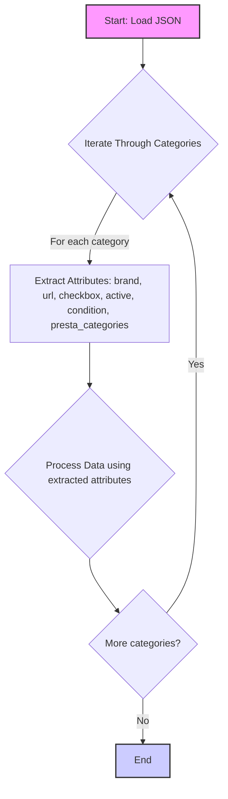

## АНАЛИЗ КОДА

### 1. <алгоритм>

Представленный код является JSON-объектом, который описывает различные категории товаров (клавиатуры и мыши) бренда HP, предназначенные для импорта или обработки. Каждый товар имеет набор атрибутов, таких как `brand`, `url`, `checkbox`, `active`, `condition` и `presta_categories`.

**Пошаговая блок-схема:**

1.  **Начало**: Загрузка JSON-объекта.
    *   *Пример:* Загружается JSON-файл `grandadvance_categories_keyboards_hp.json`.

2.  **Итерация**: Для каждого ключа (названия категории, например, `"HP WIRELESS KEYBOARD"` ) в JSON-объекте.
    *   *Пример:* Первый ключ - `"HP WIRELESS KEYBOARD"`.

3.  **Извлечение атрибутов**: Извлечение значений атрибутов из объекта: `brand`, `url`, `checkbox`, `active`, `condition` и `presta_categories`.
    *   *Пример:* Для ключа `"HP WIRELESS KEYBOARD"`:
        *   `brand` = `"HP"`
        *   `url` = `"https://www.grandadvance.co.il/default.aspx?g=products&a=list&tieId=585&manid=116"`
        *   `checkbox` = `false`
        *   `active` = `true`
        *   `condition` = `"new"`
        *   `presta_categories` = `"203,204,316"`

4.  **Обработка данных**: Атрибуты могут быть использованы для различных операций:
    *   *Пример:*
        *   `url` можно использовать для сбора данных о товаре.
        *   `presta_categories` можно использовать для отнесения товаров к определенным категориям в PrestaShop.
        *   `brand`, `condition`, и `active` используются для фильтрации товаров.

5.  **Переход**: Переход к следующей категории.
    *   *Пример:* Переход к категории `"HP USB KEYBOARD"`.

6.  **Конец**: Завершение итерации по всем категориям.
    *   *Пример:* После обработки `"HP WIRELESS  KEYBOARD-MOUSE SET"` выполнение завершается.

### 2. <mermaid>

**Описание диаграммы `mermaid`:**

Диаграмма отображает поток управления при обработке JSON-данных.

*   `Start: Load JSON`: Начало процесса, загружается JSON-файл.
*   `Iterate Through Categories`: Цикл перебирает все категории товаров в JSON-объекте.
*  `Extract Attributes: brand, url, checkbox, active, condition, presta_categories`: Из каждой категории извлекаются атрибуты.
*  `Process Data using extracted attributes`: Извлеченные данные обрабатываются.
*   `More categories?`: Проверка, есть ли еще категории для обработки.
*   `End`: Конец процесса.

### 3. <объяснение>

**Импорты**:
   - В данном коде нет импортов, так как это JSON, а не Python код.

**Классы**:
   - В данном примере нет классов, так как это JSON, а не Python код.
   
**Функции**:
   - В данном примере нет функций, так как это JSON, а не Python код.

**Переменные**:

- JSON-объект состоит из пар ключ-значение. Ключи в данном случае - названия категорий товаров (например, `"HP WIRELESS KEYBOARD"`), а значения - объекты с атрибутами товара.
-   `brand`: Строка, представляющая бренд товара (`"HP"`).
-   `url`: Строка, представляющая URL-адрес страницы товара на сайте поставщика.
-   `checkbox`: Логическое значение, возможно, используемое для выбора товара.
-   `active`: Логическое значение, указывающее, активен ли товар.
-   `condition`: Строка, указывающая состояние товара, в данном случае всегда `"new"`.
-   `presta_categories`: Строка, содержащая список идентификаторов категорий PrestaShop, разделенных запятыми.

**Цепочка взаимосвязей с другими частями проекта:**

1.  **Загрузка JSON**: Этот JSON-файл, вероятно, загружается в Python-скрипт, который обрабатывает данные о товарах. Этот скрипт может использовать библиотеки для работы с JSON.
2.  **Извлечение данных**: Данные из этого JSON-объекта могут быть использованы для автоматизации процесса добавления товаров на сайт PrestaShop, например, с использованием API PrestaShop.
3.  **Интеграция с PrestaShop**: Значение `presta_categories` используется для связывания товаров с конкретными категориями на сайте PrestaShop.
4.  **Обновление каталога**: Данные также могут использоваться для регулярного обновления каталога товаров на сайте PrestaShop.
5.  **Взаимодействие с API**: Скрипт, обрабатывающий данные, может взаимодействовать с API PrestaShop, для создания, обновления или удаления товаров.

**Потенциальные ошибки или области для улучшения:**

1.  **Отсутствие валидации**: Нет проверки на корректность URL-адресов.
2.  **Зависимость от структуры**: Структура JSON-объекта статична. При изменении структуры потребуются изменения в коде, который будет обрабатывать эти данные.
3.  **Отсутствие обработки ошибок**: Нет механизма для обработки ошибок (например, если URL-адрес недоступен или не является корректным).
4. **Жестко заданные значения**: Значение `condition` всегда `"new"`. Возможно, стоит добавить возможность обрабатывать товары с разными условиями.
5. **Отсутствие описания**: Отсутствие описания товаров, для импорта в PrestaShop.

**Дополнительные замечания:**

Этот JSON-файл представляет собой структурированные данные, которые, вероятно, будут использоваться скриптом на Python для автоматизации процесса импорта или обновления данных на сайте PrestaShop. Важно, чтобы код, который будет обрабатывать этот JSON, корректно обрабатывал ошибки и валидировал данные, а также был гибким к возможным изменениям в структуре JSON.