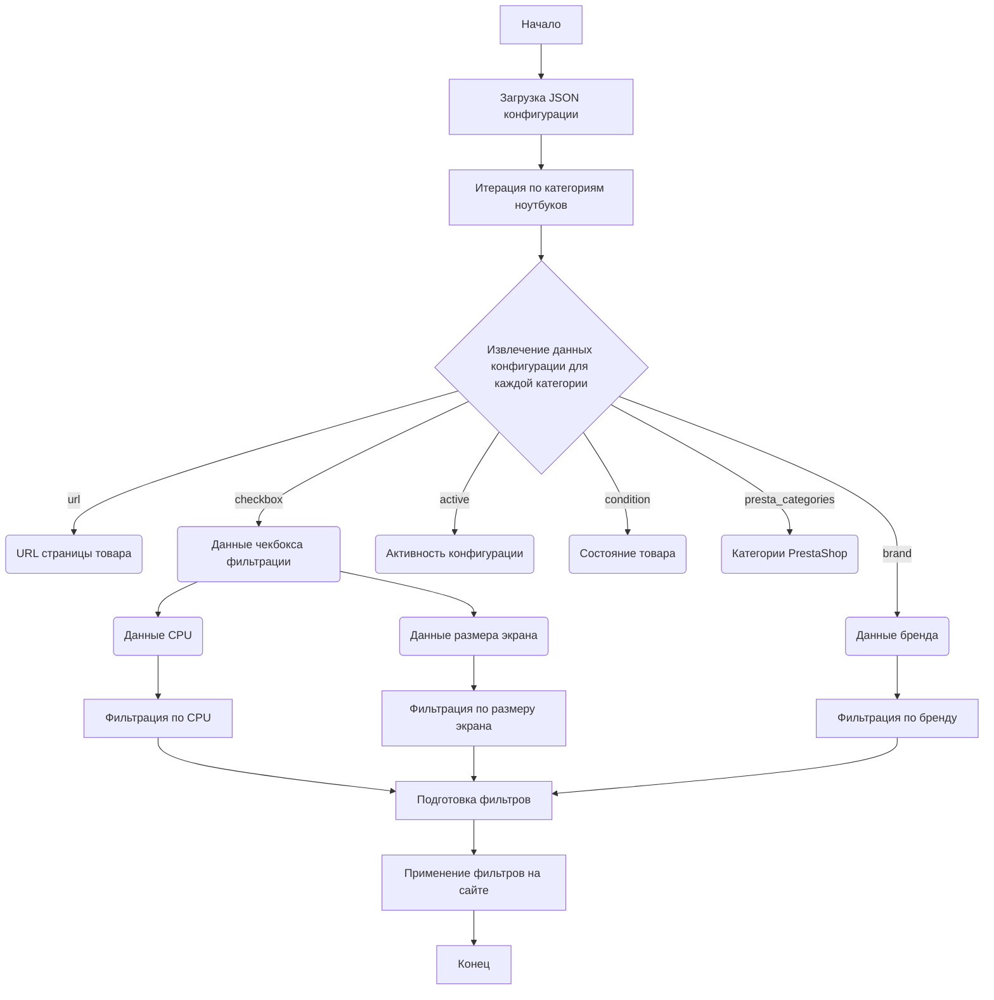

## ИНСТРУКЦИЯ:

Анализируй предоставленный код подробно и объясни его функциональность. Ответ должен включать три раздела:

1.  **<алгоритм>**: Опиши рабочий процесс в виде пошаговой блок-схемы, включая примеры для каждого логического блока, и проиллюстрируй поток данных между функциями, классами или методами.
2.  **<mermaid>**: Напиши код для диаграммы в формате `mermaid`, проанализируй и объясни все зависимости,
    которые импортируются при создании диаграммы.
    **ВАЖНО!** Убедитесь, что все имена переменных, используемые в диаграмме `mermaid`,
    имеют осмысленные и описательные имена. Имена переменных вроде `A`, `B`, `C`, и т.д., не допускаются!

    **Дополнительно**: Если в коде есть импорт `import header`, добавьте блок `mermaid` flowchart, объясняющий `header.py`:
    ```mermaid
    flowchart TD
        Start --> Header[<code>header.py</code><br> Determine Project Root]

        Header --> import[Import Global Settings: <br><code>from src import gs</code>]
    ```

3.  **<объяснение>**: Предоставьте подробные объяснения:
    *   **Импорты**: Их назначение и взаимосвязь с другими пакетами `src.`.
    *   **Классы**: Их роль, атрибуты, методы и взаимодействие с другими компонентами проекта.
    *   **Функции**: Их аргументы, возвращаемые значения, назначение и примеры.
    *   **Переменные**: Их типы и использование.
    *   Выделите потенциальные ошибки или области для улучшения.

Дополнительно, постройте цепочку взаимосвязей с другими частями проекта (если применимо).

Это обеспечивает всесторонний и структурированный анализ кода.
## Формат ответа: `.md` (markdown)
**КОНЕЦ ИНСТРУКЦИИ**

### <алгоритм>

1.  **Начало**: Загрузка JSON-файла, содержащего конфигурации для категорий ноутбуков HP.
    *   *Пример*: Файл `grandadvance_categories_laptops_hp.json` содержит объекты, где ключи - это наименование конфигурации (например, "HP 11.6 I3"), а значения - это детали конфигурации.

2.  **Итерация по категориям ноутбуков**: Проход по каждому ключу в загруженном JSON-объекте.
    *   *Пример*: Итерация начинается с ключа "HP 11.6 I3", затем "HP 11.6 i5" и т.д.

3.  **Извлечение данных конфигурации**: Для каждой категории извлекаются значения для следующих ключей:
    *   `brand`: Бренд ноутбука. *Пример*: "HP"
    *   `url`: URL-адрес страницы с ноутбуками этого бренда. *Пример*: "https://www.grandadvance.co.il/default.aspx?g=products&a=list&tieId=654&manId=38"
    *   `checkbox`: Объект, содержащий настройки для чекбоксов фильтрации на сайте.
        *   `cpu`: Настройки для фильтрации по CPU.
            *   `class`: CSS-класс элементов, используемых для фильтрации по CPU. *Пример*: ".fSel"
            *   `by`: Тип селектора. *Пример*: "css selector"
            *   `value`: Массив возможных значений для фильтрации по CPU. *Пример*: `[ "CORE I3", "CORE I 3", ..., "i 3" ]`
        *   `screensize`: Настройки для фильтрации по размеру экрана.
            *   `class`: CSS-класс элементов, используемых для фильтрации по размеру экрана. *Пример*: ".fSel"
            *   `by`: Тип селектора. *Пример*: "css selector"
            *   `value`: Массив возможных значений для фильтрации по размеру экрана. *Пример*: `[ "10.1", "10.2", ..., "10,9" ]`
    *   `active`: Флаг, указывающий, активна ли данная конфигурация. *Пример*: `true`
    *   `condition`: Состояние продукта. *Пример*: "new"
    *   `presta_categories`: Строка с категориями PrestaShop, разделенными запятыми. *Пример*: "3,52,8,52,4,362,989"

4.  **Обработка данных**: Собранные данные используются для настройки автоматизированного процесса поиска и фильтрации товаров на сайте поставщика, Grand Advance.

5.  **Завершение**: Обработка всех категорий завершена.

### <mermaid>



**Объяснение `mermaid` диаграммы:**

*   `Start`: Начало процесса.
*   `LoadConfig`: Загрузка JSON-файла конфигурации из `grandadvance_categories_laptops_hp.json`.
*   `IterateCategories`: Цикл перебирает каждую категорию ноутбуков, определенную в JSON-файле.
*   `ExtractData`: Извлечение данных конфигурации для каждой категории ноутбуков, таких как:
    *   `brand`: Бренд ноутбука (например, "HP").
    *   `url`: URL-адрес страницы с ноутбуками этого бренда.
    *   `checkbox`: Настройки для чекбоксов фильтрации на сайте.
        *   `cpu`: Настройки фильтрации по CPU (класс CSS селектора и значения).
        *   `screensize`: Настройки фильтрации по размеру экрана (класс CSS селектора и значения).
    *   `active`: Флаг, указывающий, активна ли данная конфигурация.
    *    `condition`: Состояние товара.
    *   `presta_categories`: Строка с категориями PrestaShop.
*   `BrandData`: Хранит извлеченные данные бренда.
*  `URLData`: Хранит извлеченный URL-адрес.
*  `CheckboxData`: Хранит извлеченные данные чекбоксов.
*   `CPUData`:  Хранит извлеченные данные по CPU.
*   `ScreenSizeData`: Хранит извлеченные данные по размеру экрана.
*    `ActiveData`: Хранит информацию об активности конфигурации.
*   `ConditionData`: Хранит информацию о состоянии товара.
*    `PrestaCategoriesData`: Хранит информацию о категориях PrestaShop.
*    `FilterCPU`: Применяется фильтр по CPU.
*    `FilterScreenSize`: Применяется фильтр по размеру экрана.
*  `FilterBrand`: Применяется фильтр по бренду.
* `PrepareFilters`: Подготавливает фильтры для применения на сайте поставщика.
*   `ApplyFilters`: Применяет подготовленные фильтры на сайте поставщика, используя данные из JSON-конфигурации.
*   `End`: Конец процесса.

Диаграмма показывает поток данных от загрузки конфигурации до применения фильтров на сайте поставщика.

### <объяснение>

**Импорты:**

*   В данном коде нет явных импортов, так как это JSON-файл, а не Python-код. Однако предполагается, что этот файл будет использоваться в Python-скрипте, который, вероятно, будет импортировать необходимые модули для обработки JSON и работы с веб-сайтами.  В контексте проекта `src` могут использоваться модули для web scraping такие как `requests`, `BeautifulSoup4`,  `selenium`

**Классы:**

*   В этом коде нет классов, поскольку это JSON-файл, описывающий структуру данных. Ожидается, что в Python-скрипте, который будет использовать эти данные, будут созданы классы для представления данных о конфигурациях и их обработки.

**Функции:**

*   Код не содержит функций. Однако, при использовании в Python-скрипте, ожидается наличие функций, которые будут:
    *   Загружать данные из JSON.
    *   Обходить категории.
    *   Применять фильтры.
    *   Собирать данные с веб-сайта поставщика.
        *   *Пример*: `def load_config(file_path):` - загружает JSON, `def apply_filters(url, cpu_values, screensize_values):` - применяет фильтры.

**Переменные:**

*   В JSON-структуре используются следующие переменные:
    *   **Ключи верхнего уровня** (например, "HP 11.6 I3", "HP 12 I5" и т.д.):  Представляют собой названия конфигураций ноутбуков. Тип: `str`.
    *   **`brand`**: Бренд ноутбука. Тип: `str`.
    *   **`url`**: URL-адрес страницы с ноутбуками. Тип: `str`.
    *   **`checkbox`**: Объект, содержащий настройки фильтров. Тип: `dict`.
        *   **`cpu`**: Настройки фильтра по CPU. Тип: `dict`.
            *   **`class`**: CSS-класс селектора. Тип: `str`.
            *   **`by`**: Тип селектора. Тип: `str`.
            *   **`value`**: Список возможных значений CPU. Тип: `list`.
        *   **`screensize`**: Настройки фильтра по размеру экрана. Тип: `dict`.
            *   **`class`**: CSS-класс селектора. Тип: `str`.
            *   **`by`**: Тип селектора. Тип: `str`.
            *   **`value`**: Список возможных размеров экрана. Тип: `list`.
    *   **`active`**: Флаг активности. Тип: `bool`.
    *   **`condition`**: Состояние продукта. Тип: `str`.
    *   **`presta_categories`**: Строка с ID категорий PrestaShop. Тип: `str`.

**Потенциальные ошибки и области для улучшения:**

1.  **Дублирование данных**: Многократное повторение структуры `checkbox`, особенно для `screensize`, так как значения для всех конфигураций одинаковы. Можно вынести эти значения в отдельный блок для уменьшения дублирования.
2.  **Негибкость селекторов**: Использование статических CSS-классов `.fSel` может привести к проблемам, если разметка сайта изменится. Целесообразно добавить возможность использовать XPath или другие селекторы, а также добавить возможность динамически извлекать селекторы.
3.  **Жестко закодированные URL**: URL-адреса жестко закодированы. Можно добавить возможность использования переменных URL, чтобы можно было легко менять их, если поставщик изменит структуру URL.
4.  **Отсутствие валидации**: Нет валидации для данных. Можно добавить схему валидации для проверки типов данных и наличия обязательных полей.
5.  **Обработка ошибок**: В Python-скрипте должны быть предусмотрены обработки ошибок при парсинге HTML и применении фильтров.

**Взаимосвязи с другими частями проекта:**

*   Этот JSON-файл является частью конфигурационной системы проекта. Предполагается, что другие модули проекта (например, модули web scraping) будут использовать эти данные для сбора информации о продуктах.
*   Данные о категориях `presta_categories` будут использоваться для интеграции с PrestaShop.
*   Данные из этого файла используются в модуле для конкретного поставщика - `grandadvance`. Это позволяет отделить логику работы с конкретным поставщиком от основной логики проекта.
*   Данный файл, вероятно, связан с модулем, который выполняет задачи веб-скрапинга, а также с модулем, который занимается обработкой и категоризацией данных в PrestaShop.

**Пример обработки данных в Python:**

```python
import json

def load_config(file_path):
    with open(file_path, 'r') as f:
        return json.load(f)

def apply_filters(config):
    for category, details in config.items():
        print(f"Обработка категории: {category}")
        brand = details['brand']
        url = details['url']
        cpu_values = details['checkbox']['cpu']['value']
        screensize_values = details['checkbox']['screensize']['value']
        active = details['active']
        condition = details['condition']
        presta_categories = details['presta_categories']

        print(f"  Бренд: {brand}")
        print(f"  URL: {url}")
        print(f"  CPU values: {cpu_values}")
        print(f"  Screensize values: {screensize_values}")
        print(f"  Активна: {active}")
        print(f"  Состояние: {condition}")
        print(f"  Категории PrestaShop: {presta_categories}")
        # Здесь будет логика применения фильтров на сайте

config = load_config('grandadvance_categories_laptops_hp.json')
apply_filters(config)
```

Этот пример демонстрирует, как можно загрузить данные из JSON и обработать их, но это лишь начало, для полноценного решения требуется дальнейшая реализация веб-скрапинга.