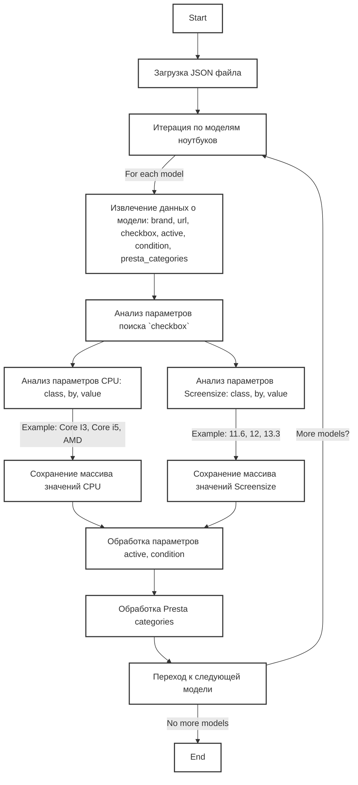

## <алгоритм>

1.  **Начало**: Исходный код представляет собой JSON-объект, где ключи - это названия моделей ноутбуков Lenovo (например, "LENOVO 11.6 I3"), а значения - это объекты, описывающие характеристики этих моделей.

2.  **Итерация по моделям**: Происходит итерация по ключам (названиям моделей) JSON-объекта. Для каждой модели выполняются следующие действия:

    *   **Извлечение данных**: Извлекаются данные о бренде, URL, параметрах поиска (`checkbox`), статусе (`active`), состоянии (`condition`) и категориях `presta_categories`.

    *   **Анализ блока `checkbox`**:
        *   Внутри `checkbox` есть два объекта: `cpu` и `screensize`. Каждый из них содержит:
            *   `class`: CSS-класс элемента, используемого для поиска на веб-странице.
            *   `by`: Метод поиска (`css selector`).
            *   `value`: Массив возможных значений для поиска.  
        *   **Пример**: Для модели `"LENOVO 11.6 I3"`:
            *   `cpu`: Ищет элементы с CSS-классом `.fSel` и любым из значений: "CORE I3", "CORE I 3", "CORE i3", ... , "i 3".
            *   `screensize`: Ищет элементы с CSS-классом `.fSel` и любым из значений: "10.1", "10.2", ..., "10,9", "11".

    *   **Обработка других параметров**:
        *   `active`: Булево значение, указывающее, активна ли модель для обработки.
        *   `condition`: Строка, обычно "new", определяющая состояние товара.
        *   `presta_categories`: Строка, содержащая список категорий через запятую, вероятно, для использования в PrestaShop.

3.  **Конец**: Процесс повторяется для каждой модели ноутбука, данные обрабатываются и подготавливаются для дальнейшего использования (например, для парсинга веб-страниц и сопоставления товаров).

## <mermaid>

**Объяснение:**

1.  **Start**: Начало процесса.
2.  **LoadJSON**: Загрузка JSON-файла с описанием моделей ноутбуков Lenovo.
3.  **IterateModels**: Цикл, проходящий по каждой модели ноутбука в JSON.
4.  **ExtractModelData**: Извлечение основных данных модели, таких как бренд, URL, настройки фильтрации (`checkbox`), флаг активности, состояние и категории PrestaShop.
5.  **AnalyzeCheckbox**: Анализ блока `checkbox` для фильтрации.
6.  **AnalyzeCPU**: Анализ настроек фильтрации для процессора (CPU). Извлекаются значения class, by и значения для поиска.
7.  **AnalyzeScreensize**: Анализ настроек фильтрации для размера экрана. Извлекаются значения class, by и значения для поиска.
8.  **StoreCPUValues**: Сохранение массива возможных значений CPU для фильтрации.
9.  **StoreScreenSizeValues**: Сохранение массива возможных значений размера экрана для фильтрации.
10. **ProcessActiveCondition**: Обработка параметров `active` и `condition` для модели.
11. **ProcessPrestaCategories**: Обработка категорий для PrestaShop.
12. **NextModel**: Переход к следующей модели в цикле.
13. **End**: Завершение процесса.

## <объяснение>

**Импорты:**

В предоставленном коде нет явных импортов. Это JSON-файл, который используется для хранения конфигурационных данных и не содержит программного кода на Python.

**Классы:**

В предоставленном коде нет классов, так как это JSON, а не Python код.

**Функции:**

В предоставленном коде нет функций, так как это JSON, а не Python код.

**Переменные:**

В этом JSON-файле используются переменные, которые можно разделить на несколько категорий:

*   **Ключи верхнего уровня (модели ноутбуков)**:
    *   `"LENOVO 11.6 I3"`, `"LENOVO 12 I3"`, `"LENOVO 13.4 - 13.3 I3"` и т.д.:  Строки, представляющие названия моделей ноутбуков Lenovo. Эти строки служат ключами для доступа к данным конкретной модели.

*   **Значения параметров моделей**:
    *   `"brand"`: Строка, указывающая бренд ноутбука ("LENOVO").
    *   `"url"`: Строка, представляющая URL-адрес, по которому можно найти список продуктов.
    *   `"checkbox"`: Объект, содержащий параметры для фильтрации продуктов на странице.
        *   `"cpu"`: Объект, определяющий параметры фильтрации по CPU.
            *   `"class"`: Строка, содержащая CSS-класс для поиска элемента на странице (".fSel").
            *   `"by"`: Строка, указывающая метод поиска ("css selector").
            *   `"value"`: Массив строк, представляющий возможные значения CPU для поиска (например, "CORE I3", "CORE i5").
        *   `"screensize"`: Объект, определяющий параметры фильтрации по размеру экрана.
            *   `"class"`: Строка, содержащая CSS-класс для поиска элемента на странице (".fSel").
            *   `"by"`: Строка, указывающая метод поиска ("css selector").
            *   `"value"`: Массив строк, представляющий возможные значения размера экрана для поиска (например, "10.1", "12", "13.3").
    *   `"active"`: Булево значение (true), указывающее, активна ли модель для обработки.
    *   `"condition"`: Строка, указывающая состояние товара ("new").
    *   `"presta_categories"`: Строка, содержащая идентификаторы категорий PrestaShop через запятую.

**Объяснение:**

Этот JSON-файл используется как конфигурационный файл для парсера веб-страниц.  Он определяет, какие модели ноутбуков Lenovo нужно искать на указанном сайте, и какие параметры фильтрации использовать для точного определения нужных товаров.

**Потенциальные ошибки и области для улучшения:**

1.  **Дублирование данных**: Структура JSON-файла содержит много дублирующихся данных, особенно в блоках `checkbox`. Это может привести к ошибкам при модификации данных.  Для улучшения, можно перенести общие части в отдельный объект, и добавить ссылку на него.
2.  **Жестко закодированные CSS селекторы**: Использование жестко закодированных CSS-селекторов может привести к проблемам, если структура HTML на веб-странице изменится. Целесообразно добавить возможность изменять селекторы без редактирования JSON.
3.  **Формат `presta_categories`**:  Хранение категорий как строки с разделением запятыми не является оптимальным. Лучше использовать массив чисел для каждой категории.
4.  **Неявные соглашения**:  Необходимо явно указывать, как обрабатывать данные (например, как объединять значения CPU и размера экрана).  Можно добавить дополнительные поля, описывающие тип данных, правила обработки и т. д.
5.  **Обработка ошибок:** В JSON файле нет механизма обработки ошибок, но в коде который его использует, необходимо обрабатывать случаи, когда данные отсутствуют или имеют некорректный формат.

**Взаимосвязь с другими частями проекта:**

Этот JSON файл, вероятно, используется в проекте для:

1.  **Веб-парсинг**: Этот файл используется для настройки парсера, который будет обрабатывать данные с сайта grandadvance.co.il, используя URL, селекторы и значения из JSON.  
2.  **Категоризация товаров**: `presta_categories` используется для автоматической категоризации товаров в PrestaShop.
3.  **Фильтрация товаров**: Блок `checkbox` помогает фильтровать товары на веб-странице и выбирать только нужные модели.
4.  **Интеграция с базой данных**: Данные из JSON используются для создания или обновления записей о товарах в базе данных.