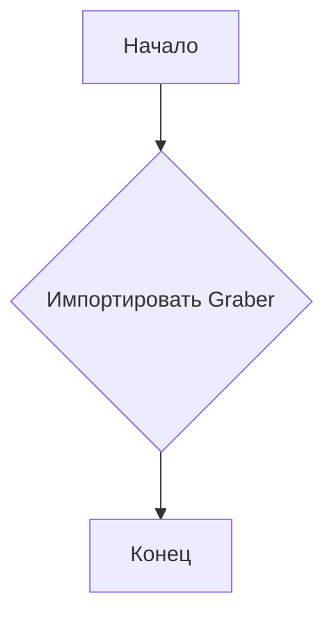
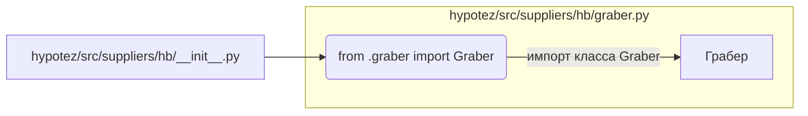

```MD
# <input code>

```python
## \file hypotez/src/suppliers/hb/__init__.py
# -*- coding: utf-8 -*-\
#! venv/Scripts/python.exe
#! venv/bin/python/python3.12

"""
.. module: src.suppliers.hb 
	:platform: Windows, Unix
	:synopsis:

"""
MODE = 'dev'


from .graber import Graber
```

# <algorithm>

В данном коде представлен `__init__.py` файл для модуля `hb` в пакете `suppliers` проекта `hypotez`.  Алгоритм работы весьма прост:  он импортирует класс `Graber` из модуля `graber.py` в том же каталоге.

**Блок-схема:**



**Пример:**

Предположим, что в `graber.py` определен класс `Graber` с методами для сбора данных.  Данный `__init__.py` просто позволяет использовать `Graber` в других частях проекта.  Нет никакой обработки или инициализации, только импорт.


# <mermaid>



**Объяснение зависимостей:**

Файл `hypotez/src/suppliers/hb/__init__.py` импортирует класс `Graber` из файла `hypotez/src/suppliers/hb/graber.py`.  Отношение импорта прямое: файл `__init__.py` использует класс `Graber`, определенный в `graber.py`.


# <explanation>

* **Импорты:**
    * `from .graber import Graber`:  Этот импорт позволяет использовать класс `Graber` из модуля `graber.py`, который находится в том же каталоге (`src/suppliers/hb`).  Символ `.` указывает на поиск в текущем пакете.  Это стандартная практика для организации модулей в Python.  Связь с другими частями проекта: `Graber` (вероятно) содержит логику взаимодействия с внешними источниками данных (например, API или файлами).

* **Классы:**
    * `Graber`:  Этот класс, определённый в `graber.py` (не показанный в данном фрагменте), отвечает за сбор данных.   Он, по всей видимости, содержит атрибуты и методы для хранения и обработки информации. Связь с другими частями:  `Graber` будет использоваться другими модулями проекта для получения данных.

* **Функции:**
    * Нет функций в данном файле, только импорт.


* **Переменные:**
    * `MODE = 'dev'`:  Это константа, вероятно, используемая для определения режима работы приложения (например, "development", "production").   Использование такой переменной позволяет легко изменять поведение приложения в разных окружениях.

* **Возможные ошибки или улучшения:**

    * Отсутствует документация для класса `Graber` внутри файла `graber.py`.  Нужно добавить документацию для улучшения читаемости и понимания работы класса.
    *  Не хватает комментариев о назначении переменной `MODE`.

* **Цепочка взаимосвязей:**

    * `__init__.py` импортирует `Graber` из `graber.py`.
    * `graber.py`, скорее всего, содержит логику взаимодействия с внешними источниками данных.
    * Другие части проекта (например, скрипты или модули) могут использовать `Graber` для получения данных.

В целом, код прост и направлен на организацию импорта классов для последующего использования. Для полноценного анализа необходимо просмотреть `graber.py`.