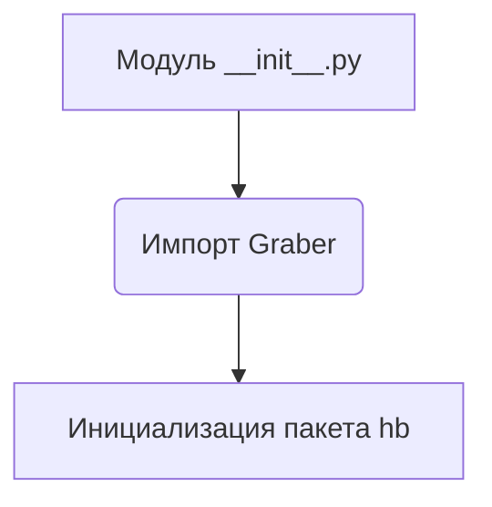
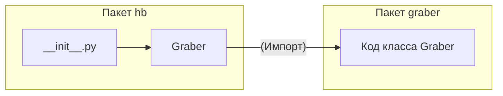

```MD
# Анализ кода hypotez/src/suppliers/hb/__init__.py

1. **<input code>**

```python
## \file hypotez/src/suppliers/hb/__init__.py
# -*- coding: utf-8 -*-
#! venv/Scripts/python.exe
#! venv/bin/python/python3.12

"""
.. module: src.suppliers.hb 
	:platform: Windows, Unix
	:synopsis:

"""
MODE = 'dev'


from .graber import Graber
```

2. **<algorithm>**

Код представляет собой модуль инициализации пакета `hb` в модуле `suppliers`.  
Он не содержит собственного алгоритма в виде циклов или сложных вычислений.  Основная функция - импорт класса `Graber` из подмодуля `graber`.  Блок-схема достаточно простая:


В данном случае нет циклов и условных операторов, следовательно, блок-схема отображает единственный шаг импорта класса.


3. **<mermaid>**



4. **<explanation>**

* **Импорты**:  `from .graber import Graber` импортирует класс `Graber` из подмодуля `graber` в текущем пакете (`suppliers.hb`). `.` означает, что модуль `graber` находится в той же директории, что и `__init__.py`. Это стандартная практика для организации кода.

* **Классы**:  Код импортирует класс `Graber`, но сам класс не определен в `__init__.py`.  Описание функциональности класса `Graber` (атрибуты и методы) находится в файле `hypotez/src/suppliers/hb/graber.py`.

* **Функции**: Нет функций, определённых непосредственно в `__init__.py`.

* **Переменные**: `MODE = 'dev'` определяет переменную, вероятно, для настройки режима работы, например, в режиме разработки (dev), тестирования или производства.  Это всего лишь пример - значение может меняться, и переменная может использоваться в других модулях пакета.

* **Возможные ошибки или области для улучшений**:
    * Отсутствует документация для `MODE`.
    * Не указано назначение переменной `MODE`.  Без контекста трудно оценить влияние на работу.
    * Для полноценного анализа требуется доступ к `graber.py` и к контексту проекта.


**Цепочка взаимосвязей**:

```
hypotez
├── src
│   ├── suppliers
│   │   └── hb
│   │       ├── __init__.py  <-- Этот файл
│   │       └── graber.py   <-- (Возможный файл)
│   └── ... (Другие пакеты/модули)
```

`__init__.py`  является точкой входа для доступа к классу `Graber`, который определён в модуле `graber.py`.  Для дальнейшего анализа требуется доступ к `graber.py` и контексту проекта.