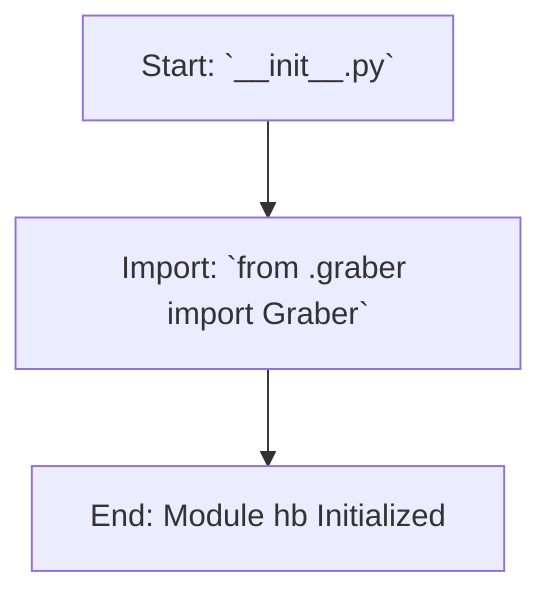

## Анализ кода `hypotez/src/suppliers/hb/__init__.py`

### <алгоритм>

1. **Импорт модуля `graber`:**
    -  Импортируется класс `Graber` из файла `graber.py`, находящегося в той же директории (`.`).
    -  Пример: `from .graber import Graber`  означает, что класс `Graber` будет доступен для использования в текущем файле `__init__.py` и в модуле `hb`.

2.  **Инициализация модуля:**
   - Файл `__init__.py` отмечает директорию `hb` как python-модуль.
   - Любой код, написанный в `__init__.py` (в данном случае, импорт класса `Graber`) будет выполнен при импорте модуля `hb`.

### <mermaid>

**Объяснение зависимостей в `mermaid`:**

-   `Start`: Начало процесса инициализации модуля `hb` при импорте.
-   `ImportGraber`: Импортирует класс `Graber` из модуля `graber`, расположенного в той же директории.
-   `End`:  Завершение инициализации модуля, теперь класс `Graber` доступен через модуль `hb`.

### <объяснение>

**Импорты:**

-   `from .graber import Graber`: Импортирует класс `Graber` из файла `graber.py`, который находится в той же директории, что и `__init__.py`. Это позволяет использовать `Graber` внутри пакета `hb` и делает его доступным при импорте модуля `hb`. `.` указывает на текущую директорию.

**Классы:**

-   **`Graber`:** Класс, который, вероятно, предназначен для сбора или извлечения каких-либо данных. Он не определён в данном файле, но его импорт указывает на то, что он будет использоваться внутри пакета `hb`. Подробности о его реализации находятся в файле `graber.py`.

**Функции:**

-  В данном файле функции отсутствуют, так как это файл инициализации модуля, который в основном предназначен для импорта и настройки.

**Переменные:**

-   Переменные в данном файле отсутствуют.

**Потенциальные ошибки и области для улучшения:**

1. **Описание модуля:** В докстринге модуля `src.suppliers.hb` отсутствует  описание. Это может затруднить понимание назначения этого модуля при просмотре кода.
2. **Отсутствие явной инициализации:** Файл  `__init__.py` не содержит никакого другого кода, кроме импорта. В зависимости от назначения модуля, может потребоваться добавить код инициализации, например, создание экземпляра класса или вызов каких-либо настроечных функций.
3. **Отсутствие примеров использования:** Добавление примеров использования импортированного класса `Graber` сделало бы код более понятным и удобным для понимания.

**Взаимосвязь с другими частями проекта:**

-   Этот файл является частью пакета `src.suppliers`, что указывает на то, что он предназначен для взаимодействия с поставщиками данных. В данном случае, `hb` может относиться к конкретному поставщику или типу поставщиков.
-   Импорт класса `Graber` указывает на то, что этот класс, вероятно, используется для извлечения данных с веб-сайтов поставщиков или из других источников.
-  `__init__.py`  делает модуль `hb` доступным для импорта в другие части проекта, как `import src.suppliers.hb`, и доступ к классу `Graber`: `hb.Graber()`.