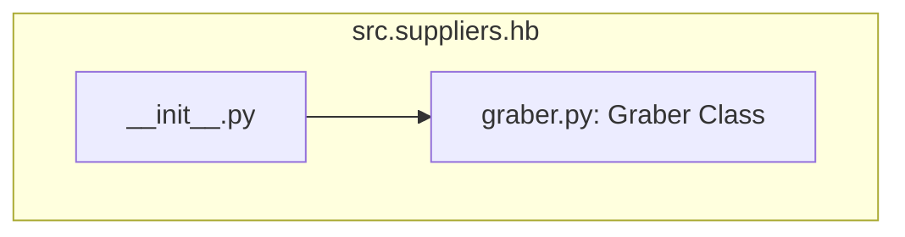

## Анализ кода `hypotez/src/suppliers/hb/__init__.py`

### 1. <алгоритм>

**Блок-схема:**

**Примеры:**

* **`B(Импорт Graber из .graber)`**:  
    - Этот шаг импортирует класс `Graber` из модуля `graber.py`, который находится в той же директории (`.`) что и `__init__.py`. Предполагается, что `graber.py` содержит логику для извлечения данных от поставщика `hb`.

**Поток данных:**

* Данные не передаются, но класс `Graber` становится доступным для использования в других модулях, импортирующих `src.suppliers.hb`.

### 2. <mermaid>

**Объяснение:**

* Диаграмма показывает, что файл `__init__.py` в пакете `src.suppliers.hb` импортирует класс `Graber` из модуля `graber.py`. Это создает зависимость между `__init__.py` и `graber.py` внутри пакета.

### 3. <объяснение>

#### Импорты:

*   **`from .graber import Graber`**:
    *   **Назначение**: Импортирует класс `Graber` из модуля `graber.py`, расположенного в том же пакете (`.`). Это делает класс `Graber` доступным для использования в других частях проекта, которые импортируют пакет `src.suppliers.hb`.
    *   **Взаимосвязь с другими пакетами `src.`**:  `graber.py` предположительно содержит логику для работы с поставщиком данных `hb`.  Импортируя `Graber` в `__init__.py`, мы делаем его частью публичного API пакета `src.suppliers.hb`. Другие модули `src` (например, `src.main`, `src.core`) могут импортировать `src.suppliers.hb` и использовать `Graber`.

#### Классы:

*   **`Graber`**:
    *   **Роль**: Класс `Graber` предположительно отвечает за сбор и обработку данных от поставщика `hb`. Поскольку код `graber.py` не предоставлен, точные детали его реализации остаются неизвестными. 
    *   **Атрибуты, методы и взаимодействие**:  Из данного фрагмента кода нельзя сказать, какими атрибутами и методами обладает класс `Graber`, но его импорт в `__init__.py` предполагает, что класс `Graber` будет использован как основной интерфейс для работы с поставщиком `hb`.

#### Функции:

*   В представленном коде нет функций.

#### Переменные:
   * В представленном коде нет переменных.

#### Дополнительные заметки:

*   **`__init__.py`**: Файл `__init__.py` делает директорию `hb` пакетом, позволяя другим модулям импортировать `Graber` из `src.suppliers.hb.Graber`. Это способствует модульной структуре проекта.
*   **Потенциальные ошибки**:
    *   Отсутствие документации: Комментарий в начале файла указывает только на общую информацию о модуле, а не о его конкретной функциональности.
    *   Неизвестное поведение `graber.py`: Без доступа к коду `graber.py` сложно оценить потенциальные ошибки, связанные с логикой сбора и обработки данных.

* **Области для улучшения:**
    *   Добавить более подробные docstrings, описывающие назначение модуля и класса `Graber`.
    *   Рассмотреть возможность добавления тестов для проверки корректности работы класса `Graber`.
    *   Рассмотреть возможность вынесения конфигурационных параметров в отдельные файлы или переменные окружения.

#### Взаимосвязь с другими частями проекта:

*   Модуль `src.suppliers.hb` предоставляет интерфейс (`Graber`) для сбора данных от поставщика `hb`.
*   Другие части проекта (например, `src.core`, `src.main`) могут использовать этот интерфейс для получения данных, необходимых для дальнейшей обработки. Это помогает разделить логику сбора данных и логику обработки данных.