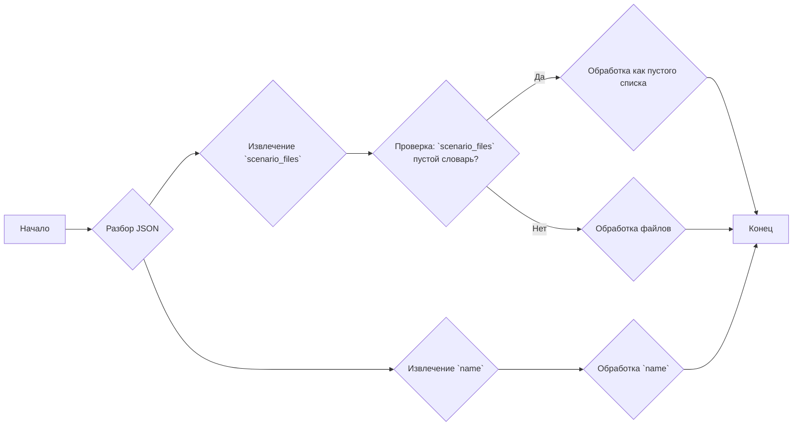
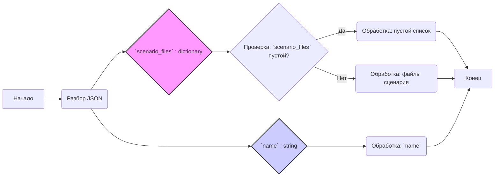

## АНАЛИЗ КОДА: 20240503035052.json

### 1. <алгоритм>

**Описание:**

Предоставленный JSON-файл представляет собой простую структуру данных, содержащую информацию о сценарии или конфигурации.  Файл включает два ключа: `scenario_files` и `name`.

- **`scenario_files`**: Это пустой словарь (`{}`). Это может указывать на то, что данный конкретный сценарий не связан с какими-либо файлами сценариев. В других контекстах, он мог бы содержать пары "ключ-значение", где ключ это имя файла, а значение это его содержимое или путь к файлу.
- **`name`**: Это строковое значение (`"20240503035052"`). Это, вероятно, уникальный идентификатор или имя для данного сценария или конфигурации.  Формат имени намекает на то, что это может быть временная метка, представляющая время создания файла.

**Пошаговая блок-схема:**



**Примеры:**

*   **Извлечение `scenario_files`**: 
    *   **Входные данные**: `{"scenario_files": {}, "name": "20240503035052"}`
    *   **Результат**: `{}` (пустой словарь)
*   **Извлечение `name`**:
    *   **Входные данные**: `{"scenario_files": {}, "name": "20240503035052"}`
    *   **Результат**: `"20240503035052"` (строка)

### 2. <mermaid>



**Описание `mermaid` диаграммы:**

Диаграмма `mermaid` показывает процесс обработки данных JSON. 
-  Блок **Начало** представляет начальную точку обработки.
-  **Разбор JSON** это операция парсинга JSON-файла.
-  Блок **`scenario_files` : dictionary** представляет собой извлечение данных связанных с файлами сценария. Проверяется является ли словарь пустым.
-   Блок **`name` : string** представляет собой извлечение данных с именем сценария.
-  Блоки **Обработка: пустой список** и **Обработка: файлы сценария**  показывают что происходит в зависимости от наличия файлов сценария.
-   **Обработка: `name`** это обработка имени сценария.
-  **Конец** показывает конец процесса обработки.

### 3. <объяснение>

**Импорты:**

В предоставленном коде нет явных импортов. Однако, подразумевается, что JSON-файл будет обработан с помощью библиотеки, поддерживающей JSON-формат, например, `json` в Python.

**Классы:**

В данном коде классы не используются. Однако, структура данных может быть представлена в виде класса для более удобного использования:

```python
class ScenarioData:
    def __init__(self, scenario_files, name):
        self.scenario_files = scenario_files
        self.name = name
```

**Функции:**

Код сам по себе не содержит функций, но для обработки JSON данных могли бы использоваться функции, например:

```python
import json

def load_scenario_data(file_path):
    with open(file_path, 'r') as f:
        data = json.load(f)
    return data

def process_scenario_data(data):
    scenario_files = data.get('scenario_files', {})
    name = data.get('name')
    
    if not scenario_files:
        print("Нет файлов сценариев.")
    else:
        print("Файлы сценариев найдены:")
        # Дополнительная обработка файлов
    
    print(f"Имя сценария: {name}")
    
    return scenario_files, name
    
    
file_path = 'hypotez/src/suppliers/hb/_journal/20240503035052.json'
data = load_scenario_data(file_path)
scenario_files, name = process_scenario_data(data)

# Дополнительные операции над scenario_files и name
```
- `load_scenario_data`: Загружает json из файла.
- `process_scenario_data`:  Извлекает `scenario_files` и `name`, и выводит сообщение.

**Переменные:**

-   `scenario_files`: Словарь (dict), который, в данном случае, является пустым. В других случаях, может содержать информацию о файлах сценария.
-   `name`: Строка (str), которая представляет собой имя сценария (в данном случае, временная метка).

**Потенциальные ошибки и области для улучшения:**

1.  **Отсутствие проверки ошибок:**  Код предполагает, что JSON всегда имеет необходимую структуру. Необходимо добавить проверки на наличие ключей и их типы.
2.  **Обработка `scenario_files`:**  В текущем виде, пустой словарь не обрабатывается. Необходимо предусмотреть логику для обработки как пустых, так и заполненных словарей.
3.  **Контекст использования:**  Данный файл является лишь частью большого проекта. Для понимания его истинной роли, необходимо знать, как и где он используется.

**Взаимосвязь с другими частями проекта:**

*   **Модули обработки сценариев:** Этот файл, вероятно, используется модулями, которые загружают и обрабатывают сценарии. В частности, модули могут использовать значения полей `name` и `scenario_files` для определения параметров сценария, путей файлов или других условий.
*   **Конфигурация:** Этот файл может быть частью конфигурационной системы, где каждая конфигурация имеет уникальное имя (как в данном случае).
*   **Файловая система**:  В `scenario_files` могут храниться пути или имена файлов, используемых для работы сценария.
*   **Логирование:** Имя сценария `name` может быть использовано для логгирования.

**Дополнительные замечания:**
*   Формат имени  `20240503035052` , возможно, является временной меткой, что позволяет понять порядок создания и версионность.
*   Присутствие поля `scenario_files` намекает на наличие возможности указания файлов для сценария, хотя сейчас оно и пустое.