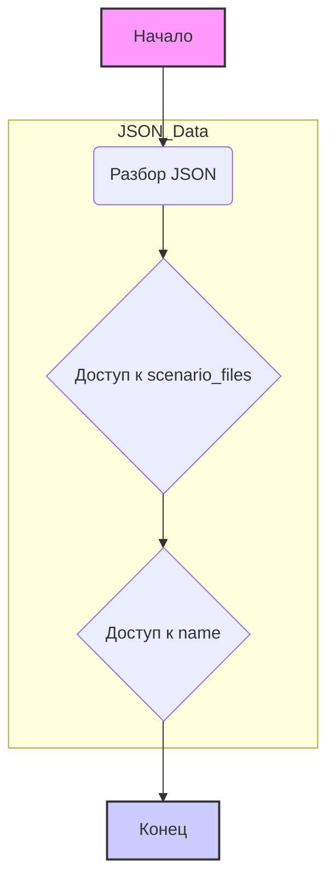

## Анализ кода `hypotez/src/suppliers/hb/_journal/20240505123838.json`

### 1. <алгоритм>

Представленный JSON-файл является структурой данных, а не кодом, поэтому блок-схема алгоритма будет простой:

1. **Начало:** Инициализация структуры данных.
2. **Разбор JSON:** JSON парсится в виде словаря (или другого подходящего объекта) в зависимости от использующего языка программирования.
3. **Доступ к данным:** Получение доступа к значениям внутри словаря по ключам `scenario_files` и `name`.
4. **Конец:** Завершение работы со структурой данных.

Пример:

```
# Python example
import json

json_string = \'\'\'{"scenario_files": {}, "name": "20240505123838"}\'\'\'
data = json.loads(json_string)

# Вывод данных
print(f"Scenario Files: {data['scenario_files']}")  # Scenario Files: {}
print(f"Name: {data['name']}") # Name: 20240505123838
```

### 2. <mermaid>



Объяснение:

1.  `graph TD`: Определяет тип диаграммы как направленный граф.
2.  `A[Начало]`: Начальный узел, представляющий начало процесса.
3.  `B(Разбор JSON)`: Узел, представляющий процесс разбора JSON-строки.
4.  `C{Доступ к scenario_files}`: Узел, представляющий доступ к значению по ключу `scenario_files`.
5.  `D{Доступ к name}`: Узел, представляющий доступ к значению по ключу `name`.
6.  `E[Конец]`: Конечный узел, представляющий завершение процесса.
7.  `style A fill:#f9f,stroke:#333,stroke-width:2px`: Задает стиль для узла `A`.
8.  `style E fill:#ccf,stroke:#333,stroke-width:2px`: Задает стиль для узла `E`.
9.  `subgraph JSON_Data ... end`:  Группирует узлы разбора и доступа к данным в подграф, что делает диаграмму более понятной.

### 3. <объяснение>

**Импорты**:

В данном примере нет импортов, так как это JSON файл, а не Python-код.

**Классы**:

В данном примере нет классов, так как это JSON файл.

**Функции**:

В данном примере нет функций, так как это JSON файл.

**Переменные**:

-   `scenario_files`: Ключ в словаре JSON. Значение - пустой словарь (`{}`). Представляет собой данные о файлах сценариев (которые в данном случае отсутствуют).
-   `name`: Ключ в словаре JSON. Значение - строка `"20240505123838"`. Представляет собой идентификатор (возможно, отметку времени) для данного набора данных.

**Объяснение**:

Данный JSON-файл, вероятно, является частью структуры данных, используемой для хранения или передачи информации о каких-либо сценариях. Ключ `name` используется для идентификации конкретного набора данных (возможно, это timestamp). Ключ `scenario_files`, представляющий пустой словарь, говорит о том, что в данной записи нет конкретных файлов сценариев.

**Потенциальные ошибки и области для улучшения**:

*   **Отсутствие файлов сценариев:** Пустой словарь `scenario_files` может быть нежелательным, если ожидается, что информация о файлах сценариев должна присутствовать. Проблема может быть в том, что данные еще не добавлены, или они должны быть в другом файле или месте.
*   **Формат имени:** Формат `name` выглядит как timestamp, но это не всегда очевидно.

**Взаимосвязи с другими частями проекта:**

Этот файл, вероятно, связан с процессами управления сценариями или конфигурациями. `name` может быть использовано для связывания этого файла с другими записями в журнале или для запроса конкретной конфигурации. `scenario_files`, если он не пустой, должен содержать информацию о сценариях, связанных с данным моментом времени/конфигурацией. Этот файл, скорее всего, используется в рамках системы, где отслеживаются и управляются конфигурации или сценарии, возможно, в рамках поставщика `hb` (судя по пути `hypotez/src/suppliers/hb/_journal/`).