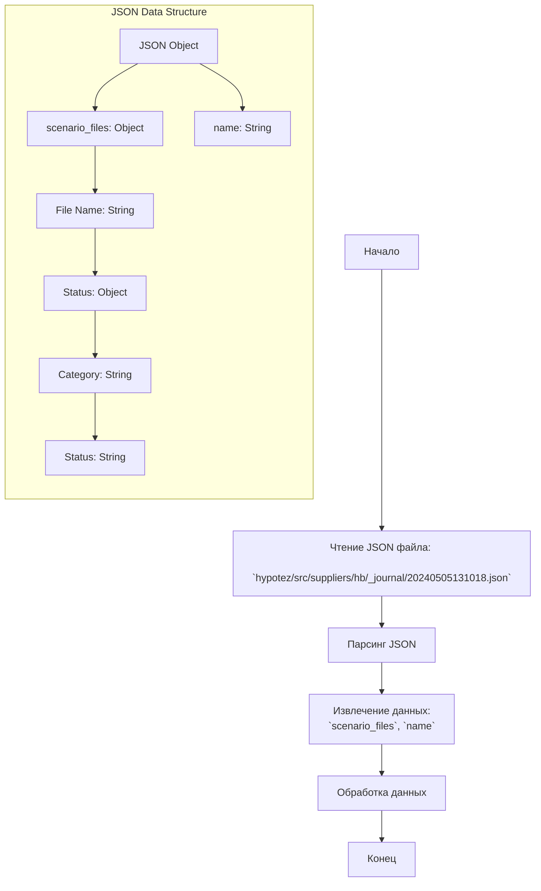

## АНАЛИЗ КОДА

### <алгоритм>
1. **Чтение JSON:**
   - Программа считывает JSON-файл, расположенный по адресу `hypotez/src/suppliers/hb/_journal/20240505131018.json`.
   - Файл содержит JSON-объект.
2. **Анализ структуры JSON:**
   - JSON-объект имеет два ключа:
     - `"scenario_files"`: Содержит вложенный объект, где ключи - имена файлов (например, `"categories_20240503015900.json"`), а значения - объекты со статусами обработки (например, `{"טיפוחהשיער": "failed"}`).
     - `"name"`: Содержит строку с именем файла или меткой (например, `"20240505131018"`).
3. **Извлечение данных:**
   - Извлекаются данные из JSON-объекта.
     - Извлекается объект `scenario_files`, содержащий информацию о файлах и их статусах обработки.
     - Извлекается имя/метка `"name"` для этого набора данных.
4. **Обработка данных (примеры):**
   - Предположим, что данные используются для мониторинга статуса обработки файлов.
   - Пример: Если статус `"failed"`, может быть запущена процедура обработки ошибок.
   - Пример: Имя файла/метки может использоваться для логирования или идентификации данных.
   - Пример: При наличии множества файлов можно итерироваться по объекту `scenario_files` и обрабатывать каждый файл отдельно.
5. **Завершение:**
   - Результаты обработки данных могут быть сохранены в лог, БД или использоваться для дальнейших действий.

### <mermaid>



### <объяснение>

1. **Импорты**:
   - В представленном коде нет явных импортов Python. Однако, для обработки JSON файла и работы с ним, импортировался бы модуль `json`. В контексте проекта, предпологается использование этого модуля.

2. **Классы**:
   - В предоставленном JSON нет классов, так как это простой файл данных. Но можно предположить, что будет использоваться класс для представления структуры полученных данных для удобства работы с ней:

   ```python
   class JournalEntry:
       def __init__(self, scenario_files, name):
           self.scenario_files = scenario_files
           self.name = name
   ```
   - **JournalEntry**: Представляет запись журнала.
    - **Атрибуты**: `scenario_files` (словарь, содержащий информацию о файлах) и `name` (строка, представляющая имя файла).

3. **Функции**:
   -  Предполагаемые функции, исходя из логики:

    ```python
   def load_journal_entry(file_path):
        """
        Загружает данные из JSON файла и возвращает экземпляр JournalEntry.

        Args:
            file_path (str): Путь к JSON файлу.

        Returns:
           JournalEntry: Объект с данными о сценариях.
        """
        import json
        try:
            with open(file_path, 'r') as file:
                data = json.load(file)
                return JournalEntry(data["scenario_files"], data["name"])
        except FileNotFoundError:
            print(f"Error: File not found at {file_path}")
            return None
        except json.JSONDecodeError:
            print(f"Error: Failed to decode JSON from {file_path}")
            return None

    def process_journal_entry(journal_entry):
            """
            Обрабатывает данные из объекта JournalEntry, выводит статус и имя
            Args:
              journal_entry(JournalEntry)  
            """
            if not journal_entry:
              return
            print(f"Processing journal entry: {journal_entry.name}")
            for file_name, statuses in journal_entry.scenario_files.items():
                print(f"  File: {file_name}")
                for category, status in statuses.items():
                    print(f"    Category: {category}, Status: {status}")
    
    def main():
        file_path = "hypotez/src/suppliers/hb/_journal/20240505131018.json"
        journal_entry = load_journal_entry(file_path)
        process_journal_entry(journal_entry)


    if __name__ == '__main__':
        main()


   ```
   - **`load_journal_entry(file_path)`**: Загружает JSON данные из файла, создает и возвращает экземпляр `JournalEntry`. Принимает путь к файлу `file_path`. Возвращает `None` если файл не найден.
   - **`process_journal_entry(journal_entry)`**: Выводит на консоль информацию о каждом файле и статусе в журнале.

4. **Переменные**:
   - **`scenario_files`**:  словарь, ключами которого являются имена файлов, а значениями - словари со статусами обработки.
   - **`name`**:  строка, представляющая имя файла или метку для данного журнала.

**Цепочка взаимосвязей:**
- Данные из `20240505131018.json` могут использоваться для мониторинга статуса обработки файлов в системе, что может повлиять на workflow других частей системы (например, инициирование повторных попыток обработки).
- Этот файл является частью подсистемы `hb` в `suppliers`, что указывает на его роль в процессе работы с поставщиками.

**Потенциальные ошибки и улучшения:**
- **Отсутствие обработки ошибок**: Необходима более надежная обработка ошибок при чтении и парсинге JSON, а также при обработке данных.
- **Жестко закодированный путь к файлу**: Путь к файлу должен передаваться как аргумент или считываться из конфигурационного файла.
- **Расширение функциональности**: Программа может быть расширена, чтобы выполнять более сложные действия на основе статусов файлов, такие как повторная отправка, уведомления и т.д.
- **Типизация:** Можно использовать `typing` для статической проверки типов.