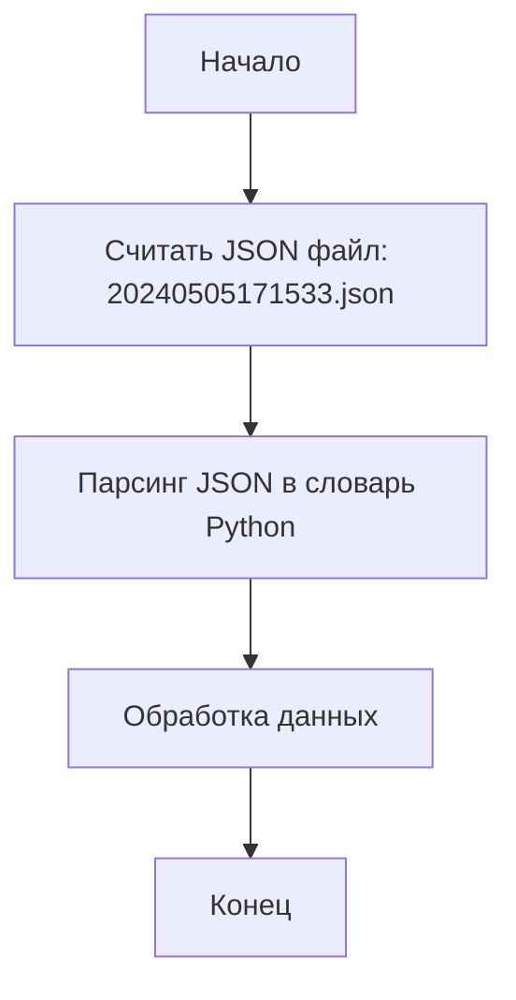

# Анализ кода `hypotez/src/suppliers/hb/_journal/20240505171533.json`

## <алгоритм>

1. **Чтение JSON-файла**:
   - Файл `20240505171533.json` считывается как текстовый файл.
   - Строка JSON анализируется и преобразуется в структуру данных Python (словарь).
   - Пример: `{"scenario_files": {}, "name": "20240505171533"}` преобразуется в словарь `{"scenario_files": {}, "name": "20240505171533"}`.

2. **Обработка данных**:
   - Данные из словаря обрабатываются, анализируются и используются.
   - В данном случае, структура данных просто существует как запись журнала.

3. **Завершение**:
   - Программа завершает свою работу после обработки данных.
   - В примере, никаких дополнительных действий не производится.

## <mermaid>

**Описание диаграммы `mermaid`**:

1.  **Start**: Начальная точка выполнения программы.
2.  **ReadJsonFile**: Этап, на котором происходит считывание JSON-файла. В нашем случае, считывается файл `20240505171533.json`.
3.  **ParseJson**: Этап, на котором происходит преобразование JSON-данных в Python-словарь.  
4.  **ProcessData**: Этап, на котором полученные данные обрабатываются.
5.  **End**: Конечная точка выполнения программы.

## <объяснение>

**Общая структура**:
Данный файл `20240505171533.json` представляет собой журнал (логирование) с определенной структурой JSON. Включает два ключа: `scenario_files` и `name`.

**Импорты**:
В представленном коде нет явных импортов, поскольку файл JSON сам по себе является статическим файлом данных, а не исполняемым кодом.

**Классы**:
В данном контексте классы отсутствуют, так как файл содержит данные в формате JSON, а не программный код.

**Функции**:
Функции также отсутствуют, поскольку это файл данных, а не программный код.

**Переменные**:
`scenario_files`: Это ключ в JSON-словаре, который соответствует значению, которое представляет собой пустой словарь. В данном случае он указывает на то, что никаких сценариев нет в данном контексте.
`name`: Это ключ в JSON-словаре, который соответствует строковому значению "20240505171533". Оно представляет имя или идентификатор записи журнала.

**Потенциальные ошибки и области для улучшения**:
- **Отсутствие валидации данных**: JSON данные могут быть не полными или некорректными. Требуется проверка данных на корректность.
- **Недостаток информации**: Файл содержит мало информации. При проектировании системы логирования стоит предусмотреть добавление более подробных данных, например, времени записи, типа события и т.д.

**Взаимосвязи с другими частями проекта**:
Этот файл, вероятно, используется в системе логирования или журналирования, где каждый файл представляет отдельную запись журнала. Другие части проекта могут использовать эти данные для анализа, отладки или мониторинга. Этот файл может считываться, например, модулями обработки логов и статистики.  Возможна связь с `src/suppliers/hb/` для отслеживания действий в этом модуле.