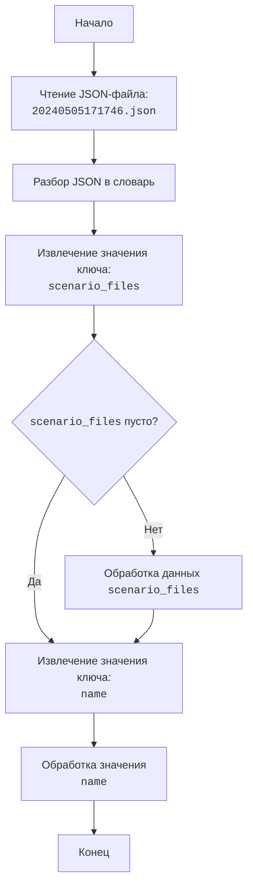

## Анализ кода `hypotez/src/suppliers/hb/_journal/20240505171746.json`

### <алгоритм>

1.  **Чтение JSON файла:** Файл `20240505171746.json` загружается.
2.  **Разбор JSON:** JSON-структура файла разбирается.
3.  **Извлечение данных:** Из разобранного JSON извлекаются значения ключей "scenario_files" и "name".
4.  **Обработка "scenario_files":** Пустое значение для ключа "scenario_files" обрабатывается.
5.  **Обработка "name":** Значение ключа "name" обрабатывается.

    Пример:
    -   **Входной JSON**: `{"scenario_files": {}, "name": "20240505171746"}`
    -   **Шаг 1 (Чтение)**: JSON файл загружается.
    -   **Шаг 2 (Разбор)**: JSON разбирается в структуру данных Python (словарь).
    -   **Шаг 3 (Извлечение)**: Извлекаются значения `scenario_files = {}` и `name = "20240505171746"`.
    -   **Шаг 4 (Обработка "scenario_files")**: Пустой словарь `{}` обрабатывается.
    -   **Шаг 5 (Обработка "name")**: Строка `"20240505171746"` обрабатывается.

### <mermaid>

**Объяснение диаграммы `mermaid`:**

*   **`Start`**: Начало процесса обработки JSON-файла.
*   **`ReadJson`**: Операция чтения JSON-файла с именем `20240505171746.json`
*   **`ParseJson`**: Разбор прочитанного JSON-содержимого в структуру данных Python, обычно в словарь.
*   **`ExtractScenarioFiles`**: Извлечение значения, связанного с ключом `scenario_files`, из словаря.
*   **`ProcessScenarioFiles`**: Логическая проверка, пусто ли значение `scenario_files`.
*   **`ProcessScenarioData`**: Обработка данных `scenario_files` (если не пусто).
*    **`ExtractName`**: Извлечение значения, связанного с ключом `name`, из словаря.
*   **`ProcessName`**: Обработка извлеченного значения ключа `name`.
*   **`End`**: Завершение процесса обработки JSON.

### <объяснение>

**Импорты:**

В представленном коде нет явных импортов Python. Код представляет собой JSON-файл, а не Python-скрипт, поэтому импорты как таковые отсутствуют. Однако, в контексте проекта `hypotez`, данный файл вероятно будет прочитан и обработан Python-скриптом, который, в свою очередь, будет использовать импорты из других частей проекта `src`.

**Классы:**

Данный JSON-файл не содержит классов. Структура JSON представляет собой простой словарь с двумя ключами и их значениями.

**Функции:**

В представленном коде нет функций. Обработка файла, вероятно, будет осуществлена функцией, которая:

1.  Загрузит данный JSON-файл.
2.  Разберет JSON в Python-словарь.
3.  Извлечет значения ключей `scenario_files` и `name`.
4.  Обработает эти значения в соответствии с логикой приложения.

**Переменные:**

*   `scenario_files`: Значение этого ключа представляет собой словарь (в данном случае пустой). В контексте проекта `hypotez`, вероятно, используется для хранения информации о файлах сценариев, связанных с данным journal.
*   `name`: Значение этого ключа представляет собой строку. В контексте проекта `hypotez`, вероятно, используется для уникальной идентификации данного journal файла.

**Потенциальные ошибки и области для улучшения:**

1.  **Обработка пустых `scenario_files`**: В данном случае `scenario_files` представлен как пустой словарь `{}`. Приложение, использующее этот JSON, должно корректно обрабатывать такую ситуацию, чтобы не было ошибок при обращении к несуществующим ключам или методам.
2.  **Отсутствие валидации**: JSON не имеет явной схемы, и приложение должно проверять наличие ожидаемых ключей и типов значений.
3.  **Цепочка взаимосвязей**:
    *   Файл `20240505171746.json` может быть загружен через функцию из `src/suppliers/hb/_journal/` в модуле, обрабатывающем данные поставщика `hb`.
    *   Значение поля `name` вероятно используется для идентификации или поиска других связанных данных.
    *  Поле `scenario_files` вероятно используется для загрузки или запуска сценариев тестирования или обработки данных.
    *  Обработка  этого JSON-файла будет встроена в основную логику `hypotez`.

**Дополнительные замечания:**

Данный JSON-файл представляет собой конфигурационный файл или файл с метаданными.  В контексте системы `hypotez` этот файл, скорее всего, используется как часть механизма обработки и отслеживания операций, связанных с поставщиком `hb`.

Этот анализ позволяет понять структуру и предназначение JSON-файла и его потенциальное использование в проекте `hypotez`.