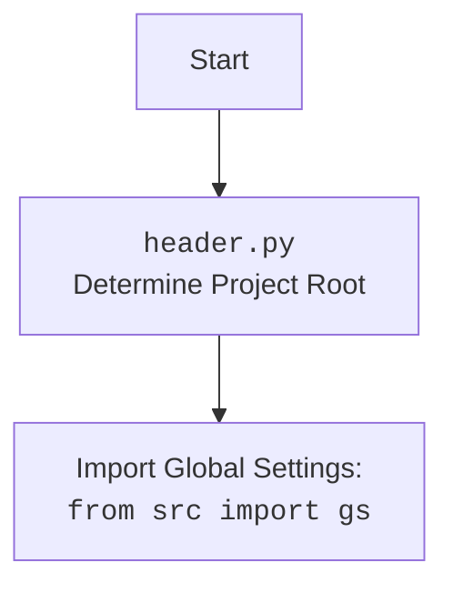

## Анализ кода `src/suppliers/hb/category.py`

### 1. <алгоритм>

**`get_list_products_in_category(s: Supplier)`**

1.  **Инициализация**:
    *   Получает объект `Driver` из объекта `Supplier` (`s.driver`).
    *   Получает локаторы для категории из объекта `Supplier` (`s.locators['category']`).
    *   Ожидает 1 секунду с помощью `d.wait(1)`.
    *   Закрывает баннер, используя локатор `s.locators['product']['close_banner']`, вызывая `d.execute_locator()`.
    *   Выполняет прокрутку страницы `d.scroll()`.

2.  **Поиск ссылок на товары**:
    *   Ищет все ссылки на товары на странице, используя локатор `l['product_links']` и метод `d.execute_locator()`, результат сохраняется в `list_products_in_category`.

3.  **Проверка на наличие ссылок**:
    *   Если `list_products_in_category` пуст, записывает предупреждение в лог и возвращает `None`.

4.  **Пагинация**:
    *   Запускает цикл `while`, который выполняется пока `d.current_url` не равно `d.previous_url` (то есть пока происходит навигация по страницам).
        *   Вызывает функцию `paginator()`, которая прокручивает страницу и проверяет наличие кнопки пагинации. Если кнопка есть, то возвращает `True`.
        *   Если `paginator()` возвращает `True`, то добавляет новые ссылки на товары к  `list_products_in_category`, вызывая `d.execute_locator()`.
        *   Если `paginator()` возвращает `False` (нет больше страниц), то цикл завершается.

5.  **Преобразование результата**:
    *   Если `list_products_in_category` это строка, преобразует ее в список из одной строки.

6.  **Логирование и возврат**:
    *   Записывает в лог количество найденных товаров для текущей категории.
    *   Возвращает `list_products_in_category`.

**`paginator(d: Driver, locator: dict, list_products_in_category: list)`**

1.  **Поиск кнопки пагинации**:
    *   Ищет кнопку "назад" пагинации, используя локатор `locator['pagination']['<-']` и метод `d.execute_locator()`, результат сохраняется в `response`.

2.  **Проверка наличия пагинации**:
    *   Если `response` отсутствует или является пустым списком, возвращает `None`.

3.  **Возврат True**:
    *   Если пагинация найдена, возвращает `True`.

**`get_list_categories_from_site(s)`**

1.  **TODO**
    *   Функция не имеет реализации. Должна собирать актуальный список категорий с сайта.

### 2. <mermaid>

```mermaid
flowchart TD
    Start_get_list_products --> Init[Инициализация: <br>Получение Driver, Locators из Supplier]
    Init --> Wait[Ожидание: <br>d.wait(1)]
    Wait --> CloseBanner[Закрытие баннера: <br>d.execute_locator()]
    CloseBanner --> Scroll[Прокрутка страницы: <br>d.scroll()]
    Scroll --> FindProductLinks[Поиск ссылок на товары: <br>d.execute_locator()]
    FindProductLinks --> CheckProductLinks[Проверка: <br>list_products_in_category пуст?]
    CheckProductLinks -- Yes --> LogWarning[Лог: <br>Нет ссылок на товары]
    LogWarning --> ReturnNone[Возврат: <br>None]
    CheckProductLinks -- No --> StartPagination[Начало пагинации: <br>while d.current_url != d.previous_url]
    StartPagination --> CallPaginator[Вызов: <br>paginator(d,l,list_products_in_category)]
    CallPaginator -- True --> AppendProductLinks[Добавление ссылок на товары: <br>list_products_in_category.append()]
    AppendProductLinks --> StartPagination
    CallPaginator -- False --> EndPagination[Конец пагинации]
    EndPagination --> ConvertToList[Преобразование в список: <br>Если list_products_in_category - строка]
    ConvertToList --> LogItems[Лог: <br>Количество товаров]
    LogItems --> ReturnList[Возврат: <br>list_products_in_category]
    
    
    Start_paginator --> FindPaginationButton[Поиск кнопки пагинации: <br>d.execute_locator()]
    FindPaginationButton --> CheckPaginationButton[Проверка: <br>response пуст?]
    CheckPaginationButton -- Yes --> ReturnNonePaginator[Возврат: <br>None]
    CheckPaginationButton -- No --> ReturnTruePaginator[Возврат: <br>True]
    
    
    Start_get_list_categories --> TODO_Categories[Реализация сбора категорий]
   
    
    
    classDef function fill:#f9f,stroke:#333,stroke-width:2px;
    class Start_get_list_products, Init, Wait, CloseBanner, Scroll, FindProductLinks, CheckProductLinks, LogWarning, StartPagination, CallPaginator, AppendProductLinks, EndPagination, ConvertToList, LogItems, ReturnList, Start_paginator, FindPaginationButton, CheckPaginationButton, ReturnNonePaginator, ReturnTruePaginator, Start_get_list_categories, TODO_Categories function;
    
```

**Зависимости:**

*   `from typing import Dict, List`: Импортирует типы данных для аннотаций. `Dict` для словарей, `List` для списков.
*   `from pathlib import Path`:  Используется для работы с путями файлов и директорий, но в данном коде не применяется.
*   `from src import gs`: Импортирует глобальные настройки из `src.gs`. Подразумевается, что в `gs` хранятся общие параметры конфигурации и настройки приложения.
*   `from src.logger.logger import logger`: Импортирует объект `logger` для логирования событий.
*   `from src.webdriver.driver import Driver`: Импортирует класс `Driver` для управления веб-драйвером.
*   `from src.suppliers import Supplier`: Импортирует класс `Supplier`, представляющий поставщика, с которым работает код.



### 3. <объяснение>

**Импорты:**

*   `typing.Dict, typing.List`: Используются для статической типизации, указывают типы данных для переменных и параметров функций, что улучшает читаемость и упрощает отладку.
*   `pathlib.Path`:  Не используется в данном файле, но обычно применяется для работы с путями к файлам и директориям, обеспечивая кроссплатформенную совместимость.
*   `src.gs`: Импортирует модуль `gs` из пакета `src`. Модуль `gs` вероятно содержит глобальные настройки приложения и параметры конфигурации.
*   `src.logger.logger.logger`: Импортирует объект `logger` из модуля `logger` пакета `src.logger`. Используется для записи сообщений (логирование) о событиях в процессе работы программы.
*   `src.webdriver.driver.Driver`: Импортирует класс `Driver` из модуля `driver` пакета `src.webdriver`. Этот класс управляет веб-драйвером, который используется для навигации по веб-страницам и взаимодействия с элементами сайта.
*   `src.suppliers.Supplier`: Импортирует класс `Supplier` из модуля `suppliers` пакета `src`. Представляет собой абстракцию поставщика, от которого парсятся данные.

**Классы:**

*   `Supplier`: Класс, представляющий поставщика. Ожидается, что он будет содержать данные о поставщике, такие как локаторы элементов на странице (`locators`), объект `driver` для управления браузером и другие необходимые параметры.
*   `Driver`: Класс, управляющий веб-драйвером (например, Selenium WebDriver). Содержит методы для навигации, поиска элементов и взаимодействия со страницей.

**Функции:**

*   `get_list_products_in_category(s: Supplier) -> list[str, str, None]`:
    *   **Аргументы**: принимает объект `Supplier` в качестве аргумента.
    *   **Возвращаемое значение**: возвращает список URL-адресов товаров, найденных на странице категории. Если товары не найдены или произошла ошибка, то возвращает `None`.
    *   **Назначение**: Эта функция отвечает за сбор ссылок на товары со страницы категории. Она использует `Driver` для взаимодействия с веб-страницей, находит ссылки на товары, обрабатывает пагинацию и возвращает список URL-адресов.
    *   **Пример**:
        ```python
        supplier = Supplier(...) # Предполагаем что класс Supplier инициализирован
        list_of_urls = get_list_products_in_category(supplier)
        if list_of_urls:
            for url in list_of_urls:
                print(url)
        else:
            print("No products found in category")
        ```
*   `paginator(d:Driver, locator: dict, list_products_in_category: list)`:
    *   **Аргументы**: принимает объект `Driver`, словарь с локаторами для пагинации и список собранных продуктов.
    *   **Возвращаемое значение**: возвращает `True` если пагинация есть, иначе `None`.
    *   **Назначение**: Определяет, есть ли пагинация на текущей странице. Если есть, то переходит на следующую страницу.
    *   **Пример**:
      ```python
      driver = Driver(...) # Предполагаем что класс Driver инициализирован
      category_locators =  { 'pagination': {'<-': '//div[@class="pagination"]/a[@class="next"]'} }
      products = ['url1', 'url2']
      if paginator(driver, category_locators, products):
          print('Переходим на следующую страницу')
      else:
          print('Больше страниц нет')
      ```
*    `get_list_categories_from_site(s)`:
    *   **Аргументы**: принимает объект `Supplier`.
    *   **Возвращаемое значение**: отсутствует (пока не реализована).
    *   **Назначение**: (TODO) Должна собирать все категории с сайта поставщика.
    *   **Пример**:
      ```python
      supplier = Supplier(...) # Предполагаем что класс Supplier инициализирован
      list_of_categories = get_list_categories_from_site(supplier)
      if list_of_categories:
          for category in list_of_categories:
              print(category)
      else:
          print("No categories found")
      ```

**Переменные:**

*   `d`: Объект класса `Driver`, используемый для управления веб-драйвером.
*   `l`: Словарь с локаторами элементов для текущей категории.
*    `s`: Объект класса `Supplier`.
*   `list_products_in_category`: Список строк, представляющих URL-адреса товаров на странице категории.
*   `response`: Результат выполнения метода `execute_locator`.

**Потенциальные ошибки и области для улучшения:**

*   **Обработка ошибок**: Код содержит базовую обработку ошибок (например, запись предупреждения в лог при отсутствии ссылок на товары), но ее можно улучшить, добавив более детальную обработку исключений.
*   **Пагинация**: Логика пагинации реализована, но требует доработок.
*   **`get_list_categories_from_site`**: Требуется реализация функциональности для сбора списка категорий.
*   **Локаторы**: Зависимость от локаторов делает код хрупким. Необходимо предусмотреть механизмы обработки их изменений на сайте.
*   **Управление драйвером**: Управление драйвером должно быть более четким, включая его закрытие.
*   **Абстракция**: Код мог бы быть более абстрактным. Например, вынести логику пагинации в отдельную функцию.

**Цепочка взаимосвязей:**

1.  Модуль `category.py` является частью поставщика `hb` и отвечает за получение списка товаров из категорий `hb`.
2.  Использует `Supplier` для получения общих данных.
3.  Использует `Driver` для взаимодействия с веб-страницами.
4.  Использует `logger` для логирования.
5.  Использует `gs` для доступа к глобальным настройкам.
6.  Данные, полученные из этого модуля, вероятно, будут использоваться другими частями приложения для дальнейшей обработки и сохранения информации о товарах.