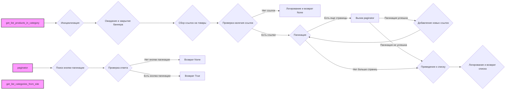

## Анализ кода `hypotez/src/suppliers/hb/category.py`

### 1. <алгоритм>
**`get_list_products_in_category(s: Supplier)`**

1.  **Инициализация**:
    *   Получает экземпляр `Driver` из `s.driver` (`d`).
    *   Получает локаторы для категории из `s.locators['category']` (`l`).
    *   Пример: `s` - это объект `Supplier` с инициализированными драйвером и локаторами.
2.  **Ожидание и закрытие баннера**:
    *   Выполняет ожидание в 1 секунду, используя `d.wait(1)`.
    *   Закрывает баннер, используя локатор `s.locators['product']['close_banner']` и метод `d.execute_locator()`.
        *   Пример: Если на странице есть всплывающий баннер, он будет закрыт.
    *   Выполняет скролл страницы с помощью `d.scroll()`.
3.  **Сбор ссылок на товары**:
    *   Собирает ссылки на товары, используя локатор `l['product_links']` и метод `d.execute_locator()`. Результат сохраняется в `list_products_in_category`.
4.  **Проверка наличия ссылок**:
    *   Если `list_products_in_category` пуст, логируется предупреждение и функция завершается.
        *   Пример: Если на странице категории нет ссылок на товары.
5.  **Пагинация**:
    *   Пока текущий URL не равен предыдущему (это нужно для пагинации)
         *  Вызывает функцию `paginator` и если она возвращает `True`, то добавляет в `list_products_in_category` новые ссылки на товар. Если вернулся `False` прерывает цикл. 
6.  **Приведение к списку**:
    *  Если `list_products_in_category` является строкой, то приводим её к списку.
7.  **Логирование и возврат**:
    *   Логирует количество найденных товаров.
    *   Возвращает `list_products_in_category`.

**`paginator(d: Driver, locator: dict, list_products_in_category: list)`**

1.  **Поиск кнопки пагинации**:
    *   Выполняет поиск кнопки переключения на предыдущую страницу с помощью `d.execute_locator(locator['pagination']['<-'])` результат сохраняется в `response`.
        *   Пример:  `locator['pagination']['<-']` содержит локатор для кнопки "Предыдущая страница".
2.  **Проверка ответа**:
    *   Если `response` не найден (пустой или `None`), то возвращает None.
3. **Возврат**:
    * Если кнопка пагинации найдена, возвращает `True`.

**`get_list_categories_from_site(s)`**

1.  **Сбор категорий**:
    *   Описание этого метода отсутствует в предоставленном коде, но предполагается, что он собирает список категорий с сайта, используя объект `Supplier` (`s`).

### 2. <mermaid>



**Объяснение `mermaid`:**

*   `get_list_products_in_category`, `paginator` и `get_list_categories_from_site` - основные функции модуля, обозначенные прямоугольниками со стилем.
*   **Поток данных:**
    *   `get_list_products_in_category` вызывает `paginator` для обработки пагинации.
    *   Стрелки показывают последовательность выполнения и передачи управления.
    *   Внутри `get_list_products_in_category` показаны основные шаги: инициализация, ожидание, сбор ссылок, пагинация и т.д.
    *   `paginator` проверяет наличие кнопки пагинации.
*   **Имена переменных:**
    *   `get_list_products_in_category` - функция для получения списка товаров в категории.
    *   `paginator` - функция для обработки пагинации.
    *   `get_list_categories_from_site` - функция для получения списка категорий с сайта.

### 3. <объяснение>

#### Импорты:

*   `typing`:
    *   `Dict`, `List`: Используются для аннотации типов данных, что повышает читаемость и облегчает отладку.
    *   Пример: `list[str, str, None]` - список, содержащий строки и None.
*   `pathlib`:
    *   `Path`: Используется для работы с путями к файлам и директориям. В данном коде не используется.
*   `src`:
    *   `gs`: Возможно, модуль для глобальных настроек, но не используется в представленном коде.
    *   `logger.logger`: Используется для логирования событий и отладки.
    *   `webdriver.driver`:  `Driver` - Класс для управления веб-драйвером, используется для взаимодействия с браузером.
    *   `suppliers`:  `Supplier` - Базовый класс для поставщиков, содержит общую логику.

#### Классы:

*   `Supplier`:
    *   Роль: Базовый класс для поставщиков, содержит общую логику для сбора данных.
    *   Атрибуты: `driver` (экземпляр `Driver`), `locators` (словарь локаторов), `current_scenario` (текущий сценарий)
    *   Методы: Не показаны в предоставленном коде, но предполагается, что содержит методы для взаимодействия с веб-драйвером и сбора данных.
    *   Взаимодействие: Передается в `get_list_products_in_category` и `get_list_categories_from_site`.
*   `Driver`:
    *   Роль: Класс для управления веб-драйвером.
    *   Методы: `wait()`, `execute_locator()`, `scroll()`, `current_url`, `previous_url` и др.
    *   Взаимодействие: Используется для взаимодействия с браузером, навигации по страницам и извлечения данных.

#### Функции:

*   `get_list_products_in_category(s: Supplier) -> list[str, str, None]`:
    *   Аргументы: `s` (объект `Supplier`).
    *   Возвращает: Список URL товаров, `None` в случае неудачи.
    *   Назначение: Собирает ссылки на товары со страницы категории.
    *   Пример:
        ```python
        supplier = Supplier(...)
        product_urls = get_list_products_in_category(supplier)
        if product_urls:
            for url in product_urls:
                print(url)
        ```
*   `paginator(d: Driver, locator: dict, list_products_in_category: list)`:
    *   Аргументы: `d` (экземпляр `Driver`), `locator` (словарь локаторов), `list_products_in_category` - список полученных ссылок.
    *   Возвращает: `True`, если пагинация успешна, `None` в противном случае.
    *   Назначение: Листает страницы категории.
        *   Пример:
           ```python
           driver = Driver(...)
           category_locator = {'pagination':{'<-':'button.next-page'}}
           products = []
           if paginator(driver,category_locator,products):
              products.extend(driver.execute_locator(category_locator['product_links']))
           ```

*    `get_list_categories_from_site(s)`:
    *   Аргументы: `s` (объект `Supplier`).
    *   Возвращает: Список категорий (не указано явно).
    *   Назначение: Собирает список категорий с сайта.
        *  Пример:
           ```python
           supplier = Supplier(...)
           categories = get_list_categories_from_site(supplier)
           for cat in categories:
              print (cat)
           ```

#### Переменные:

*   `MODE`: Строка `'dev'`. Используется для обозначения режима работы, в данном случае - разработка.
*   `d`: Экземпляр класса `Driver`.
*   `l`: Словарь локаторов для категории.
*   `list_products_in_category`: Список ссылок на товары, найденных на странице категории.
*   `response`: Результат выполнения метода `execute_locator`.

#### Потенциальные ошибки и области для улучшения:

*   **Обработка ошибок**: Отсутствует явная обработка исключений.
*   **`get_list_categories_from_site`**: Функция не описана, что затрудняет понимание логики сбора категорий.
*   **Пагинация**: Логика пагинации реализована частично, нужно добавить проверку на наличие следующей страницы, например.
*  **Дублирование ссылок**: Не проверяются дубликаты ссылок, которые могут возникать при пагинации.
* **Неоднозначность возврата**: Функция  `paginator` может возвращать `None` или `True`, что может запутать.

#### Цепочка взаимосвязей:

1.  Модуль `src.suppliers.hb.category` использует:
    *   `src.logger.logger` для логирования.
    *   `src.webdriver.driver.Driver` для взаимодействия с браузером.
    *   `src.suppliers.Supplier` для общей логики поставщика.
2.  Функции в `src.suppliers.hb.category` вызываются извне, например, из модуля сбора данных по конкретному поставщику.
3.  Данные, полученные из `src.suppliers.hb.category` (списки товаров, категории) передаются для дальнейшей обработки.

В целом, код выполняет сбор данных со страниц категорий поставщика HB, используя веб-драйвер, но требует улучшения в части обработки ошибок, пагинации и структуризации `get_list_categories_from_site`.