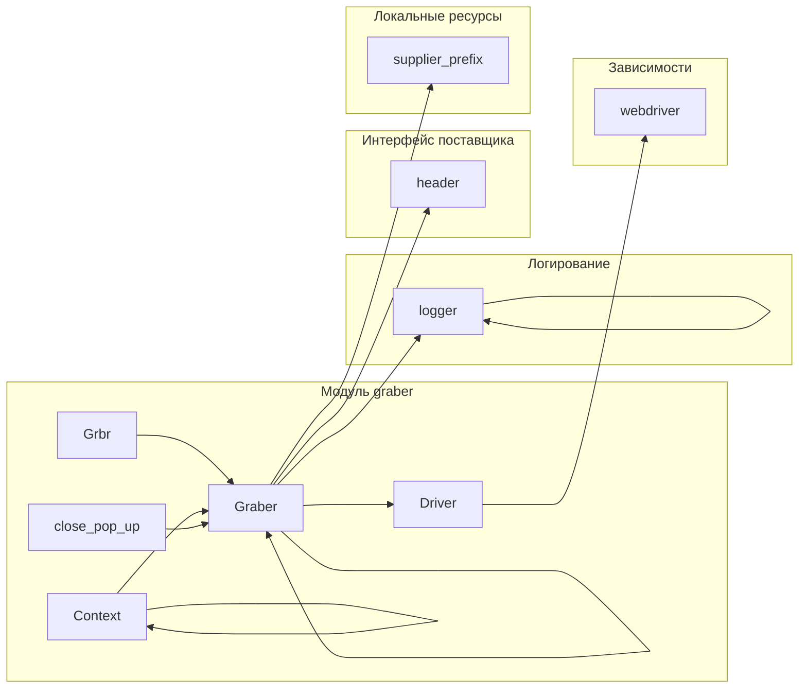

```MD
# <input code>

```python
## \file hypotez/src/suppliers/hb/graber.py
# -*- coding: utf-8 -*-\
#! venv/Scripts/python.exe
#! venv/bin/python/python3.12

"""
.. module: src.suppliers.hb 
	:platform: Windows, Unix
	:synopsis: Класс собирает значение полей на странице  товара `hb.co.il`. 
    Для каждого поля страницы товара сделана функция обработки поля в родительском классе.
    Если нужна нестандертная обработка, функция перегружается в этом классе.
    ------------------
    Перед отправкой запроса к вебдрайверу можно совершить предварительные действия через декоратор. 
    Декоратор по умолчанию находится в родительском классе. Для того, чтобы декоратор сработал надо передать значение 
    в `Context.locator`, Если надо реализовать свой декоратор - раскоментируйте строки с декоратором и переопределите его поведение

"""
MODE = 'dev'

from typing import Any, Callable
import header
from src.suppliers.graber import Graber as Grbr, Context, close_pop_up
from src.webdriver.driver import Driver
from src.logger import logger


# # Глобальные настройки через отдельный объект
# class Context:
#     """Класс для хранения глобальных настроек."""
#     driver: Driver = None
#     locator: SimpleNamespace = None

# # Определение декоратора для закрытия всплывающих окон
# # В каждом отдельном поставщике (`Supplier`) декоратор может использоваться в индивидуальных целях
# # Общее название декоратора `@close_pop_up` можно изменить 


# def close_pop_up(value: Any = None) -> Callable:
#     """Создает декоратор для закрытия всплывающих окон перед выполнением основной логики функции.

#     Args:
#         value (Any): Дополнительное значение для декоратора.

#     Returns:
#         Callable: Декоратор, оборачивающий функцию.
#     """
#     def decorator(func: Callable) -> Callable:
#         @wraps(func)
#         async def wrapper(*args, **kwargs):
#             try:
#                 # await Context.driver.execute_locator(Context.locator.close_pop_up)  # Await async pop-up close  
#                 ... 
#             except ExecuteLocatorException as e:
#                 logger.debug(f'Ошибка выполнения локатора: {e}')
#             return await func(*args, **kwargs)  # Await the main function
#         return wrapper
#     return decorator


class Graber(Grbr):
    """Класс для операций захвата Morlevi."""
    supplier_prefix: str

    def __init__(self, driver: Driver):
        """Инициализация класса сбора полей товара."""
        self.supplier_prefix = 'hb'
        super().__init__(supplier_prefix=self.supplier_prefix, driver=driver)
        # Устанавливаем глобальные настройки через Context
        
        Context.locator_for_decorator = None # <- если будет уастановлено значение - то оно выполнится в декораторе `@close_pop_up`
```

# <algorithm>

В коде определен класс `Graber`, который наследуется от класса `Grbr` из модуля `src.suppliers.graber`.  

1. **Инициализация:** При создании объекта `Graber` происходит инициализация родительского класса с указанием префикса поставщика `hb`.  В классе также инициализируется атрибут `locator_for_decorator` в объекте `Context` для возможного использования декоратора `close_pop_up`.

2. **Декоратор `close_pop_up` (комментирован):** Код декоратора `close_pop_up` (комментирован) демонстрирует способ обработки всплывающих окон перед выполнением основной функции.  Он использует `await Context.driver.execute_locator(...)`, чтобы выполнить какое-то действие с веб-драйвером.  В случае ошибки, логируется сообщение.  Он будет применяться к методам класса `Graber`.

3. **Методы (в родительском классе):**  Родительский класс `Grbr` предполагает наличие методов для обработки различных полей на странице товара. Этот код предоставляет основу для наследования и переопределения.


# <mermaid>




# <explanation>

- **Импорты:**
    - `header`: Вероятно, содержит необходимые для поставщика конфигурации или константы.
    - `src.suppliers.graber`: Содержит базовый класс `Graber` (или похожий), предоставляющий общие методы для сбора данных с веб-страниц.
    - `src.webdriver.driver`: Содержит класс `Driver`, отвечающий за взаимодействие с веб-драйвером.
    - `src.logger`: Модуль для логирования,  используется для записи сообщений об ошибках или другой информации.

- **Классы:**
    - `Graber`: Наследуется от `Grbr` (из `src.suppliers.graber`), добавляет специфические для поставщика `hb` логику и обработку.
    - `Grbr`: Базовый класс для сбора данных.  Предполагается, что он содержит методы для обработки различных полей на странице товара.
    - `Context`: Класс для хранения глобальных настроек, как-то веб-драйвер.
- **Функции:**
    - `close_pop_up`: Декоратор (комментированный). Оборачивает функции, выполняя действия по закрытию всплывающих окон до запуска основной логики функции.

- **Переменные:**
    - `MODE`: Переменная, вероятно, для определения режима работы приложения (например, 'dev', 'prod').
    - `supplier_prefix`: Свойство класса для обозначения префикса поставщика (`hb`).


- **Возможные ошибки или области для улучшений:**
    - Декоратор `close_pop_up` комментирован. Для корректной работы нужно реализовать его логику внутри функции и правильно передать значения в `Context`.
    -  Не определены типы переменных  `Context.locator`. Должно быть ясное понимание того, что он собой представляет.
    - В коде присутствует много комментированных блоков кода.  Необходимо решить, нужен ли этот код, или его можно удалить.


**Цепочка взаимосвязей:**

Код в `hypotez/src/suppliers/hb/graber.py` напрямую зависит от класса `Grbr` в `src.suppliers.graber`, который в свою очередь, вероятно, взаимодействует с `Driver` в `src.webdriver.driver` для управления веб-драйвером, и `logger` для записи в лог. В общем, это часть архитектуры, направленной на сбор данных с различных веб-сайтов.