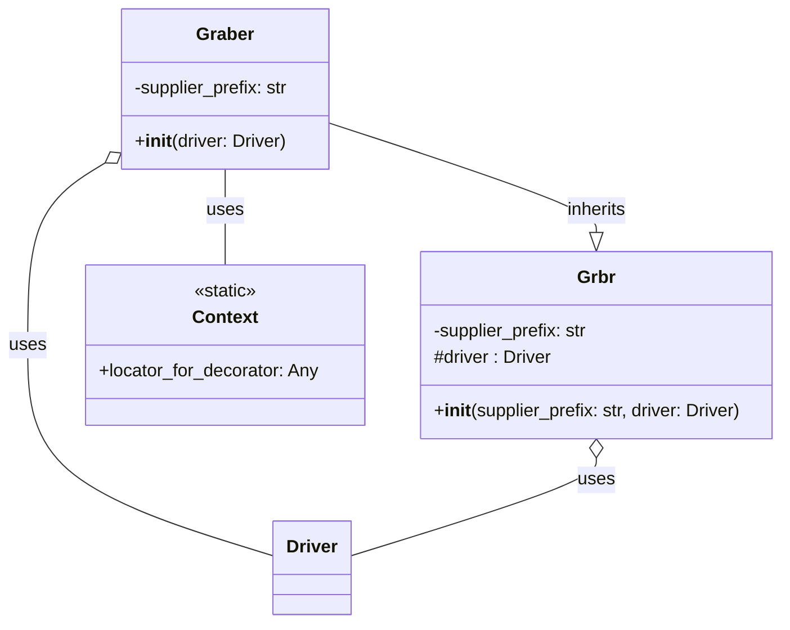

## Анализ кода `hypotez/src/suppliers/hb/graber.py`

### 1. <алгоритм>
1. **Инициализация:**
   - Создается экземпляр класса `Graber` с передачей объекта `Driver`.
   - Устанавливается префикс поставщика `hb`.
   - Вызывается конструктор родительского класса `Graber` (`src.suppliers.graber.Graber`), передавая префикс и драйвер.
   - Устанавливается `Context.locator_for_decorator` в `None`.
2. **Наследование от `src.suppliers.graber.Graber`:**
   - Класс `Graber` наследует функциональность сбора данных от родительского класса `src.suppliers.graber.Graber`.
   - Родительский класс `Graber` предоставляет общую логику сбора данных, а дочерний класс может переопределять ее.
3. **Декоратор (неактивный):**
    - В коде закомментирован пример декоратора `close_pop_up`.
    - Этот декоратор должен был закрывать всплывающее окно перед выполнением основной функции, если установлен `Context.locator`.
    - Логика декоратора:
      - Декоратор принимает функцию `func`.
      - Оборачивает её в функцию `wrapper`.
      - Внутри `wrapper`:
        - Происходит попытка выполнить локатор для закрытия всплывающего окна (`Context.locator.close_pop_up`).
        - Если возникает ошибка `ExecuteLocatorException`, она логируется.
        - Выполняется основная функция `func`.
    - Этот декоратор является необязательным и может быть переопределен в дочернем классе.
4. **Обработка полей товара:**
   - Предполагается, что в родительском классе `src.suppliers.graber.Graber` реализованы методы для сбора полей товара.
   - В дочернем классе `Graber` можно переопределять методы родительского класса для нестандартной обработки полей.
   - Для каждого поля, которое нужно собрать, вызывается соответствующий метод, например `get_product_name`, `get_price`.
5. **Работа с `Context`:**
   - Класс использует статический класс `Context` для хранения глобальных настроек и данных.
   - Устанавливается `Context.locator_for_decorator = None`.

**Пример потока данных:**
```
Driver --> Graber.__init__ --> Grbr.__init__ --> Context(установка supplier_prefix, driver, locator_for_decorator)
Graber.get_product_name() --> родительский метод get_product_name() или переопределенный метод
```
### 2. <mermaid>


**Объяснение диаграммы:**
- **`Graber`**: Класс, который занимается сбором данных для поставщика `hb`. Имеет атрибут `supplier_prefix` и метод `__init__` для инициализации.
- **`Grbr`**: Базовый класс для граберов, из модуля `src.suppliers.graber`. Имеет атрибут `supplier_prefix`, `driver`  и метод `__init__` для инициализации.
- **`Driver`**: Класс, представляющий веб-драйвер.
- **`Context`**: Статический класс для хранения глобальных данных, включая `locator_for_decorator`.
- **`Graber` --|> `Grbr`**: Обозначает наследование, класс `Graber` наследует от `Grbr`.
- **`Graber` o-- `Driver`**: Обозначает композицию (агрегацию), класс `Graber` использует объект `Driver`.
- **`Graber` -- `Context`**:  Обозначает использование, класс `Graber` использует статический класс `Context`.
- **`Grbr` o-- `Driver`**: Обозначает композицию (агрегацию), класс `Grbr` использует объект `Driver`.

### 3. <объяснение>

**Импорты:**
- `typing.Any`: Используется для определения типа переменной, которая может принимать значения любого типа, в основном для `Context.locator_for_decorator`.
- `header`: (Не используется)
- `src.suppliers.graber.Graber as Grbr, Context, close_pop_up`:
  - `Graber` (переименован в `Grbr`) - это базовый класс для грабберов, который предоставляет общую логику сбора данных.
  - `Context` - статический класс для хранения глобальных настроек и данных.
  - `close_pop_up` - декоратор, который закрывает всплывающие окна. В данном коде декоратор закомментирован.
- `src.webdriver.driver.Driver`: Класс для работы с веб-драйвером.
- `src.logger.logger.logger`:  Объект логгера для записи отладочной информации.

**Классы:**
- `Graber`:
  - **Роль:** Класс для сбора данных с сайта `hb.co.il`. Наследуется от `src.suppliers.graber.Graber`, что позволяет переопределять или расширять его методы сбора данных.
  - **Атрибуты:**
    - `supplier_prefix` (str): Префикс поставщика, используется для идентификации поставщика, и инициализируется значением 'hb'.
  - **Методы:**
    - `__init__(self, driver: Driver)`: Конструктор класса, принимает объект `Driver` и инициализирует атрибут `supplier_prefix` и вызывает конструктор родительского класса. Устанавливает `Context.locator_for_decorator` в `None`.
  - **Взаимодействие:**
    - Наследуется от `src.suppliers.graber.Graber`, используя его базовые методы.
    - Использует `src.webdriver.driver.Driver` для управления веб-драйвером.
    - Использует статический класс `Context` для хранения глобальных настроек.

**Функции:**
- Декоратор `close_pop_up` (закомментирован):
    - **Аргументы:** `value: Any = None` (опционально)
    - **Возвращаемое значение:** `Callable` (декоратор)
    - **Назначение:** Создает декоратор, который закрывает всплывающие окна перед выполнением основной функции.
    - **Пример:** Если был бы применен, то он был бы  применим к любой функции, которая должна была бы выполняться после закрытия всплывающего окна
    ```python
    # @close_pop_up()
    # async def my_function():
    #    ...
    ```

**Переменные:**
- `MODE = 'dev'`:  Указывает режим работы приложения. (Не используется в данном фрагменте)
- `supplier_prefix: str`:  Атрибут класса `Graber`, хранит префикс поставщика.
- `Context.locator_for_decorator`:  Атрибут статического класса `Context`, хранит локатор для декоратора. Инициализируется в `None`.

**Потенциальные ошибки и области для улучшения:**

1. **Отсутствие обработки исключений:**
    -  В закомментированном декораторе есть `try...except` для `ExecuteLocatorException`, но необходимо убедиться, что все методы сбора данных и взаимодействие с веб-драйвером обрабатывают исключения.
2. **Закомментированный декоратор:**
    - Если декоратор `close_pop_up` нужен, его нужно раскомментировать и доработать.
3. **Управление `Context.locator_for_decorator`:**
    - Сейчас его значение устанавливается в None в конструкторе, если есть потребность использовать декоратор, то нужно установить другой локатор перед вызовом метода, который нужно обернуть в декоратор.
4. **Отсутствие конкретной логики сбора данных:**
    - В коде нет примеров конкретных методов сбора данных, таких как `get_product_name`, `get_price`. Их нужно добавить в `Graber` или родительский класс `Grbr`.
5.  **Неиспользуемый импорт `header`**: Его следует убрать, если не используется.
6. **Зависимость от `src`**: Зависимость от других пакетов `src` может усложнить переиспользование кода. Следует проверить, нельзя ли упростить структуру.

**Цепочка взаимосвязей:**
1. `src.webdriver.driver.Driver` → `src.suppliers.hb.graber.Graber`: `Graber` использует `Driver` для управления браузером.
2. `src.suppliers.graber.Graber` → `src.suppliers.hb.graber.Graber`: `Graber` наследует базовую логику сбора данных из `Graber`.
3. `src.suppliers.hb.graber.Graber` → `src.logger.logger.logger`: `Graber` использует логгер для записи отладочной информации.
4. `src.suppliers.hb.graber.Graber` → `Context`: `Graber` использует `Context` для хранения глобальных настроек.

Этот подробный анализ предоставляет всестороннее понимание функциональности предоставленного кода, его архитектуры, зависимостей и возможных проблем.