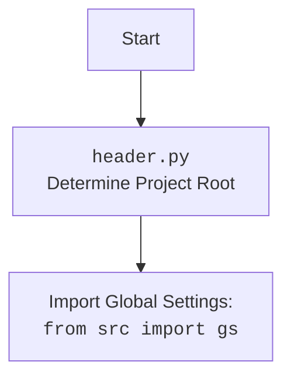

## ИНСТРУКЦИЯ:

Анализируй предоставленный код подробно и объясни его функциональность. Ответ должен включать три раздела:

1.  **<алгоритм>**: Опиши рабочий процесс в виде пошаговой блок-схемы, включая примеры для каждого логического блока, и проиллюстрируй поток данных между функциями, классами или методами.
2.  **<mermaid>**: Напиши код для диаграммы в формате `mermaid`, проанализируй и объясни все зависимости,
    которые импортируются при создании диаграммы.
    **ВАЖНО!** Убедитесь, что все имена переменных, используемые в диаграмме `mermaid`,
    имеют осмысленные и описательные имена. Имена переменных вроде `A`, `B`, `C`, и т.д., не допускаются!

    **Дополнительно**: Если в коде есть импорт `import header`, добавьте блок `mermaid` flowchart, объясняющий `header.py`:
    ```mermaid
    flowchart TD
        Start --> Header[<code>header.py</code><br> Determine Project Root]

        Header --> import[Import Global Settings: <br><code>from src import gs</code>]
    ```

3.  **<объяснение>**: Предоставьте подробные объяснения:
    -   **Импорты**: Их назначение и взаимосвязь с другими пакетами `src.`.
    -   **Классы**: Их роль, атрибуты, методы и взаимодействие с другими компонентами проекта.
    -   **Функции**: Их аргументы, возвращаемые значения, назначение и примеры.
    -   **Переменные**: Их типы и использование.
    -   Выделите потенциальные ошибки или области для улучшения.

Дополнительно, постройте цепочку взаимосвязей с другими частями проекта (если применимо).

Это обеспечивает всесторонний и структурированный анализ кода.
## Формат ответа: `.md` (markdown)
**КОНЕЦ ИНСТРУКЦИИ**

## <алгоритм>

1. **Импорт модулей**:
   - Импортируются необходимые модули для работы: `typing`, `header`, `src.suppliers.graber`, `src.webdriver.driver`, `src.logger.logger`.
2.  **Определение класса `Graber`**:
    -  Создается класс `Graber`, наследующийся от `src.suppliers.graber.Graber`.
    - Определяется атрибут класса `supplier_prefix` со значением `'hb'`.
3.  **Инициализация класса `__init__`**:
    - При создании объекта `Graber` вызывается метод `__init__`.
    - Устанавливается префикс поставщика `supplier_prefix` равным 'hb'.
    - Вызывается конструктор родительского класса `Graber` из `src.suppliers.graber`, передавая `supplier_prefix` и объект драйвера.
    - Устанавливается `Context.locator_for_decorator` в значение `None`.

**Пример использования:**
```python
from src.webdriver.driver import Driver  # Предполагается, что класс Driver существует

# Пример создания экземпляра класса Driver
driver_instance = Driver()
# Создание экземпляра класса Graber
graber_instance = Graber(driver=driver_instance)

# После создания экземпляра, graber_instance.supplier_prefix == 'hb'
# Context.locator_for_decorator == None
```

## <mermaid>

```mermaid
flowchart TD
    Start --> ImportModules[Импорт модулей: <code>typing</code>, <code>header</code>, <code>src.suppliers.graber</code>, <code>src.webdriver.driver</code>, <code>src.logger.logger</code>]
    ImportModules --> DefineGraberClass[Определение класса <code>Graber</code> (наследуется от <code>src.suppliers.graber.Graber</code>)]
    DefineGraberClass --> SetSupplierPrefix[Установка атрибута <code>supplier_prefix</code> = 'hb']
    SetSupplierPrefix --> InitGraber[Инициализация <code>__init__</code> класса <code>Graber</code>]
    InitGraber --> CallSuperInit[Вызов <code>__init__</code> родительского класса с <code>supplier_prefix</code> и <code>driver</code>]
    CallSuperInit --> SetContextLocator[Установка <code>Context.locator_for_decorator = None</code>]
    SetContextLocator --> End
    
    
    
    
  style ImportModules fill:#f9f,stroke:#333,stroke-width:2px
  style DefineGraberClass fill:#ccf,stroke:#333,stroke-width:2px
    
    
```



## <объяснение>

**Импорты:**

*   `from typing import Any`: Импортирует `Any` из модуля `typing` для использования в аннотациях типов, указывая, что переменная может быть любого типа.
*   `import header`: Импортирует модуль `header`, который, как предполагается, содержит логику определения корня проекта и загрузки глобальных настроек. `header.py` обычно отвечает за настройку путей и импорт необходимых переменных окружения.
*   `from src.suppliers.graber import Graber as Grbr, Context, close_pop_up`: Импортирует:
    *   `Graber` как `Grbr` (переименование) - базовый класс для грабберов (сборщиков данных) из модуля `src.suppliers.graber`.
    *   `Context` - класс для хранения контекстной информации, возможно, общей для различных частей граббера.
    *   `close_pop_up` - функция или декоратор, предназначенный для обработки всплывающих окон.
*   `from src.webdriver.driver import Driver`: Импортирует класс `Driver` из модуля `src.webdriver.driver`, который, вероятно, управляет веб-драйвером для автоматизации браузера.
*   `from src.logger.logger import logger`: Импортирует объект `logger` из модуля `src.logger.logger`, который используется для логирования событий и ошибок.

**Классы:**

*   `class Graber(Grbr)`:
    *   Этот класс `Graber` предназначен для сбора данных с сайта `hb.co.il`. Он наследуется от класса `Grbr` (переименованного `Graber` из `src.suppliers.graber`), предоставляя базовую функциональность сбора данных.
    *   `supplier_prefix: str`: Атрибут класса, определяющий префикс поставщика, используется для идентификации, например, в формировании имен файлов или при логировании.
    *   `__init__(self, driver: Driver)`: Конструктор класса:
        *   Принимает экземпляр `Driver` в качестве аргумента, который используется для взаимодействия с веб-браузером.
        *   Инициализирует `self.supplier_prefix` как `'hb'`.
        *   Вызывает конструктор родительского класса `Grbr` через `super().__init__`, передавая префикс поставщика и драйвер.
        *   Устанавливает `Context.locator_for_decorator` в значение `None`. Это указывает, что по умолчанию декоратор не будет применять никаких действий с локатором.

**Функции:**

*   В представленном коде нет явно определенных функций, но присутствует закомментированный шаблон декоратора `close_pop_up`. Этот шаблон показывает, как можно создать декоратор для закрытия всплывающих окон перед выполнением основной логики функции граббера. Если раскомментировать, то он будет выполнять следующие действия:
    *   `close_pop_up(value: Any = None) -> Callable`: Декоратор, который принимает дополнительное значение `value` и возвращает другой декоратор.
    *   `decorator(func: Callable) -> Callable`: Внутренний декоратор, который принимает функцию `func` и возвращает обертку `wrapper`.
    *   `wrapper(*args, **kwargs)`: Обертка, которая выполняет следующую логику:
        *   Пытается выполнить локатор `Context.locator.close_pop_up` (если он установлен). Если возникнет ошибка `ExecuteLocatorException`, она будет залогирована.
        *   Вызывает оборачиваемую функцию `func` с переданными аргументами и возвращает ее результат.

**Переменные:**

*   `supplier_prefix`: Строка, которая хранит префикс поставщика (`'hb'`).
*   `driver`: Объект класса `Driver`, используется для управления браузером.
* `Context.locator_for_decorator`: Свойство контекста, которое управляет локатором для декоратора, в этом коде устанавливается в `None`.

**Потенциальные ошибки и области для улучшения:**

*   **Закомментированный декоратор**: Декоратор `close_pop_up` закомментирован, что означает, что его функциональность не используется. Если он нужен, его следует раскомментировать и доработать.
*   **Обработка ошибок**: Обработка ошибок в закомментированном декораторе ограничена логированием ошибки. Возможно, стоит добавить более продвинутую обработку ошибок, например, повторные попытки или завершение операции.
*   **Зависимость от `Context`**: Глобальный доступ к `Context.locator_for_decorator` через класс `Context` может сделать код сложнее для отладки и тестирования, лучше инкапсулировать это в экземпляр класса.
*   **Отсутствие реализации**:  В коде нет реализации сбора данных. Есть только инициализация, а непосредственный сбор данных через веб-драйвер не описан.

**Цепочка взаимосвязей с другими частями проекта:**

1.  **`header.py`**: Обеспечивает базовую настройку проекта, включая определение корневого каталога и загрузку глобальных настроек.
2.  **`src.suppliers.graber`**: Предоставляет базовый класс `Graber` и класс `Context`, от которых зависит текущий класс.
3.  **`src.webdriver.driver`**: Предоставляет класс `Driver`, который управляет веб-браузером.
4.  **`src.logger.logger`**: Обеспечивает функциональность логирования для отслеживания работы граббера и возможных ошибок.

**Взаимодействие:**

1.  `Graber` наследует от `src.suppliers.graber.Graber`, что позволяет повторно использовать код и структуры данных.
2.  Использует `src.webdriver.driver.Driver` для взаимодействия с браузером.
3.  Использует `src.logger.logger` для ведения журнала.
4.  Использует `Context` для хранения общих настроек и контекстной информации, хотя это может быть пересмотрено в пользу инкапсуляции.
5.  `header.py` обеспечивает загрузку и настройку переменных окружения для проекта.