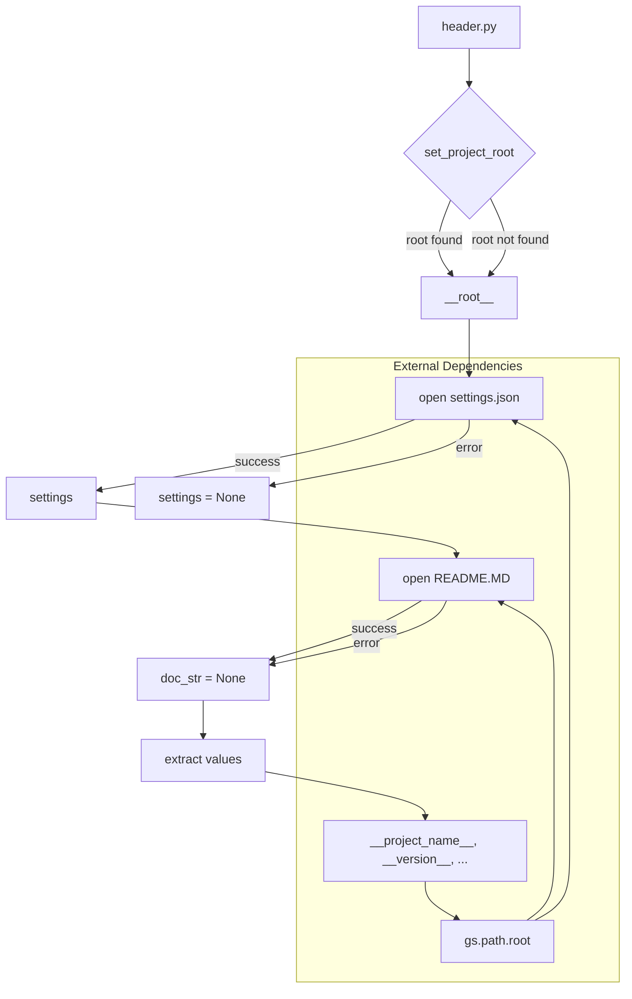

```MD
# <input code>

```python
## \file hypotez/src/suppliers/hb/header.py
# -*- coding: utf-8 -*-
#! venv/Scripts/python.exe
#! venv/bin/python/python3.12

"""
.. module: src.suppliers.hb 
	:platform: Windows, Unix
	:synopsis:

"""
MODE = 'dev'

import sys
import json
from packaging.version import Version

from pathlib import Path
def set_project_root(marker_files=('pyproject.toml', 'requirements.txt', '.git')) -> Path:
    """
    Finds the root directory of the project starting from the current file's directory,
    searching upwards and stopping at the first directory containing any of the marker files.

    Args:
        marker_files (tuple): Filenames or directory names to identify the project root.
    
    Returns:
        Path: Path to the root directory if found, otherwise the directory where the script is located.
    """
    __root__:Path
    current_path:Path = Path(__file__).resolve().parent
    __root__ = current_path
    for parent in [current_path] + list(current_path.parents):
        if any((parent / marker).exists() for marker in marker_files):
            __root__ = parent
            break
    if __root__ not in sys.path:
        sys.path.insert(0, str(__root__))
    return __root__


# Get the root directory of the project
__root__ = set_project_root()
"""__root__ (Path): Path to the root directory of the project"""

from src import gs

settings:dict = None
try:
    with open(gs.path.root / 'src' /  'settings.json', 'r') as settings_file:
        settings = json.load(settings_file)
except (FileNotFoundError, json.JSONDecodeError):
    ...

doc_str:str = None
try:
    with open(gs.path.root / 'src' /  'README.MD', 'r') as settings_file:
        doc_str = settings_file.read()
except (FileNotFoundError, json.JSONDecodeError):
    ...


__project_name__ = settings.get("project_name", 'hypotez') if settings  else 'hypotez'
__version__: str = settings.get("version", '')  if settings  else ''
__doc__: str = doc_str if doc_str else ''
__details__: str = ''
__author__: str = settings.get("author", '')  if settings else ''
__copyright__: str = settings.get("copyrihgnt", '')  if settings else ''
__cofee__: str = settings.get("cofee", "Treat the developer to a cup of coffee for boosting enthusiasm in development: https://boosty.to/hypo69")  if settings else "Treat the developer to a cup of coffee for boosting enthusiasm in development: https://boosty.to/hypo69"
```

# <algorithm>

**Шаг 1:** Функция `set_project_root`.
    - Получает текущий путь к файлу `header.py`.
    - Инициализирует переменную `__root__` текущим путем.
    - Перебирает родительские каталоги от текущего пути.
    - Для каждого родительского каталога проверяет наличие файлов `pyproject.toml`, `requirements.txt`, или `.git`.
    - Если какой-либо файл найден, `__root__` устанавливается в родительский каталог и цикл завершается.
    - Если `__root__` не находится в `sys.path`, добавляется в начало списка `sys.path`.
    - Возвращает `__root__`.
**Пример:** Если `header.py` находится в `hypotez/src/suppliers/hb`, `set_project_root` найдет `hypotez` как корневую директорию.


**Шаг 2:** Получение корневой директории.
    - Вызывается функция `set_project_root()`, результат сохраняется в переменной `__root__`.

**Шаг 3:** Чтение файла `settings.json`.
    - Используется модуль `gs.path.root` для получения пути к файлу `settings.json`.
    - Если файл найден, загружает JSON в `settings`.
    - Игнорирует ошибки `FileNotFoundError` и `json.JSONDecodeError`.


**Шаг 4:** Чтение файла `README.MD`.
    - Используется модуль `gs.path.root` для получения пути к файлу `README.MD`.
    - Если файл найден, читает содержимое в `doc_str`.
    - Игнорирует ошибки `FileNotFoundError` и `json.JSONDecodeError`.


**Шаг 5:** Получение настроек.
    - Вытаскивает значения из `settings` для переменных `__project_name__`, `__version__`, `__author__`, `__copyright__`, `__cofee__`.
    - Использует значения по умолчанию, если ключ не найден в `settings`.


# <mermaid>



**Объяснение диаграммы:**

* `header.py` (A) вызывает `set_project_root` (B) для нахождения корневой директории проекта (`__root__`).
* `set_project_root` зависит от существования папок и файлов, заданных `marker_files` в аргументах.
* `gs.path.root` (K) - внешний модуль, обеспечивающий доступ к корневой директории проекта. Он необходим для правильного чтения файлов `settings.json` и `README.MD`.
* Взят корневой каталог, считываются и парсятся  `settings.json` и `README.MD`, из `settings.json` извлекаются необходимые значения. Результатом является инициализация переменных в `header.py`.


# <explanation>

**Импорты:**

- `sys`: Используется для добавления корневого пути проекта в `sys.path`, что позволяет импортировать модули из `src` папки.
- `json`: Для работы с JSON файлами настроек `settings.json`.
- `packaging.version`:  Для работы с версиями (хотя в данном коде не используется).
- `pathlib`: Обеспечивает работу с путями к файлам.
- `src.gs`: Вероятно, собственный модуль, предоставляющий информацию о пути к корневому каталогу проекта (`gs.path.root`). Эта зависимость неявно указывает на более сложную структуру проекта.


**Классы:**

Нет определенных классов в коде.


**Функции:**

- `set_project_root(marker_files)`: Ищет корневой каталог проекта, начиная с текущего файла. Аргумент `marker_files` предоставляет список файлов для поиска. Возвращает `Path` к корневому каталогу. Важно обработать ситуацию, если корневой каталог не найден.


**Переменные:**

- `MODE`: Строковая константа, вероятно, для настройки режима работы.
- `settings`: Словарь, содержащий настройки проекта из `settings.json`.
- `doc_str`: Строка, содержащая содержимое файла `README.MD`.
- `__root__`: Путь к корневому каталогу проекта.
- `__project_name__`, `__version__`, `__author__`, `__copyright__`, `__cofee__`: Переменные, содержащие информацию о проекте, полученные из `settings.json` или значения по умолчанию.


**Возможные ошибки и улучшения:**

- **Обработка ошибок:** Обработка ошибок `FileNotFoundError` и `json.JSONDecodeError` при чтении файлов является хорошей практикой.
- **Документация:** Документация для переменных `__root__` ,  `settings`, `doc_str` не хватает. Уточнить, откуда берутся значения.
- **Модуль `gs`:** Необходимо детально исследовать, как `gs.path.root` получает путь к корневому каталогу. Понимание реализации модуля `gs` важно для правильного внедрения в проект.
- **`sys.path.insert(0, str(__root__))`:** Может быть потенциальным источником проблем, если корневой путь уже существует в `sys.path`.
- **Тип возвращаемого значения `set_project_root`:** Функция возвращает `Path`, что обеспечивает безопасность и удобство работы с путями.


**Цепочка взаимосвязей:**

Код в `header.py` зависит от модуля `gs`, который, вероятно, предоставляет методы для получения информации о корневом каталоге проекта.  `settings.json` и `README.MD` содержат метаданные о проекте, влияющие на значения переменных в `header.py`.