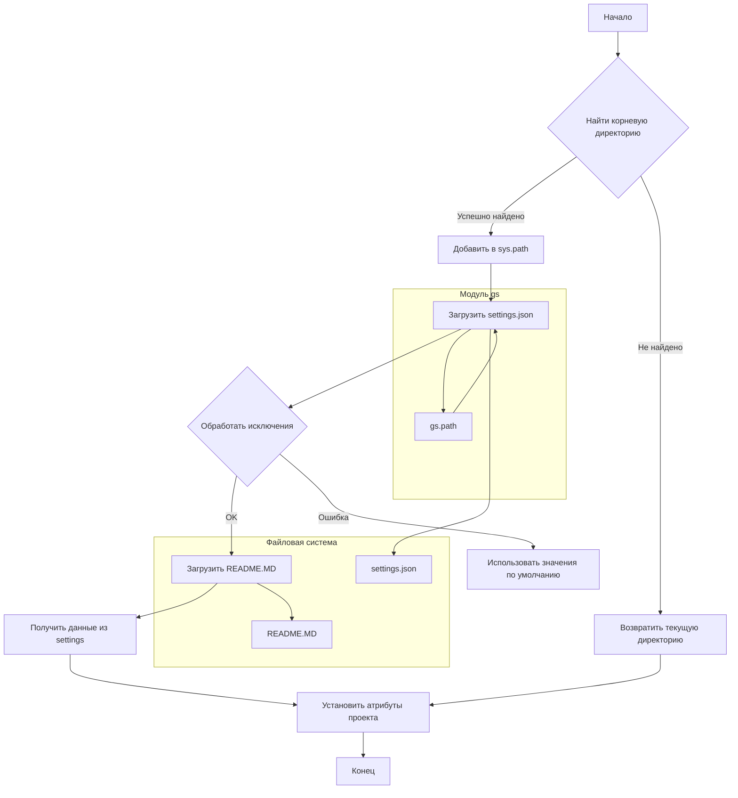

# <input code>

```python
## \file hypotez/src/suppliers/hb/header.py
# -*- coding: utf-8 -*-
#! venv/Scripts/python.exe
#! venv/bin/python/python3.12

"""
.. module: src.suppliers.hb 
	:platform: Windows, Unix
	:synopsis:

"""
MODE = 'dev'

import sys
import json
from packaging.version import Version

from pathlib import Path
def set_project_root(marker_files=('pyproject.toml', 'requirements.txt', '.git')) -> Path:
    """
    Finds the root directory of the project starting from the current file's directory,
    searching upwards and stopping at the first directory containing any of the marker files.

    Args:
        marker_files (tuple): Filenames or directory names to identify the project root.
    
    Returns:
        Path: Path to the root directory if found, otherwise the directory where the script is located.
    """
    __root__:Path
    current_path:Path = Path(__file__).resolve().parent
    __root__ = current_path
    for parent in [current_path] + list(current_path.parents):
        if any((parent / marker).exists() for marker in marker_files):
            __root__ = parent
            break
    if __root__ not in sys.path:
        sys.path.insert(0, str(__root__))
    return __root__


# Get the root directory of the project
__root__ = set_project_root()
"""__root__ (Path): Path to the root directory of the project"""

from src import gs

settings:dict = None
try:
    with open(gs.path.root / 'src' /  'settings.json', 'r') as settings_file:
        settings = json.load(settings_file)
except (FileNotFoundError, json.JSONDecodeError):
    ...

doc_str:str = None
try:
    with open(gs.path.root / 'src' /  'README.MD', 'r') as settings_file:
        doc_str = settings_file.read()
except (FileNotFoundError, json.JSONDecodeError):
    ...


__project_name__ = settings.get("project_name", 'hypotez') if settings  else 'hypotez'
__version__: str = settings.get("version", '')  if settings  else ''
__doc__: str = doc_str if doc_str else ''
__details__: str = ''
__author__: str = settings.get("author", '')  if settings else ''
__copyright__: str = settings.get("copyrihgnt", '')  if settings else ''
__cofee__: str = settings.get("cofee", "Treat the developer to a cup of coffee for boosting enthusiasm in development: https://boosty.to/hypo69")  if settings else "Treat the developer to a cup of coffee for boosting enthusiasm in development: https://boosty.to/hypo69"
```

# <algorithm>

**Шаг 1:** Найти корневую директорию проекта.
* Функция `set_project_root` ищет корень проекта, начиная от текущей директории файла и поднимаясь вверх по дереву директорий.
* Она проверяет наличие файлов `pyproject.toml`, `requirements.txt` и `.git` в родительских директориях.
* Если один из этих файлов найден, функция возвращает путь к родительской директории как корневую директорию.
* В противном случае возвращает путь к текущей директории.
* Пример: Если текущий файл находится в `hypotez/src/suppliers/hb/header.py`, функция будет искать корень проекта, проверяя директории `hypotez/src/suppliers/hb`, `hypotez/src`, и т.д. пока не найдет один из указанных файлов.


**Шаг 2:** Добавить корневую директорию в `sys.path`.
* Если корневая директория не входит в `sys.path`, функция добавляет ее в начало списка `sys.path`.

**Шаг 3:** Загрузить настройки проекта.
* Из `gs` импортируется путь к корню проекта.
* Используя этот путь, файл `settings.json` открывается и загружается в переменную `settings`.
* Используется обработка исключений `try...except` для обработки ошибок `FileNotFoundError` и `json.JSONDecodeError`.

**Шаг 4:** Загрузить README.
* Файл `README.MD` загружается в переменную `doc_str`
* Используется обработка исключений `try...except` для обработки ошибок `FileNotFoundError` и `json.JSONDecodeError`.

**Шаг 5:** Получить данные из настроек.
* Различные атрибуты проекта (`__project_name__`, `__version__`, `__doc__`, `__author__`, `__copyright__`, `__cofee__`) получают из словаря `settings` с использованием метода `get`.
* Если `settings` отсутствует, используется значение по умолчанию.


# <mermaid>



# <explanation>

**Импорты:**

* `sys`: Предоставляет доступ к системным переменным, в частности `sys.path`.
* `json`: Для работы с JSON-файлами.
* `packaging.version`: Для работы с версиями пакетов.
* `pathlib`: Для работы с путями к файлам.
* `src.gs`: Предположительно, модуль, содержащий функции для работы с путями к файлам и ресурсам проекта.  Связь между модулями определяется использованием `from src import gs`, что указывает на то, что `gs` находится в пакете `src`.  Необходимо уточнить, как `gs.path.root` взаимодействует с файловой системой.

**Классы:**

* Нет определенных классов. Только функции и переменные.

**Функции:**

* `set_project_root(marker_files)`: Функция находит корневую директорию проекта, начиная с текущего файла и идя вверх по дереву директорий. Возвращает `Path` объект корневой директории. Аргумент `marker_files` позволяет указать файлы, по наличию которых можно определить корневую директорию.

**Переменные:**

* `MODE`: Строковая константа, хранящая режим работы (в данном случае 'dev').
* `__root__`: `Path` объект, представляющий корневую директорию проекта.
* `settings`: Словарь, содержащий настройки проекта, загруженный из `settings.json`. Тип `dict`.
* `doc_str`: Строка, содержащая содержимое файла `README.MD`.
* `__project_name__`, `__version__`, `__doc__`, `__details__`, `__author__`, `__copyright__`, `__cofee__`: Строковые переменные, содержащие информацию о проекте, полученные из `settings` или значения по умолчанию.

**Возможные ошибки и улучшения:**

* **Уровни логирования:** Включение логирования (например, с помощью `logging`) сделает код более надежным и читаемым, особенно для отслеживания ошибок в чтении файлов.
* **Обработка путей:**  Обработка путей (особенно в `gs.path.root`) должна быть более гибкой, чтобы корректно работать на разных платформах.
* **Проверка корректности данных:**  Важно добавить проверку на корректность данных, загруженных из `settings.json`, чтобы избежать неожиданных ошибок в будущем.
* **Более подробное описание:** Добавить документирование к переменным, чтобы сразу было понятно их назначение.

**Взаимосвязи с другими частями проекта:**

Код напрямую зависит от модуля `src.gs`.  Модуль `gs` отвечает за определение корневого пути проекта, поэтому нехватка информации о `gs` затрудняет полное понимание функциональности `header.py`.  Ожидается, что модуль `gs` содержит вспомогательные функции для работы с файловой системой, связанными с проектом.