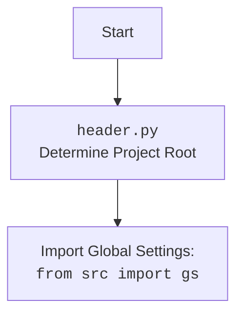

## АНАЛИЗ КОДА: `hypotez/src/suppliers/hb/header.py`

### 1. <алгоритм>

**set_project_root Function:**

1.  **Начало**: Функция `set_project_root` принимает необязательный параметр `marker_files` (по умолчанию `('__root__', '.git')`), который является кортежем имен файлов или директорий.
2.  **Определение текущего пути**: Получает абсолютный путь к директории, в которой находится текущий файл `header.py`, используя `Path(__file__).resolve().parent` и сохраняет его в переменную `current_path`.
3.  **Инициализация корня**: Инициализирует переменную `__root__` текущим путём `current_path`.
4.  **Поиск родительских директорий**:
    *   Начинает итерацию по родительским директориям текущего пути (`current_path`).
    *   Для каждой родительской директории `parent`, проверяет, существует ли какой-либо из файлов или директорий, указанных в `marker_files`. Это делается с помощью генератора `(parent / marker).exists() for marker in marker_files` и функции `any()`.
    *   **Пример:** Если `marker_files` равно `('__root__', '.git')`, то проверяется, существует ли в текущей директории файл `__root__` или папка `.git`. Если ни того, ни другого нет, то переходим к родительской директории.
    *   Если хотя бы один из маркеров найден, то `parent` становится новым `__root__`. Цикл прерывается.
5.  **Обновление `sys.path`**: Проверяет, есть ли путь `__root__` в `sys.path`. Если нет, то добавляет его в начало списка путей, чтобы Python мог импортировать модули из этой директории.
6.  **Возврат**: Возвращает найденный путь к корневой директории `__root__`.

**Пример:**

Допустим, что `header.py` находится в директории `/project/src/suppliers/hb/`.

1.  Изначально, `current_path` будет `/project/src/suppliers/hb/`.
2.  `__root__` будет инициализировано `/project/src/suppliers/hb/`.
3.  Начинается итерация по родительским директориям:
    *   Проверяется `/project/src/suppliers/hb/`. Не найдено ни `__root__`, ни `.git`.
    *   Проверяется `/project/src/suppliers/`. Не найдено ни `__root__`, ни `.git`.
    *   Проверяется `/project/src/`. Не найдено ни `__root__`, ни `.git`.
    *   Проверяется `/project/`. Допустим, что здесь найден файл `__root__`. Тогда `__root__` становится `/project/`.
    *   Цикл прерывается.
4.  Если `/project/` еще не было в `sys.path`, то оно добавляется в список.
5.  Функция возвращает `/project/`.

**Основной поток выполнения:**

1. **Определение корня проекта**: Вызывает функцию `set_project_root()`, чтобы определить корневую директорию проекта и присваивает результат переменной `__root__`.
2. **Импорт глобальных настроек**: Импортирует модуль `gs` из пакета `src`.
3. **Загрузка настроек из `settings.json`**:
    * Пытается открыть файл `settings.json`, расположенный в `src/settings.json` относительно корневой директории, прочитав его содержимое.
    * Пытается загрузить JSON из файла в переменную `settings` в виде словаря.
    * Если файл не найден или JSON невалидный, то блок `try` игнорируется.
4. **Загрузка документации из `README.MD`**:
    * Пытается открыть файл `README.MD`, расположенный в `src/README.MD` относительно корневой директории, прочитав его содержимое.
    * Пытается прочитать содержимое файла в переменную `doc_str` в виде строки.
    * Если файл не найден, то блок `try` игнорируется.
5. **Определение глобальных переменных**: Определяет глобальные переменные на основе загруженных настроек:
    *   `__project_name__`: Имя проекта (по умолчанию `hypotez`).
    *   `__version__`: Версия проекта.
    *   `__doc__`: Документация проекта из `README.MD`.
    *   `__details__`: Строка с деталями (по умолчанию пустая).
    *   `__author__`: Автор проекта.
    *   `__copyright__`: Авторское право проекта.
    *   `__cofee__`: Сообщение о поддержке разработчика.

### 2. <mermaid>

```mermaid
flowchart TD
    Start --> FindProjectRoot[<code>set_project_root()</code><br> Determine Project Root]
    
    FindProjectRoot --> GetCurrentPath[Get Absolute Path: <br><code>Path(__file__).resolve().parent</code>]
    GetCurrentPath --> InitRoot[Init: <code>__root__ = current_path</code>]
    InitRoot --> LoopParents[Loop through parent directories]
    LoopParents -- For each parent directory --> CheckMarkers[Check if markers exist: <code>(parent / marker).exists()</code>]
    CheckMarkers -- Marker exists --> UpdateRoot[Update: <code>__root__ = parent</code>]
    UpdateRoot --> BreakLoop[Break Loop]
     CheckMarkers -- Marker does not exist --> LoopParents
    LoopParents -- No more parents --> CheckSysPath[Check if <code>__root__</code> in <code>sys.path</code>]
    CheckSysPath -- Not in <code>sys.path</code> --> AddToSysPath[Add <code>__root__</code> to <code>sys.path</code>]
    AddToSysPath --> ReturnRoot[Return <code>__root__</code>]
     CheckSysPath -- In <code>sys.path</code> --> ReturnRoot
     ReturnRoot --> ImportGlobalSettings[Import Global Settings: <br><code>from src import gs</code>]
     ImportGlobalSettings --> LoadSettings[Load Settings from <code>settings.json</code>]
     LoadSettings --> LoadReadme[Load Documentation from <code>README.MD</code>]
     LoadReadme --> DefineGlobalVars[Define Global Variables: <code>__project_name__</code>, <code>__version__</code>, etc.]
      DefineGlobalVars --> End
    
    
    
```


**Объяснение зависимостей в `mermaid`:**

*   **`set_project_root()`**: Функция для поиска корневой директории проекта.
    *   **`Path(__file__).resolve().parent`**: Получение абсолютного пути к директории текущего файла.
    *   **`__root__`**: Переменная, хранящая путь к корневой директории.
    *   **`current_path`**: Переменная, хранящая текущий путь.
    *   **`parent`**: Переменная, представляющая родительскую директорию во время итераций.
    *   **`marker`**: Переменная, представляющая имя файла или директории-маркера.
    *    **`sys.path`**: Список путей поиска модулей в Python.
*   **`from src import gs`**: Импорт глобальных настроек проекта из модуля `gs`.
*   **`settings.json`**: Файл настроек проекта в формате JSON.
*   **`README.MD`**: Файл документации проекта.
*   **`__project_name__`**: Глобальная переменная, хранящая имя проекта.
*   **`__version__`**: Глобальная переменная, хранящая версию проекта.
*   **`__doc__`**: Глобальная переменная, хранящая документацию проекта.

### 3. <объяснение>

**Импорты:**

*   **`import sys`**: Модуль `sys` предоставляет доступ к некоторым переменным и функциям, используемым интерпретатором Python. В данном случае используется для добавления пути к корневой директории проекта в `sys.path`, чтобы Python мог находить и импортировать модули проекта.
*   **`import json`**: Модуль `json` используется для работы с данными в формате JSON. В данном случае, он используется для чтения файла настроек `settings.json`.
*    **`from packaging.version import Version`**: Импортирует класс `Version` из библиотеки `packaging`. В коде не используется. Возможно, зарезервировано для дальнейшей работы с версиями.
*   **`from pathlib import Path`**: Модуль `pathlib` предоставляет объектно-ориентированный способ работы с путями к файлам и директориям. Здесь используется для представления путей в виде объектов `Path` и манипуляции ими.
*   **`from src import gs`**: Импортирует модуль `gs` из пакета `src`. Этот модуль, вероятно, содержит глобальные настройки или константы, которые используются в проекте. Он импортируется после определения корневой директории проекта, что гарантирует корректный путь для импорта.

**Функции:**

*   **`set_project_root(marker_files=('__root__', '.git')) -> Path`**:
    *   **Аргументы:**
        *   `marker_files`: Кортеж имен файлов или директорий, которые используются для определения корневой директории проекта. По умолчанию равен `('__root__', '.git')`.
    *   **Возвращаемое значение:** Объект `Path`, представляющий путь к корневой директории проекта.
    *   **Назначение:** Функция находит корневую директорию проекта путем поиска файлов или директорий-маркеров вверх по дереву каталогов.

**Переменные:**

*   `__root__: Path`: Глобальная переменная, которая хранит путь к корневой директории проекта.
*   `settings: dict`: Словарь, в котором хранятся настройки проекта, загруженные из `settings.json`.
*   `doc_str: str`: Строка, в которой хранится содержимое файла `README.MD` (документация).
*   `__project_name__: str`: Имя проекта (по умолчанию `hypotez`).
*   `__version__: str`: Версия проекта.
*   `__doc__: str`: Документация проекта.
*   `__details__: str`: Детали проекта (по умолчанию пустая строка).
*   `__author__: str`: Автор проекта.
*   `__copyright__: str`: Авторское право проекта.
*   `__cofee__: str`: Сообщение с предложением поддержать разработчика.

**Цепочка взаимосвязей с другими частями проекта:**

1.  **`set_project_root` и `sys.path`**: Функция `set_project_root` находит корень проекта и изменяет `sys.path`, добавляя корень проекта в список путей поиска модулей. Это позволяет импортировать модули из разных частей проекта, например `from src import gs`.
2.  **`gs`**: Модуль `gs` содержит глобальные настройки.
3.  **`settings.json`**: Этот файл содержит конфигурационные настройки проекта, которые используются для определения имени проекта, версии, автора, и др.
4. **`README.MD`**: Этот файл содержит документацию проекта.
5. **Глобальные переменные:** Все определенные глобальные переменные, такие как `__project_name__` , `__version__`, и другие, могут быть использованы в других модулях проекта после их импорта.
6. **Зависимость от структуры проекта**: Код полагается на определенную структуру проекта: наличие файлов `settings.json` и `README.MD` в директории `src`.

**Потенциальные ошибки и области для улучшения:**

1.  **Обработка исключений**: В блоках `try...except` используется `...` как оператор заглушки `pass` для случаев `FileNotFoundError` и `json.JSONDecodeError`. Это может затруднить отладку, поскольку ошибки игнорируются. Лучше добавить логирование или хотя бы вывод предупреждения.
2.  **Зависимость от структуры проекта**: Код предполагает, что `settings.json` и `README.MD` всегда находятся в каталоге `src` относительно корня проекта. Это может быть негибким, поэтому следует рассмотреть возможность настройки путей или использовать переменные окружения.
3.  **Зависимость от наличия `settings`**: Большая часть переменных проекта зависит от успешной загрузки файла `settings.json`, что может привести к ошибкам, если файл не существует или поврежден. Возможно, следует добавить проверки и дефолтные значения на все переменные.
4. **Используемые маркеры**: Маркеры `__root__` и `.git` достаточно общие и могут совпасть с другими файлами в структуре проекта. Возможно, стоит добавить более уникальный маркер.
5.  **Улучшение сообщений**: Сообщение `__cofee__` довольно длинное, стоит его вынести в отдельную переменную или функцию, для упрощения кода.

**Дополнительные замечания:**

*   Код предназначен для определения корневой директории проекта и загрузки основных настроек и документации, что является типичным для стартового скрипта проекта.
*   Файл  `header.py` используется для определения глобальных переменных и путей, которые затем используются в других частях проекта.