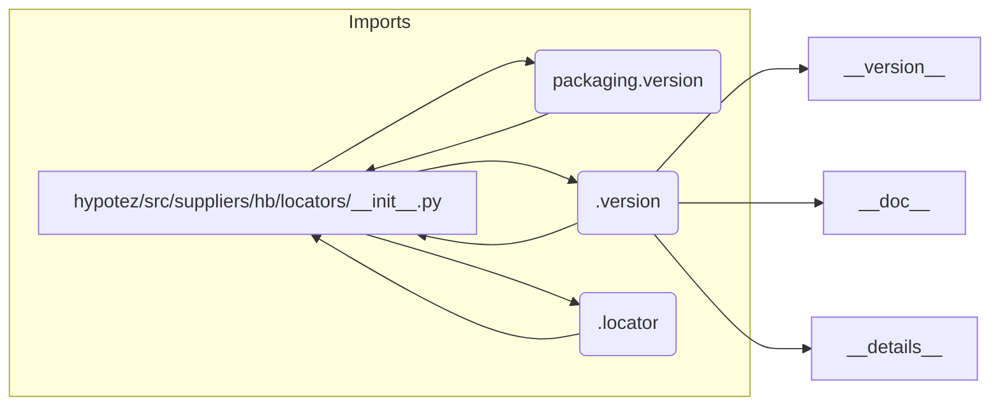

```MD
# Анализ кода hypotez/src/suppliers/hb/locators/__init__.py

## <input code>

```python
## \file hypotez/src/suppliers/hb/locators/__init__.py
# -*- coding: utf-8 -*-\
#! venv/Scripts/python.exe
#! venv/bin/python/python3.12

"""
.. module: src.suppliers.hb.locators 
	:platform: Windows, Unix
	:synopsis:

"""
MODE = 'dev'

"""
	:platform: Windows, Unix
	:synopsis:

"""


"""
	:platform: Windows, Unix
	:synopsis:

"""


"""
  :platform: Windows, Unix

"""
"""
  :platform: Windows, Unix
  :platform: Windows, Unix
  :synopsis:
"""MODE = 'dev'
  
""" module: src.suppliers.hb.locators """


""" Изменения в локаторах. Применять с осторожносастью  """
...

from packaging.version import Version
from .version import __version__, __doc__, __details__  
from .locator import 
```

## <algorithm>

Этот код, к сожалению, не содержит логики. Он представляет собой фрагмент модуля `__init__.py`, который является частью пакета `locators` в подпакете `hb` внутри `suppliers`.  Алгритм работы отсутствует, поскольку это только описание и импорты.


## <mermaid>



## <explanation>

**Импорты:**

- `from packaging.version import Version`: Импортирует класс `Version` из пакета `packaging`.  Этот пакет используется для работы с версиями пакетов. В данном случае, вероятно, для проверки версий или управления совместимостью.  Связь с `src` идет через dependency - `packaging`.
- `from .version import __version__, __doc__, __details__`: Импортирует переменные `__version__`, `__doc__`, `__details__` из модуля `version.py`, который находится в текущем каталоге `locators`. Это, скорее всего, метаданные о версии, документации и дополнительных данных для модуля.  Связь с `src` - косвенная, через подпакеты.
- `from .locator import`: Импортирует что-то из модуля `locator.py` в текущем каталоге. Без информации о содержании `locator.py` сложно сказать, что это. Скорее всего, это импорт классов или функций, которые используются в локаторах.  Связь с `src` - косвенная, через подпакеты.

**Классы/Функции/Переменные:**

- `MODE = 'dev'`: Переменная, которая вероятно определяет режим работы (например, `dev`, `prod`), но она не используется в коде.
-  `__version__`, `__doc__`, `__details__`:  Не являются переменными в обычном смысле, а являются специальными атрибутами модуля, доступные через `__init__.py`. Используются для информации о версии, документации и дополнительных данных, которые необходимы при работе с пакетом.
-  Неизвестные атрибуты импортированного `from .locator import` не определены.

**Возможные ошибки/улучшения:**

- Отсутствует логика. Файл является только `__init__.py` для пакета `locators`, а значит содержит импорты, но не содержат функций/классов, которые исполняются.
- Должна быть определена логика работы локаторов внутри `locator.py`.
- Необходимо добавить документацию к `locator.py`.
- Неясно, как этот модуль взаимодействует с другими частями проекта.  Не хватает информации о том, что представляют собой `locators` и как они используются.

**Взаимосвязи с другими частями проекта:**

Для полной картины необходимо увидеть содержимое `locator.py` и других файлов в папке `locators`. Вероятно, эти локаторы используются для поиска данных в базе данных, выполняют какие-то другие действия и являются частью системы.


**Вывод:**

Код предоставляет импорты для работы с версиями и компонентами внутри пакета `locators`, но сам не содержит исполняемой логики. Необходимо рассмотреть код `locator.py` для полного понимания функциональности.