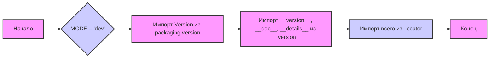

## Анализ кода `hypotez/src/suppliers/hb/locators/__init__.py`

### <алгоритм>

1. **Инициализация режима работы:**
   - Задается переменная `MODE` со значением `'dev'`. Это может указывать на то, что приложение работает в режиме разработки.
   - Пример: `MODE = 'dev'` устанавливает режим работы приложения как "разработка".
2. **Импорт версионной информации:**
   - Импортируются `Version` из библиотеки `packaging.version`.
   - Импортируются `__version__`, `__doc__`, и `__details__` из модуля `version`.
     - Это нужно для отслеживания версий, документации и деталей релиза текущего пакета.
   - Пример: `from packaging.version import Version` импортирует класс для работы с версиями.
3. **Импорт локаторов:**
    - Импортируются все имена из модуля `locator`. Это предполагает, что в модуле `locator` определены различные классы или переменные, представляющие локаторы элементов на веб-странице.
    - Пример: `from .locator import *` импортирует все определения локаторов.

### <mermaid>

**Разъяснение:**

- **Начало:** `A` обозначает начало процесса инициализации модуля.
- **Установка режима:** `B` представляет присвоение переменной `MODE` значения `'dev'`, что означает режим разработки.
- **Импорт `Version`:** `C` показывает импорт класса `Version` из библиотеки `packaging.version`, который используется для сравнения версий.
- **Импорт информации о версии:** `D` отображает импорт переменных `__version__`, `__doc__`, `__details__` из модуля `version`, которые несут информацию о версии, документации и деталях текущего модуля.
- **Импорт локаторов:** `E` показывает импорт всех элементов (классов, переменных) из модуля `locator`, которые содержат определения локаторов.
- **Конец:** `F` представляет конец процесса инициализации модуля.

### <объяснение>

**Импорты:**

- `from packaging.version import Version`:
  -   **Назначение**: Импортирует класс `Version` из библиотеки `packaging.version`. Этот класс используется для работы с версиями пакетов, позволяя сравнивать и анализировать версии.
  -   **Взаимосвязь**: Не имеет прямой связи с другими пакетами `src` кроме как с пакетом текущего модуля `src.suppliers.hb.locators` через импорт модуля `version`
- `from .version import __version__, __doc__, __details__`:
    -   **Назначение**: Импортирует переменные `__version__` (версия модуля), `__doc__` (документация модуля) и `__details__` (детали модуля) из модуля `version` в той же директории.
    -   **Взаимосвязь**: Модуль `version` предназначен для хранения метаданных текущего модуля.
- `from .locator import *`:
    -   **Назначение**: Импортирует все имена (классы, функции, переменные) из модуля `locator` в той же директории.
    -   **Взаимосвязь**: Модуль `locator` должен содержать определения локаторов для элементов веб-страниц.

**Переменные:**

- `MODE = 'dev'`:
    -   **Тип**: Строка (`str`).
    -   **Использование**: Определяет режим работы приложения. В данном случае, `'dev'` означает, что приложение находится в режиме разработки. Это может влиять на поведение и настройки приложения.

**Объяснение:**

Файл `__init__.py` в пакете `src.suppliers.hb.locators` выполняет несколько ключевых функций:

1.  **Настройка режима работы**: Устанавливает глобальную переменную `MODE` в `'dev'`, что сигнализирует о том, что приложение находится в режиме разработки. Этот режим может влиять на различные аспекты работы, такие как уровень логирования, использование заглушек или подключение к тестовым ресурсам.
2.  **Управление версиями**: Импортирует и обеспечивает доступ к информации о версии модуля, его документации и деталях. Это необходимо для отслеживания релизов и корректной работы с пакетами.
3.  **Импорт локаторов**: Импортирует все локаторы, определенные в модуле `locator`. Это централизованное место для доступа ко всем локаторам, необходимым для взаимодействия с веб-страницами.

**Потенциальные ошибки и области для улучшения:**

-   **Использование `*` при импорте:** Импорт `*` из модуля `locator` может сделать код менее явным и затруднить отладку, особенно в больших проектах. Рекомендуется импортировать конкретные имена, которые используются в коде, что улучшит читаемость и поддерживаемость.
-   **Отсутствие документации в модуле `locator`**: Желательно добавить документацию в модуль `locator`, так как в `__init__.py` импортируются все элементы из него, и нужно понимать их предназначение и структуру.
-   **Зависимость от жестко заданного `MODE`:** Желательно сделать настройку `MODE` более гибкой, например, через переменные окружения или конфигурационный файл, чтобы легко переключаться между режимами работы (разработка, тестирование, продакшен).

**Цепочка взаимосвязей:**

-   **`src.suppliers.hb.locators.__init__.py`** --> **`src.suppliers.hb.locators.version`**: Импортирует информацию о версии модуля.
-   **`src.suppliers.hb.locators.__init__.py`** --> **`src.suppliers.hb.locators.locator`**: Импортирует локаторы для веб-страниц.
-   **`src.suppliers.hb.*`** (где `*` - другие части пакета `hb`) могут использовать локаторы из `src.suppliers.hb.locators`, что делает этот модуль важным компонентом для взаимодействия с веб-страницами в контексте данного поставщика.