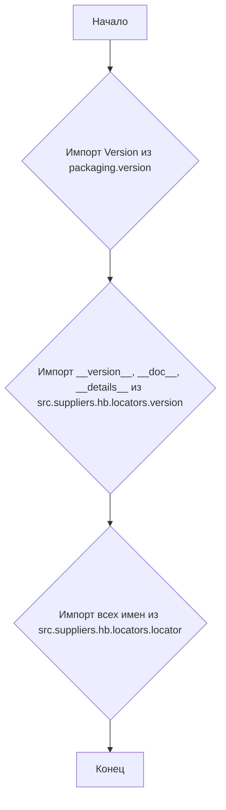
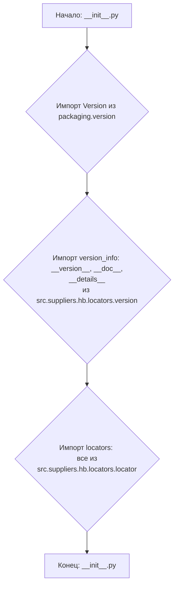

## АНАЛИЗ КОДА: `hypotez/src/suppliers/hb/locators/__init__.py`

### 1. <алгоритм>

1.  **Импорт модулей**:
    *   Импортируется `Version` из `packaging.version`. Это класс для работы с версиями пакетов.
        *   Пример: `Version("1.2.3") > Version("1.2.2")` вернет `True`.
    *   Импортируются `__version__`, `__doc__`, и `__details__` из модуля `src.suppliers.hb.locators.version`. Эти переменные предположительно содержат информацию о версии, документации и деталях о модуле.
2.  **Импорт всего из `locator`**:
    *   Импортируются все имена (классы, функции, переменные) из модуля `src.suppliers.hb.locators.locator`. Это подразумевает, что `locator.py` содержит основные локаторы или классы для работы с ними, и данный модуль предоставляет доступ к ним.



### 2. <mermaid>



### 3. <объяснение>

**Импорты:**

*   `from packaging.version import Version`:
    *   **Назначение:** Импортирует класс `Version` из библиотеки `packaging`, предназначенный для сравнения и анализа версий пакетов.
    *   **Взаимосвязь с `src`**: Не имеет прямой связи с другими пакетами `src`, но используется для управления версиями внутри этого пакета.
*   `from .version import __version__, __doc__, __details__`:
    *   **Назначение:** Импортирует переменные, содержащие информацию о версии, документации и деталях текущего модуля, из файла `version.py` в той же директории.
    *   **Взаимосвязь с `src`**: `version.py` является частью пакета `src.suppliers.hb.locators` и содержит метаинформацию о данном модуле.
*   `from .locator import **`:
    *   **Назначение:** Импортирует все имена (классы, функции, переменные) из модуля `locator.py`, находящегося в той же директории. Это основной способ предоставить внешнему коду доступ к локаторам.
    *   **Взаимосвязь с `src`**: Модуль `locator.py` является ключевым компонентом пакета `src.suppliers.hb.locators` и содержит логику для работы с локаторами.

**Классы:**

*   Класс `Version` из `packaging.version` используется для представления и сравнения версий пакетов. Класс `Version` не определен в данном файле, а импортируется, и, таким образом, является частью внешней библиотеки.

**Функции:**

*   В данном файле функции не определены, а происходит импорт имен из `locator.py`, где предположительно функции определены.

**Переменные:**

*   `__version__`: Строка, представляющая версию пакета.
*   `__doc__`: Строка, содержащая документацию к модулю.
*   `__details__`: Строка, содержащая дополнительную информацию о модуле.
*   Имена (классы, функции, переменные) импортированные из `locator.py`.

**Потенциальные проблемы и улучшения:**

*   Импорт `from .locator import *` может привести к конфликтам имен, особенно если в `locator.py` много переменных и функций. Рекомендуется импортировать только необходимые имена или использовать псевдонимы, например:
    ```python
    from .locator import LocatorClass1, locator_function2
    ```
*   Строки документации в начале файла выглядят избыточными. Рекомендуется их объединить или убрать дубликаты.
*   Файл `__init__.py` используется в качестве точки входа для модуля. Он импортирует необходимую информацию, чтобы при импорте `from src.suppliers.hb.locators import ...` можно было использовать все локаторы, информацию о версии и документацию.

**Цепочка взаимосвязей:**

1.  `src`: Корневая директория проекта.
2.  `src.suppliers`: Пакет, содержащий модули поставщиков.
3.  `src.suppliers.hb`: Модуль для поставщика `hb`.
4.  `src.suppliers.hb.locators`: Пакет, содержащий модули для работы с локаторами.
5.  `src.suppliers.hb.locators.__init__.py`: Инициализирует пакет `locators`, импортируя все необходимые компоненты.
6. `src.suppliers.hb.locators.version.py`: Модуль для хранения метаданных о версии, описания и тд.
7. `src.suppliers.hb.locators.locator.py`: Модуль с основными локаторами.