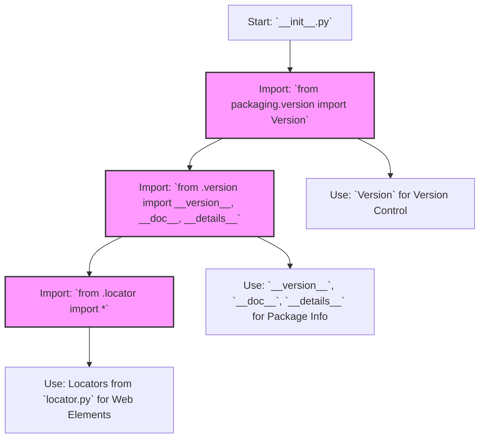

## Анализ кода `hypotez/src/suppliers/hb/locators/__init__.py`

### <алгоритм>

1. **Импорт необходимых модулей:**
    - Из `packaging.version` импортируется `Version`. Этот модуль используется для работы с версиями.
    - Из текущего пакета (`.`) импортируются `__version__`, `__doc__`, `__details__` и все (`*`) из модуля `locator`.  
        - `__version__` - строка, содержащая версию текущего пакета.
        - `__doc__` -  строка документации текущего пакета.
        - `__details__` - строка с детальной информацией о текущем пакете.
        - Все из `locator` импортируются все имена (классы, функции, переменные) из модуля `locator`.

2. **Использование импортированных модулей:**
   -  `Version` используется для сравнения версий, это можно предположить по названию модуля и того что он предназначен для сравнения версий.  
   - `__version__`, `__doc__`, `__details__` используются для предоставления информации о текущем пакете.  
   -  Импортированные локаторы из `locator.py` будут использованы другими частями проекта для взаимодействия с веб-страницами (например, поиск элементов на странице).

### <mermaid>

**Объяснение `mermaid`:**

- **`flowchart TD`**: Указывает, что это блок-схема, и ее направление сверху вниз.
- **`Start[Start: __init__.py]`**: Начальная точка схемы, представляющая файл `__init__.py`.
- **`ImportVersion[Import: from packaging.version import Version]`**: Обозначает импорт класса `Version` из модуля `packaging.version`.
- **`ImportFromPackage[Import: from .version import __version__, __doc__, __details__]`**: Обозначает импорт переменных `__version__`, `__doc__`, `__details__` из модуля `version.py` в текущем пакете.
- **`ImportAllFromLocator[Import: from .locator import *]`**: Обозначает импорт всех имен из модуля `locator.py` в текущем пакете.
- **`UseVersion[Use: Version for Version Control]`**: Показывает, что класс `Version` будет использоваться для управления версиями.
- **`UsePackageInfo[Use: __version__, __doc__, __details__ for Package Info]`**: Показывает, что импортированные переменные будут использоваться для предоставления информации о пакете.
- **`UseLocators[Use: Locators from locator.py for Web Elements]`**: Показывает, что локаторы из `locator.py` будут использоваться для работы с элементами на веб-страницах.
- **`classDef importClass fill:#f9f,stroke:#333,stroke-width:2px`**: Определяет стиль для классов импорта.
- **`class ImportVersion,ImportFromPackage,ImportAllFromLocator importClass`**: Применяет стиль импорта к соответствующим узлам диаграммы.

### <объяснение>

**Импорты:**

-   `from packaging.version import Version`:
    -   Импортирует класс `Version` из пакета `packaging.version`. Этот пакет предназначен для работы с версиями программного обеспечения, включая их сравнение и проверку соответствия. `Version` позволяет сравнивать версии, что может быть полезно, если есть какие-то зависимости от конкретных версий других библиотек или компонентов.
-   `from .version import __version__, __doc__, __details__`:
    -   Импортирует три переменные из модуля `version.py`, расположенного в том же пакете (`.`):
        -   `__version__`: Содержит строку с версией текущего пакета.
        -   `__doc__`: Содержит строку с документацией пакета.
        -   `__details__`: Содержит строку с более подробной информацией о пакете.
        -   Эти переменные обычно используются для предоставления метаданных о пакете, что может быть полезно для отладки, логирования или показа информации о библиотеке.
-   `from .locator import *`:
    -   Импортирует все имена (классы, функции, переменные) из модуля `locator.py` в том же пакете. Модуль `locator.py` скорее всего содержит определения локаторов для элементов веб-страниц. Это типичный подход для работы с Selenium, Playwright или другими инструментами для автоматизации браузеров, где локаторы используются для поиска элементов на веб-странице.  Использование `*` может быть не очень хорошим вариантом, поскольку это может привести к проблемам с пространством имен, в которых могут быть конфликты имен, и может быть более сложно понять, откуда берется то или иное имя.

**Назначение и взаимодействие:**

-   Файл `__init__.py` делает доступными все импортированные элементы на уровне пакета. Это означает, что при импорте пакета `src.suppliers.hb.locators` можно будет получить доступ к `Version`, `__version__`, `__doc__`, `__details__`, а также ко всем именам, импортированным из `locator.py`.
-   Пакет `src.suppliers.hb.locators`, вероятно, предназначен для хранения локаторов (селекторов) элементов веб-страниц, используемых в рамках проекта, который, по всей видимости, автоматизирует взаимодействие с веб-сайтами.

**Возможные улучшения:**

-   Использовать `from .locator import SpecificLocator` вместо `from .locator import *` для явного импорта, чтобы избежать конфликтов имен и сделать код более читаемым.
-   Добавить более подробную документацию и docstring к пакетам, классам и функциям.
-   Сделать использование переменных `__version__`, `__doc__`, `__details__` более явным.

**Взаимосвязь с другими частями проекта:**

-   Данный пакет, скорее всего, является частью более крупной системы автоматизации тестирования или RPA (роботизированная автоматизация процессов), которая использует веб-браузер для взаимодействия с веб-сайтами.
-   Другие модули и пакеты проекта могут импортировать этот пакет для доступа к определенным локаторам, которые используются для взаимодействия с элементами веб-страниц.