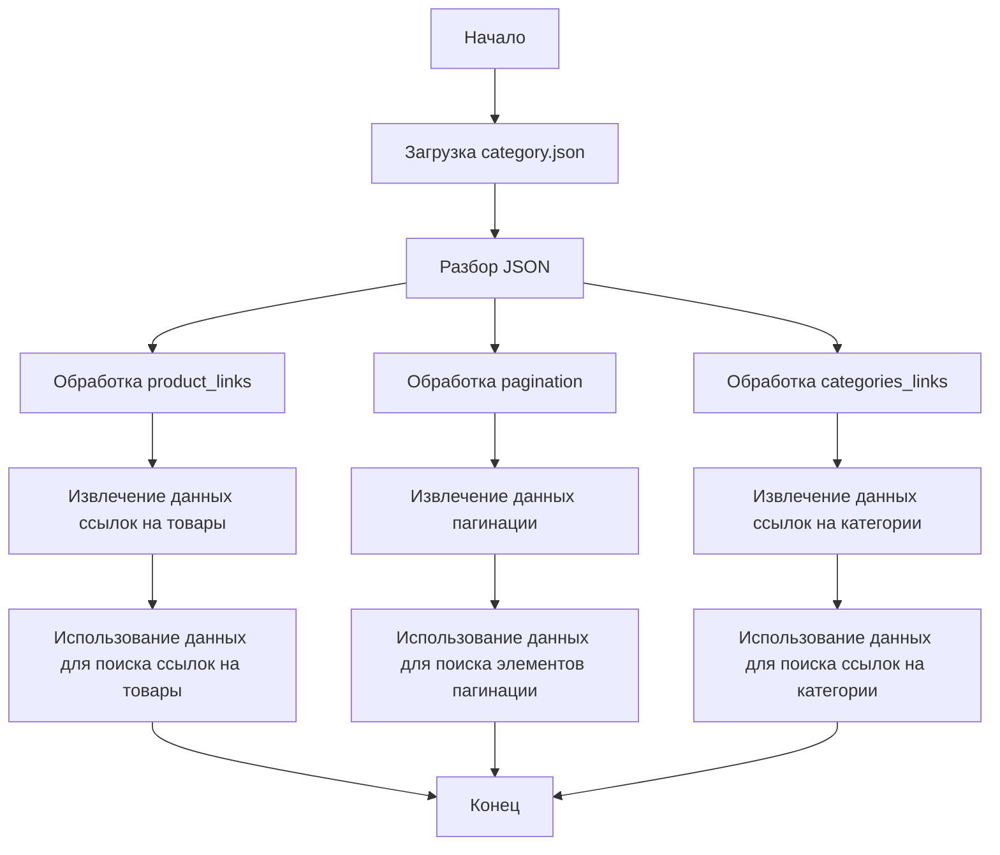

# Анализ JSON-кода: `hypotez/src/suppliers/hb/locators/category.json`

## <алгоритм>

1. **Начало**: Загрузка JSON-файла `category.json`.
2. **Разбор JSON**:  Файл содержит объект JSON с тремя основными ключами: `product_links`, `pagination` и `categories_links`.
3.  **Обработка `product_links`**:
    - Извлекаются данные, необходимые для определения локаторов ссылок на товары:
        - `attribute`: "href" - атрибут, который нужно извлечь (ссылка).
        - `by`: "XPATH" - тип локатора.
        - `selector`: "//h3[@class = 'post-title']//a" -  XPATH-выражение для поиска ссылок.
        - `if_list`: "first" - указывает, что нужно брать первую найденную ссылку (в рамках списка).
        - `use_mouse`: `false` - не использовать мышь при взаимодействии.
        - `mandatory`: `true` -  поле обязательно для нахождения.
        - `timeout`: `0` - нет таймаута.
        - `timeout_for_event`: "presence_of_element_located" - событие ожидания - присутствие элемента.
        - `event`: `false` - нет события.
        - `locator_description`: "Список ссылок на товары со страницы категории" - описание локатора.
    - Пример: На странице категорий мы хотим получить ссылки на товары, которые размещены внутри тега `<a>` внутри тега `<h3>` с классом `post-title`.
4. **Обработка `pagination`**:
    - Извлекаются данные для определения локатора элемента пагинации:
        - `attribute`: `false` - не извлекаем атрибут.
        - `by`: "XPATH" - тип локатора.
        - `selector`: "//ul[@class='pagination']" - XPATH-выражение для поиска элемента пагинации.
        - `timeout`: `0` - нет таймаута.
        - `timeout_for_event`: "presence_of_element_located" - событие ожидания - присутствие элемента.
        - `event`: "click()" - событие - клик.
        - `mandatory`: `false` - необязательный элемент.
        - `locator_description`: "" - описание локатора.
    - Пример: На странице категории мы хотим найти блок пагинации `<ul class="pagination">`, на который мы можем кликнуть.
5. **Обработка `categories_links`**:
    - Извлекаются данные для определения локаторов ссылок на категории:
      - `attribute`: `{"text": "href"}` - атрибут `href`, который нужно извлечь, с текстом.
        - `by`: "XPATH" - тип локатора.
        - `selector`: "//a[contains(@class, 'menu-item')]" - XPATH-выражение для поиска ссылок на категории.
        - `timeout`: `0` - нет таймаута.
        - `timeout_for_event`: "presence_of_element_located" - событие ожидания - присутствие элемента.
        - `event`: `false` - нет события.
        - `mandatory`: `false` -  поле необязательно для нахождения.
        - `locator_description`: "" - описание локатора.
    - Пример: Мы хотим найти все ссылки на категории, находящиеся в тегах `<a>` с классом `menu-item`, используя XPATH, и извлечь атрибут `href`.
6. **Конец**: Все данные из JSON распарсены и доступны для использования.

## <mermaid>

**Описание зависимостей:**

Диаграмма описывает поток данных при разборе `category.json` файла. Основные блоки включают в себя загрузку и разбор JSON, а также последующую обработку данных для локаторов: ссылок на товары, пагинации и ссылок на категории. Каждый из этих блоков извлекает данные и подготавливает их для использования при поиске элементов на веб-странице.

## <объяснение>

**Общая структура:**
JSON файл `category.json` описывает локаторы элементов для страниц категорий веб-сайта поставщика `hb`. Он включает в себя:

-   `product_links`: Локаторы для ссылок на товары.
-   `pagination`: Локаторы для элементов пагинации.
-   `categories_links`: Локаторы для ссылок на категории.

**`product_links`:**

-   `attribute`: `"href"` указывает, что нужно извлечь атрибут href из найденного элемента. Это значение будет содержать URL товара.
-   `by`: `"XPATH"` указывает, что для поиска элемента будет использован XPATH.
-   `selector`: `"//h3[@class = 'post-title']//a"` - XPATH-выражение, которое ищет элементы `<a>`, являющиеся потомками элемента `<h3>` с классом `post-title`. Это позволяет получить ссылки на товары.
-   `if_list`: `"first"` указывает, что необходимо брать первый элемент из списка найденных.
-   `use_mouse`: `false` - не использовать мышь при взаимодействии (клик, наведение).
-   `mandatory`: `true` -  этот локатор должен быть найден, иначе поиск завершится с ошибкой.
-   `timeout`: `0` - таймаут равен 0, нет явного ожидания.
-   `timeout_for_event`: `"presence_of_element_located"` - ожидается пока элемент не появится на странице.
-   `event`: `false` - событие не вызывается.
-   `locator_description`: `"Список ссылок на товары со страницы категории"` - описание локатора.

**`pagination`:**

-   `attribute`: `false` - не нужно извлекать атрибут, так как используется для навигации.
-   `by`: `"XPATH"` указывает, что для поиска элемента будет использован XPATH.
-   `selector`: `"//ul[@class='pagination']"` - XPATH-выражение, которое ищет элемент `<ul class="pagination">`, который содержит элементы пагинации.
-   `timeout`: `0` - таймаут равен 0, нет явного ожидания.
-    `timeout_for_event`: `"presence_of_element_located"` - ожидается пока элемент не появится на странице.
-   `event`: `"click()"` - указывает, что после обнаружения элемента нужно кликнуть.
-   `mandatory`: `false` -  этот локатор необязательный для нахождения.
-   `locator_description`: `""` - описание локатора отсутствует.

**`categories_links`:**

-   `attribute`: `{ "text": "href" }` - нужно извлечь атрибут "href" и его текст.
-   `by`: `"XPATH"` указывает, что для поиска элемента будет использован XPATH.
-   `selector`: `"//a[contains(@class, 'menu-item')]"` - XPATH-выражение, которое ищет все элементы `<a>`, у которых класс содержит `menu-item`. Это ссылки на категории.
-   `timeout`: `0` - таймаут равен 0, нет явного ожидания.
-   `timeout_for_event`: `"presence_of_element_located"` - ожидается пока элемент не появится на странице.
-   `event`: `false` - событие не вызывается.
-   `mandatory`: `false` -  этот локатор необязательный для нахождения.
-   `locator_description`: `""` - описание локатора отсутствует.

**Потенциальные проблемы и улучшения:**

-   **Жестко заданные XPATH:** Использование жестко заданных XPATH может привести к поломкам, если верстка сайта изменится. Можно рассмотреть использование более гибких локаторов или добавление дополнительных атрибутов для более точного поиска элементов.
-   **Отсутствие описания для `pagination` и `categories_links`**:  Отсутствие `locator_description` для `pagination` и `categories_links` может затруднить понимание их назначения. Желательно добавить описания для этих локаторов.
-   **Таймауты:** Использование таймаутов = 0, говорит о том, что явного ожидания нет. Желательно пересмотреть таймауты для более стабильного поиска элементов.
-   **Обработка ошибок**: В коде, использующем эти локаторы, должна быть реализована обработка ошибок на случай, если какой-либо из обязательных элементов (`product_links` - `mandatory`: `true`) не найден.

**Взаимосвязи с другими частями проекта:**

Этот JSON-файл, вероятно, используется в модуле парсинга (например, в `src/suppliers/hb/parser.py`) для сбора данных о товарах с сайта `hb`. Он предоставляет информацию о том, где находятся ссылки на товары, элементы пагинации и ссылки на категории. Этот файл позволяет системе автоматически находить нужные элементы на странице без ручного ввода локаторов. Таким образом, этот файл является частью конфигурации, которая управляет процессом сбора данных.