## Анализ JSON-конфигурации для локаторов продукта

### <алгоритм>

Представленный JSON-файл содержит конфигурацию для локаторов элементов на веб-странице продукта, используемых для сбора данных о товаре. Каждый ключ верхнего уровня в этом JSON-объекте представляет собой конкретное поле данных о продукте (например, `name`, `price`, `description`), а значение - объект, описывающий, как найти соответствующий элемент на странице.

Вот пошаговый разбор процесса для каждого поля:

1.  **Определение поля данных**: Ключ верхнего уровня определяет поле данных, которое нужно извлечь. Например, ключ `"name"` указывает, что необходимо получить имя продукта.

2.  **Настройка локатора**: Для каждого поля определены следующие параметры:
    *   `attribute`: Атрибут элемента, который нужно извлечь (например, `"innerText"`, `"src"`, `null`).  Может быть так же `VALUE` - значение атрибута.
    *   `by`: Метод поиска элемента (`"XPATH"`, `"VALUE"` или `null`). `null` означает, что значение берется из attribute.
    *   `selector`: Строка, определяющая местоположение элемента (например, `"//h1[contains(@class,'product_title')]"`).
    *   `if_list`: Указывает, как обрабатывать список элементов (`"first"` - взять первый элемент, `"all"` - взять все элементы).
    *  `use_mouse`: `true/false` - использовать мышку или нет.
    *   `mandatory`: Логическое значение, указывающее, является ли поле обязательным для извлечения (`true` или `false`).
    *   `timeout`: Тайм-аут ожидания элемента (в секундах).
    *   `timeout_for_event`: Событие ожидания элемента (`"presence_of_element_located"`).
    *   `event`: Действие, которое нужно выполнить с элементом (например, `click()`).
    *  `locator_description`: Описание локатора.

3.  **Поиск элемента**: На основе параметров `by` и `selector` производится поиск элемента на странице.

4.  **Извлечение данных**: Если элемент найден, значение атрибута, указанного в `attribute`, извлекается. Если `attribute` `null`, то данные берутся из `selector` (в зависимости от `by`).

5.  **Обработка списка элементов**: Если `if_list` имеет значение `"first"`, берется первый найденный элемент; если `"all"`, берется список элементов.

6.  **Обработка обязательности**: Если `mandatory` имеет значение `true` и элемент не найден, это может вызвать ошибку или прерывание процесса.

**Примеры**:

*   **`"name"`**: Извлекает текст из элемента `<h1>` с классом `product_title` (основной заголовок продукта).
*   **`"price"`**: Извлекает текст из элемента `
` с классом `price` (цена продукта).
*   **`"default_image_url"`**: Извлекает значение атрибута `src` из первого элемента `` с классом `zoomImg` (URL основного изображения продукта).
*   **`"description"`**: Нажимает на таб описания и извлекает текст из div.

```mermaid
flowchart TD
    subgraph "product.json"
      Start[Start] --> ParseJSON[Parse JSON Configuration];
      ParseJSON --> LoopThroughLocators[Loop through each Locator];
        LoopThroughLocators -->  LocatorDetails[Extract Locator Details: <br>attribute, by, selector, if_list, use_mouse, mandatory, timeout, timeout_for_event, event];
          LocatorDetails --> CheckByMethod{Check 'by' method: <br>XPATH, VALUE, null};
            CheckByMethod -- XPATH --> FindElementByXpath[Find Element by XPATH using 'selector'];
              FindElementByXpath --> CheckElementFound{Check if element was found};
            CheckByMethod -- VALUE --> GetAttributeValue[Get Attribute Value from 'attribute' field]
                GetAttributeValue --> CheckElementFound
            CheckByMethod -- null --> GetValueByNullMethod[Get Value by null method. Value in 'attribute' field]
                GetValueByNullMethod --> CheckElementFound
              
              
            CheckElementFound -- Yes --> ExtractAttribute{Extract attribute based on 'attribute'};
              ExtractAttribute --> CheckIfList{Check if 'if_list' is 'first' or 'all'};
                CheckIfList -- first --> GetFirstElement[Get first element from list];
                  GetFirstElement --> CheckMandatory{Check if 'mandatory' is true};
                CheckIfList -- all --> GetAllElements[Get all elements from list];
                 GetAllElements --> CheckMandatory
            CheckElementFound -- No --> CheckMandatoryNoElement{Check if 'mandatory' is true};
              CheckMandatoryNoElement -- Yes --> ThrowError[Throw Error];
              CheckMandatoryNoElement -- No --> NextLocator[Move to next locator]
                  ThrowError --> NextLocator
            CheckMandatory -- Yes --> NextLocator[Move to next locator];
             CheckMandatory -- No --> NextLocator
              NextLocator --> LoopThroughLocators
          LoopThroughLocators --> End[End];
  
  
    end
  
    
```

### <mermaid>

**Объяснение:**

1.  **`Start`**: Начало процесса обработки JSON-конфигурации.
2.  **`ParseJSON`**: Разбор JSON-файла, получение словаря с настройками локаторов.
3.  **`LoopThroughLocators`**:  Цикл перебора всех локаторов в словаре.
4.  **`LocatorDetails`**: Извлечение деталей текущего локатора (атрибут, метод поиска, селектор и т. д.).
5.  **`CheckByMethod`**: Проверка метода поиска (`by`). Если `XPATH` - переходим к `FindElementByXpath`, если `VALUE` - переходим к `GetAttributeValue`, если `null` - переходим к `GetValueByNullMethod`.
6. **`FindElementByXpath`**: Поиск элемента на веб-странице с использованием XPATH.
7. **`GetAttributeValue`**: Получение значение из атрибута.
8. **`GetValueByNullMethod`**: Получение значение по `null` методу. Значение хранится в `attribute`.
9.  **`CheckElementFound`**: Проверка, был ли найден элемент на странице.
10.  **`ExtractAttribute`**: Извлечение значения нужного атрибута у найденного элемента.
11. **`CheckIfList`**: Проверка, какой метод получения списка.
12.  **`GetFirstElement`**: Если `if_list = first`, берётся только первый элемент из найденного списка.
13. **`GetAllElements`**: Если `if_list = all`, берётся все элементы из найденного списка.
14.  **`CheckMandatory`**: Проверка, является ли локатор обязательным (поле `mandatory`).
15. **`CheckMandatoryNoElement`**: Проверка, является ли локатор обязательным, если элемент не найден.
16.  **`ThrowError`**: Если элемент обязателен и не найден, выбрасывается ошибка.
17. **`NextLocator`**: Переход к следующему локатору.
18.  **`End`**: Конец процесса обработки.

### <объяснение>

**Импорты**:

*   В данном коде нет явных импортов Python. Этот JSON-файл является конфигурационным файлом и не содержит исполняемого кода Python. Однако, подразумевается, что этот файл будет использоваться в Python-скрипте.
*   Этот файл используется в контексте веб-скрапинга, поэтому он взаимодействует с библиотеками Python, такими как `Selenium` или `BeautifulSoup`, для поиска элементов на веб-страницах и извлечения данных, но на прямую он их не импортирует.

**Классы**:

*   В данном JSON-файле не определены классы. Это файл данных, используемый для настройки и определения локаторов.

**Функции**:

*   В данном JSON-файле нет функций. Его цель – предоставление данных для функций, которые будут написаны на Python (или другом языке). Эти функции будут использовать параметры из JSON для поиска элементов и извлечения данных.

**Переменные**:

*   JSON-файл содержит ряд ключей, которые можно рассматривать как переменные для настройки поиска элементов на веб-странице:
    *   **`attribute`**: Атрибут элемента HTML, значение которого нужно извлечь, например `innerText`, `src`. Тип: `String` или `null`.
    *   **`by`**: Метод, по которому нужно найти элемент. Тип: `String` (`XPATH` или `VALUE` или `null`).
    *   **`selector`**: Строка, содержащая XPATH-запрос для поиска элемента. Тип: `String` или `null`.
    *   **`if_list`**: Определяет, как обрабатывать список элементов (брать первый или все). Тип: `String` (`first` или `all`).
    *   **`use_mouse`**: Определяет, использовать мышку или нет. Тип: `Bool` (`true` или `false`).
    *   **`mandatory`**: Указывает, является ли элемент обязательным. Тип: `Bool` (`true` или `false`).
    *   **`timeout`**: Время ожидания элемента. Тип: `Integer`.
    *   **`timeout_for_event`**: Событие для ожидания элемента. Тип: `String` (`presence_of_element_located`).
    *   **`event`**: Действие, которое нужно выполнить с элементом. Тип: `String` (например, `click()`).

**Потенциальные ошибки и области для улучшения**:

1.  **Отсутствие обработки ошибок**: JSON-файл не содержит логики обработки ошибок. В Python-скрипте, использующем этот файл, должна быть предусмотрена обработка ситуаций, когда элемент не найден или возникает таймаут.
2.  **Жестко заданные значения**: Некоторые значения, такие как `additional_shipping_cost`, являются жестко заданными. Возможно, их следует вынести в отдельный конфигурационный файл или сделать настраиваемыми.
3.  **Зависимость от структуры HTML**: Локаторы XPATH зависят от структуры HTML страницы. Любые изменения на сайте могут привести к поломке локаторов.
4. **`logic for action[AND|OR|XOR|VALUE|null]`**: Не совсем понятно назначение.  Если этот параметр используется, то следует описать его подробнее.

**Цепочка взаимосвязей с другими частями проекта**:

*   Этот JSON-файл является частью системы сбора данных о товарах. Он используется для поиска элементов на веб-страницах конкретного поставщика (HB).
*   Локаторы, определенные в файле, будут использоваться в модуле веб-скрапинга для извлечения информации о товарах.
*   Извлеченные данные могут быть использованы для:
    *   Обновления базы данных каталога товаров.
    *   Анализа цен и других параметров.
    *   Автоматизации процесса импорта товаров в систему клиента.
    *   Создания отчетов.

Этот файл является ключевым элементом в процессе сбора данных, он настраивает, какие элементы и как находить на страницах поставщика. Правильное и точное определение локаторов напрямую влияет на успех сбора данных.